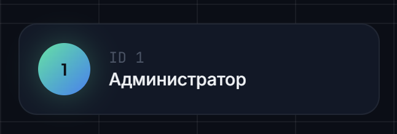

# BUG-004: отображение ID

**Найден:** 2026-04-13
**Severity:** cosmetic
**Status:** open
**Component:** web-panel 
**Role affected:** ADMIN / TEACHER / STUDENT / HEADMAN / all 
**Phase reference:** фронтенд

## Описание

я захожу в аккаунт как любой пльзователь, и у меня в правом верхнем углу и левом нижнем углу есть плашка типо с моим профилем

и

Сейчас там ничего не происходит. а я хочу чтобы оно происходило. Там должен открываться профиль, где можно сменить пароль, сменить аватарку. и самое главное там не должен оттображаться id или что-то такое. 
пусть пока будет кружок, который станет аватаркой. Поэтому убираем цифры оттуда, делаем возможность выбора автарки из представленных. 
важно чтобы все сервисы поддерживали эту автаарку и передавали. Её можно захешировать ечли она не меняется. По умолчанию просто круг такой как сейяас но без цифр

## Шаги для воспроизведения

1. Зайти
2. Главная страница

## Ожидаемое поведение

кликнув по всей плашке попасть в профиль (всклывающее окно) 

## Фактическое поведение

ничего не происходит только есть цифра которая никак не нужна

## Окружение

- **Браузер/устройство:** браузер
- **URL:** /dashboard
- **Пользователь/роль:** все роли

## Скриншоты / видео

<!-- Файлы лежат в этой же папке рядом с report.md. Ссылки относительные. -->
-  — как пыглядит сейчас
- [img_1.png](img_1.png) — как выглядит сейчас

## Fix (заполнить когда status = fixed)

как и во всех текущих реализациях. общий отчёт потом в конце исправления

## Ответы автора (2026-04-13)

- **Аватар**: набор пресетов + вариант "буквы из ФИО (инициалы)" — оба способа доступны пользователю.
  - По умолчанию — инициалы на цветном фоне (без цифр ID).
  - Цифру ID убрать с плашек в правом верхнем и левом нижнем углу.
- **Хранение аватара**: на усмотрение исполнителя — главное, чтобы не сломать существующую систему и было корректно/расширяемо. Передавать через все сервисы (можно кэшировать, т.к. меняется редко).
- **Смена пароля**: должны работать ОБА пути — через OTP и через старый пароль. Сначала проверить, как реализована смена в backend (auth-service), и опираться на это.
- **UI**: всплывающее окно (модалка) поверх страницы, не отдельный роут `/profile`. Действий пока мало.
- **Клик**: вся плашка профиля кликабельна → открывает модалку.
