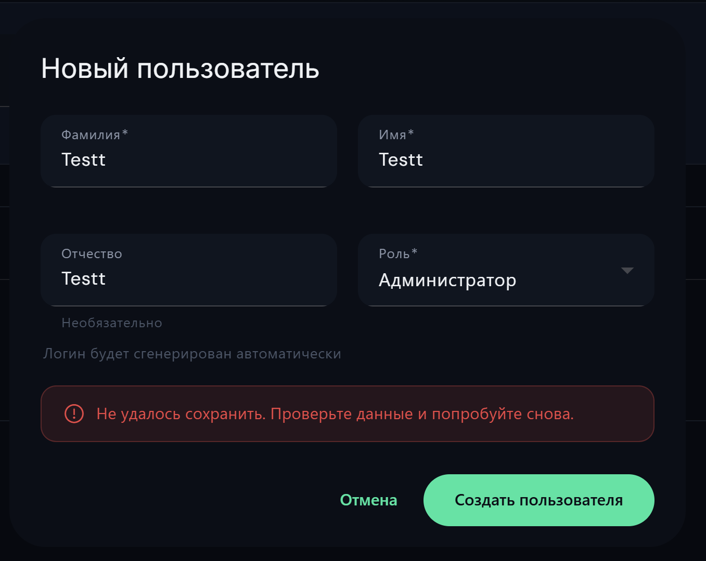
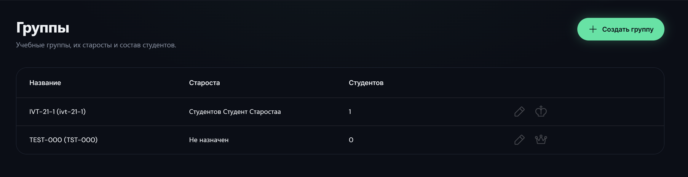

# BUG-006: исправление логикии и дизайна панели администратора

**Найден:** 2026-04-13
**Severity:** major / cosmetic
**Status:** open
**Component:** web-panel 
**Role affected:** ADMIN 
**Phase reference:** фронтенд

## Описание

Когда в поиске я пишу имя, то он не ищет и выдаёт всех. А мне при поиске по имени нужно выдать именно релевантные ответы.
Я могу писать как ФИО полностью, так и отдельно. А могу писать и логин пользователя или группу.

Я хочу создать администратора преподавателя или студента, но он мне выдаёт ошибку "Не удалось сохранить. Проверьте данные и попробуйте снова."

Важно. у нас в системе студенты привязаны к телеграмм и телеграмм по ТЗ должен запускаться (бот в телеграмм) только если id студента уже есть в системе
иначе система его не пропустит. А вот если id есть то сразу телеграмм понимает что за группа и связывает пользователя с группой и посещаемостью. Сейчас же администратор ен вводит телеграмм id при регистрации сьулента (хотя по схеме должно быть или проверь весть проект)

Я создал группу, но не могу ни сделать поиск группы, и не разделены название и код группы (хотя название должно и код это ондно и то же и смысла вводить 2 нет). Плюс проверь, и скажи как у нас происходит перевод группы на следующий курс.
это должно быть отражено в тз к системе но вопрос как реализовано.

Теперь я создаю семестры. Я не должен мочь создавать семестры когда есть активный семестр или завершённый. Я не могу изменять прошлые семестры после завершения. Я не могу создать семестр в даты которые уже заняты какими-то семестрами (а пока я всё это могу)

## Шаги для воспроизведения

1. Зайти от имени администратора
2. Попытаться создать пользователя, создать группу, создать семестр

## Ожидаемое поведение

В пользователях поле поиск должно искать по всем пользователям и выдавать подходящих
я должен мочь создавать преподавателей, администраторов и студентов (и проверь что я могу видеть их init пароли до того как они сменят чтобы дать им (я могу посомтреть несколько раз))
добвавить поле с телеграмм id для регистрации стулентов чтобы при запуске бота их сразу заспознавала система
работающий поиск по группе
Уход от кода и названия группы (по сути это одно и тоже) и проверить как происходит переименование автоматическое групп (по правилу из тз) это должно происходить за 2 недели до начала нового осеннего семестра. Но давай это обсудим если есть вопросы

## Фактическое поведение

поск не работает, не могу создавать пользователей любых, нет привязки к телеграмм студентам.

## Скриншоты / видео

<!-- Файлы лежат в этой же папке рядом с report.md. Ссылки относительные. -->
- все скрины указаны и описаны выше

## Ответы автора (2026-04-13)

- **Поиск пользователей**: на усмотрение исполнителя как лучше. Ожидаемое количество пользователей в проде — **300–8000**.
- **Ошибка "Не удалось сохранить" при создании пользователя**: запустить локально и воспроизвести (логов пока нет — будут после внедрения Kafka/ELK из BUG-009).
- **Telegram ID при регистрации студента**:
  - Поле **обязательное** при создании.
  - При смене Telegram-аккаунта — admin редактирует, исторические данные пользователя сохраняются (привязка не пересоздаёт сущность).
- **Init password**: admin видит его **всегда**, пока пользователь не сменил. После первой смены — пароль уже не показывается.
- **Группа: код = название**: слить в одно поле "Название группы" (формат `XXXx-000`).
  - Миграцию сделать спокойно (в БД пока только тестовая группа).
  - **ОБЯЗАТЕЛЬНО** проверить тесты + фронтенд после миграции — в прошлый раз с миграцией были проблемы на сервере.
- **Формат имени группы**: `XXXx-000`
  - до тире — название направления
  - 1-я цифра после тире — номер курса
  - 2-я цифра — тип курса
  - 3-я цифра — номер группы по счёту (не используется системой, для админа)
  - Жизненный цикл группы ведёт админ (архивирует при выпуске).
- **Автопереименование групп**: проверить, реализовано ли в коде (1→2→3 курс). Триггер — за 2 недели до начала осеннего семестра. Если не реализовано — реализовать.
- **Семестры**:
  - Завершённые накапливаются в истории (это нормально).
  - Запрет: новый семестр с датами в прошлом ИЛИ перекрывающийся датами с любым существующим семестром (любого статуса).
  - Запрет редактирования завершённых — да.
  - Запрет пересечения дат — да.

