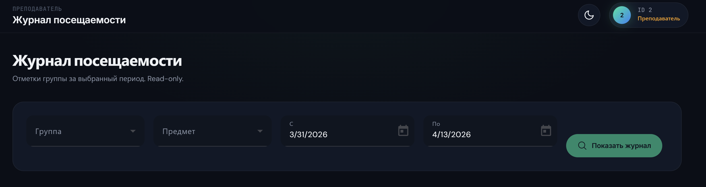

# BUG-007: кнопка журнал посещаемости

**Найден:** 2026-04-13
**Severity:** critical / cosmetic
**Status:** open
**Component:** web-panel 
**Role affected:** TEACHER 
**Phase reference:** фронтенд

## Описание

когда преподаватель заходит в журнал

то у него кнопка поиска ниже чем остальные кнопки.

## Шаги для воспроизведения

1. зайти от имени преподавателя
2. зайти в журнал посещаемости

## Ожидаемое поведение

кнопка такого же размера как и кнопки фильтров и находится на одном с ними уровне

## Фактическое поведение

кнопка поиска находится ниже кнопок и не соответствует размерам кнопки

## Скриншоты / видео

указаны и описаны выше

## Ответы автора (2026-04-13)

Дополнительных вопросов нет — выровнять кнопку поиска по высоте и размеру с остальными кнопками фильтров на одной строке.
