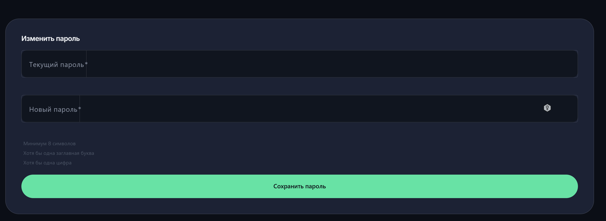
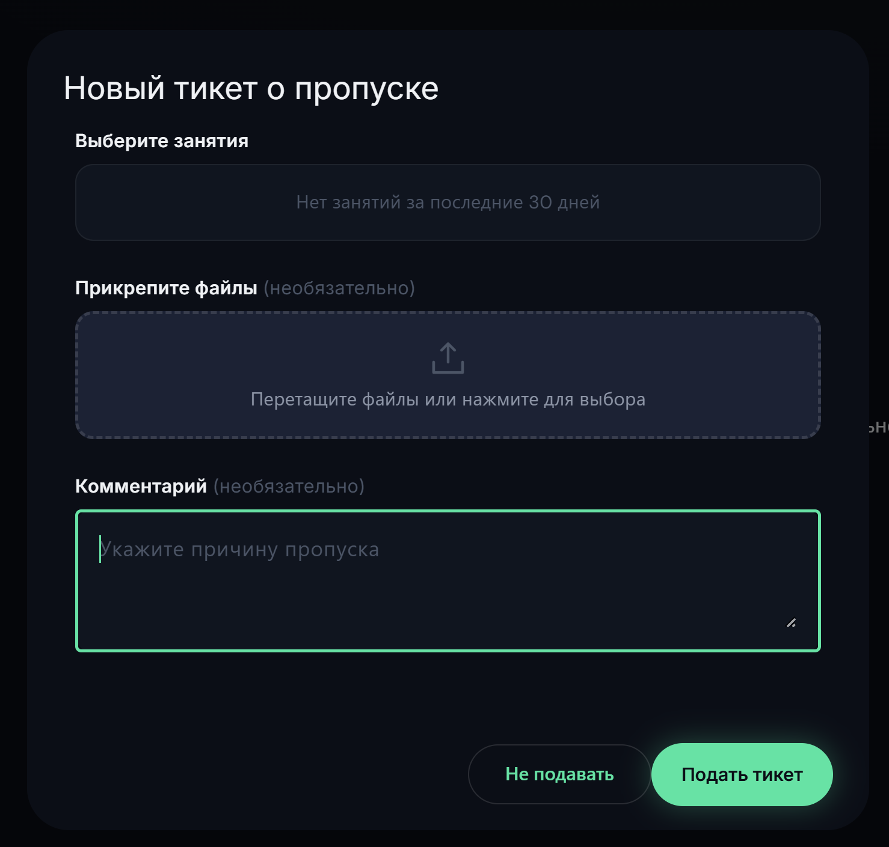
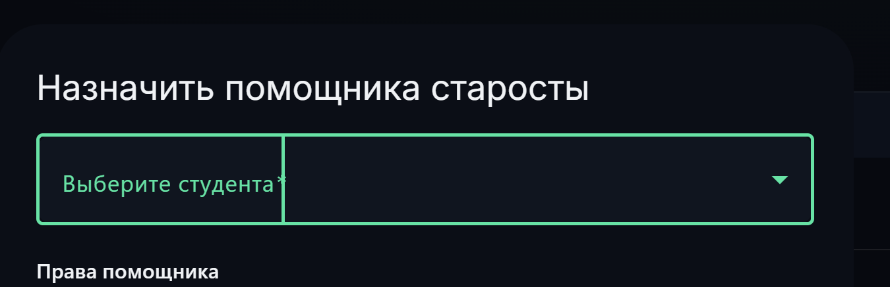
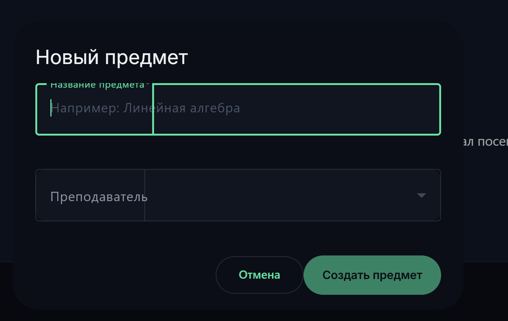
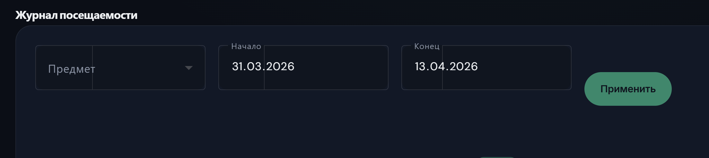

# BUG-008: не работает кнопка добавить pwa и кабинет старосты

**Найден:** 2026-13-04
**Severity:** blocker / cosmetic
**Status:** open
**Component:** pwa / web-panel 
**Role affected:**  STUDENT / HEADMAN 
**Phase reference:** фронтенд + PWA

## Описание

Когда я захожу со стороны старосты то у меня сразу есть плашка добавить pwa приложение, я нажимаю (с телефона естественно), но ничего не происходит
белый экран на https://ruttrack.site/app/

Когда я перехожу на https://ruttrack.site/student/dashboard - то там ошибка Не удалось загрузить данные. Проверьте подключение и обновите страницу.
хотя такая страница должна давать отчёт о посещаемости конкретного студента

не работает переход на страницу https://ruttrack.site/student/checkin оно не реагирует просто

на странице статистики ошибка Не удалось загрузить статистику. Попробуйте позже. https://ruttrack.site/student/stats

страница https://ruttrack.site/student/notifications вообще не открывается

страница профиля смены пароля выглядит недоработанной

лишние вертикальные чёрточки в полях ввода, мелкая и невидная инструкция для пароля

когда студент создаёт тикет о пропуске

то почему-то ему не предлагается указать причину по которой оно создаётся

Теперь к кабинету старосты
начнём с того, что есть вложенность вниз, но при этом она не прокручивается и чтобы выйти или сделать действия в самом низу панель старосты приходится с компа уменьшать масштаб экрана

у старосты очень много полей ввода данных и почему-то на них всех есть полоска вертикальная

 - тут кнопка создать предмет больше чем кнопка рядом
 - тут ещё кнопка применить сползла вниз и неровно стоит

## Шаги для воспроизведения

1. Зайти от имени старосты (там же есть функционал студента)

## Ожидаемое поведение

Должна работать плашка добавить pwa
должен работать дашборд
должна работать страница chekin
должна работать страница статистики выдавать данные
должна открываться страница уведомлений
Форма смена пароля должна быть доработанной
создание тикета нужно доработать без вертикальной полоски
нужно иметь возможность указать о причине пропуска не только во время проставления статуса, но и во время подачи тикета
нужно иметь возможность прокрутить боковое меню для старосты
пофиксить поля ввода и убать вертикальные полоски

## Скриншоты / видео
описаны выше

## Ответы автора (2026-04-13)

- **Белый экран на `/app/`**: исполнитель сам прогоняет дебаг локально. CI/CD прошёл успешно — значит, причина не в сборке, а скорее в runtime / service worker / роутинге base href.
- **Кнопка "Установить PWA"**: тестировалось на Android (не реагирует). На iOS дополнительно проверить и при необходимости показать инструкцию "Поделиться → На экран Домой" (на iOS нет `beforeinstallprompt`).
- **`/student/dashboard`, `/student/stats`, `/student/notifications`**: проверить наличие эндпоинтов на бэкенде. Если их нет — добавить.
- **`/student/checkin`**: страница вообще не открывается (не "не работает кнопка") — отдебажить роутинг и компонент.
- **Причины пропуска в тикете**: использовать тот же справочник причин, что используется при проставлении уважительной причины в журнале (excused / free_attendance — взять перечень из существующего UI/бэкенда).
- **Вертикальные полоски в полях ввода**: исправить **глобально** в design-system (общий css/scss инпутов), не точечно.
- **Скролл в сайдбаре старосты**: отдельный `overflow-y` на боковой панели — да.
- **Форма смены пароля**: применить дизайн из BUG-004 (модалка профиля) + глазик показа пароля из BUG-003. Видимая инструкция требований к паролю.
