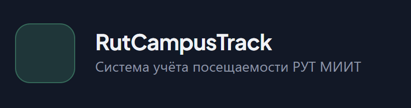
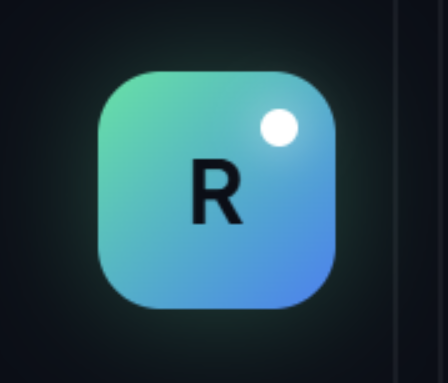

# BUG-003: naming

**Найден:** 2026-04-13
**Severity:** cosmetic
**Status:** fixed
**Component:** web-panel
**Role affected:** all / anonymous
**Phase reference:** фронтенд

## Описание

В названии в панеле входа у нас стоит RutCampusTrack а должен стоять RutTrack как и везде

Вдополнение есть слева зелёный блок пустой, в него хотелось бы поместить иконку нашего приложения

И хотелось бы на фоне некоторого интерактива в плане лёгкой анимации градинета. Лёгкая ненавязчивая, но красивая и в стиле проекта

## Шаги для воспроизведения

1. Зайти на сайт https://ruttrack.site/login

## Ожидаемое поведение

Должно быть название RutTrack, слева должна быть иконка нашего приложения. Должна быть анимация на фоне

## Фактическое поведение

анимации нет, название как из репозитория а не как должно, нет иконки в поле для иконки
нет глазика в поле пароля чтобы посомтреть пароль и скрыть его

## Скриншоты / видео

<!-- Файлы лежат в этой же папке рядом с report.md. Ссылки относительные. -->
-  — блок с названием и прямоугольником куда поставить логотип
-  — сам логотип который хочется расположить там

## Логи / console / network (опционально)

само название - <h1 _ngcontent-ng-c4022231091="" class="login-brand__title">RutCampusTrack</h1>
весь блок куда встроить иконку - 
<i _ngcontent-ng-c4022231091="" aria-hidden="true" class="ph-duotone ph-graduation-cap"></i>

## Предполагаемый fix (опционально)

сделать анимацию, изменить название, вставить логотип
сделать глащик для поля пароль чтоы можо было просмотреть пароль или скрыть его

## Fix (заполнить когда status = fixed)

- Commit(s): сделать коммит с фиксом
- Phase/plan: в рамках багфикса
- Notes: потом сделать репорт по всем сразу

## Ответы автора (2026-04-13)

- **Палитра анимации градиента**: использовать стандартную палитру проекта (см. `docs/design-decisions.md`), без дополнительных вариантов.
- **Глазик показа пароля**: нужен ВЕЗДЕ, где есть поле password (login + смена пароля в профиле из BUG-008 + любые другие формы).
- **Логотип в зелёный блок**: тот же логотип RutTrack, что и в favicon (см. BUG-002).
- **Название**: заменить `RutCampusTrack` → `RutTrack` в `login-brand__title` (и проверить остальные места, где осталось старое имя).
