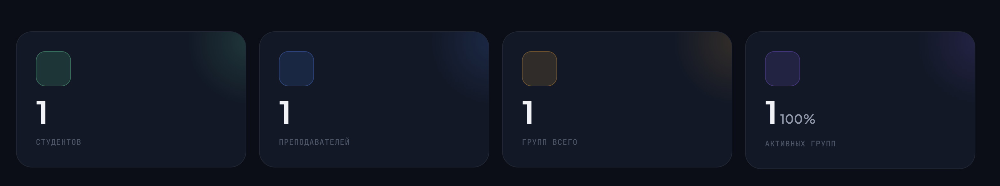
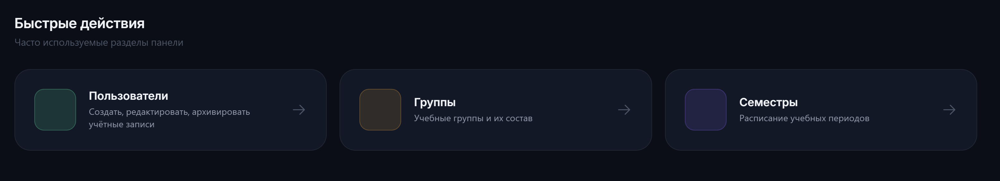

# BUG-005: функциональность дашборда

**Найден:** 2026-04-13
**Severity:** cosmetic
**Status:** fixed
**Component:** web-panel 
**Role affected:** ADMIN 
**Phase reference:** фронтенд

## Описание

Я нахожусь в дашборде и у меня есть блоки с "студентов" "преподавателей" "групп всего" "активных групп"
сейчас я не могу кликнуть на них и быстро перейти на соответствующий раздел а я должен мочь перейти на нужный мне раздел. 
В дополнение там в блоке 

есть квадраты которые не заполнены. Давай их вообще убираем они не несут никакого смысла

мне не нужна панель быстрого действия если применятся верхние правки

## Шаги для воспроизведения

1. Зайти от администратора

## Ожидаемое поведение

Я хочу функциональный дашборд и только с логичными полями. Вот у меня есть данные по количеству студентов в системе - и я при нажатии перехожу во вкладку управления студентами (те вкладка управления пользователями но там уже выбран филттр на студентов только)
Есть у меня вкладка преподаватели и при нажатии я попадаю на вкладку управления преподавателями (так же вкладка управления всеми человеками системы но с филттром преподаватели)
Групп всего - я сразу попадаю на вкладку с группами

Быстрые действия можно сделать только для следующих действий: создать преподавателя, создать студента, создать группу

## Фактическое поведение

ссылки некликабельны, есть разноцветные квадратики котрые не нужны

## Скриншоты / видео

<!-- Файлы лежат в этой же папке рядом с report.md. Ссылки относительные. -->
- — как выглядит дашборд сейяас
-  — квадраты которые вообще не нужны в системе если они пустые
-  - панель быстрого доступа которую нужно полностью передалать

## Ответы автора (2026-04-13)

- **Роутинг кликов по карточкам — подтверждено**:
  - "Студентов" → `/admin/users?role=student`
  - "Преподавателей" → `/admin/users?role=teacher`
  - "Групп всего" → `/admin/groups`
  - "Активных групп" → `/admin/groups?status=active`
- **Пустые цветные квадраты**: убрать полностью.
- **Быстрые действия**: оставить три кнопки — "Создать преподавателя", "Создать студента", "Создать группу" — каждая ведёт на страницу создания (не модалка).
