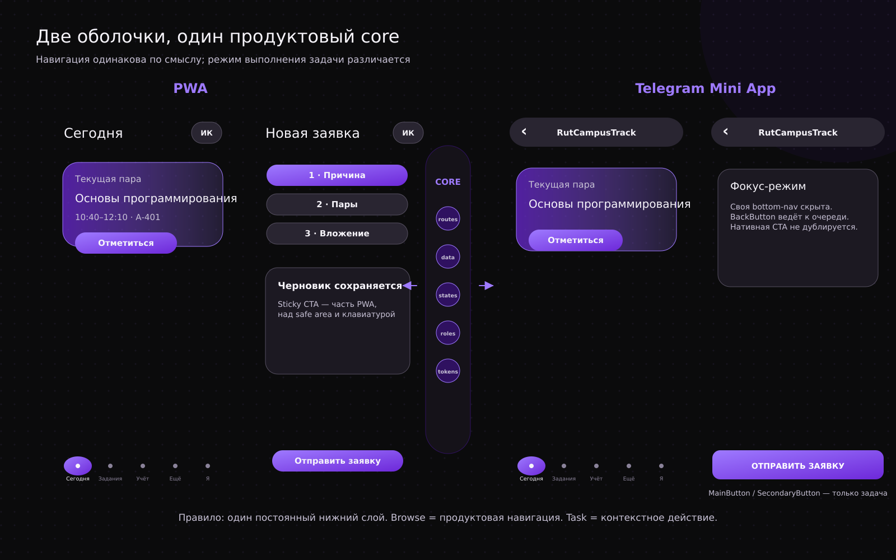
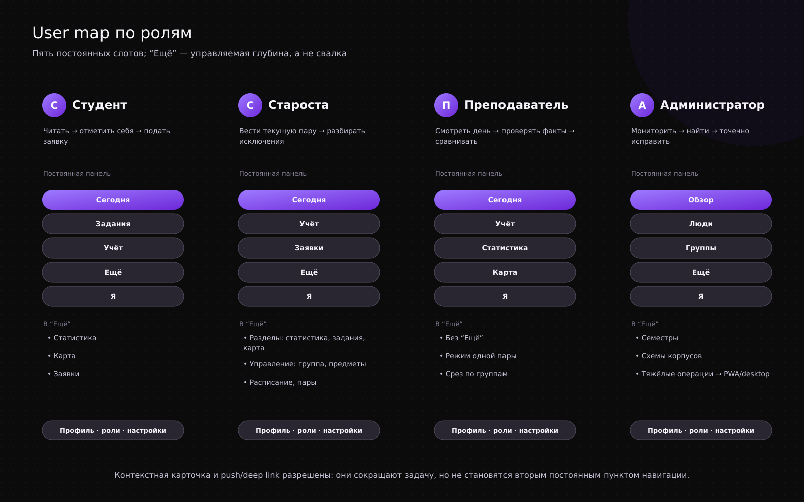
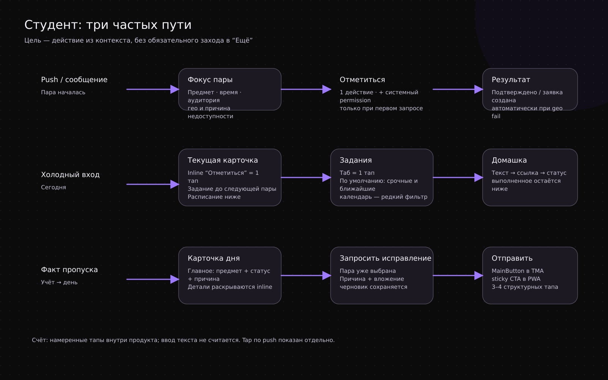
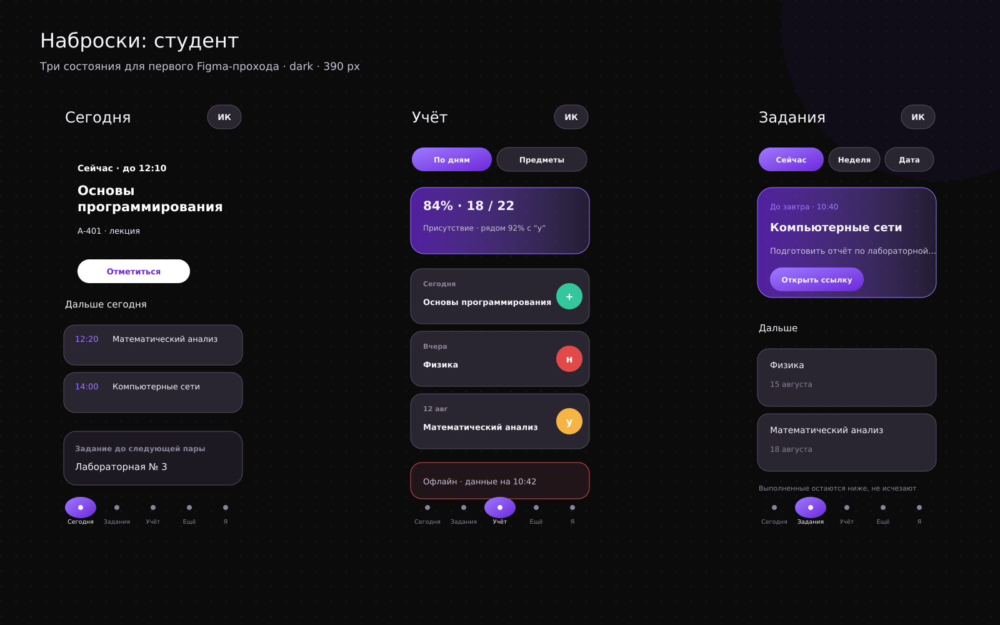
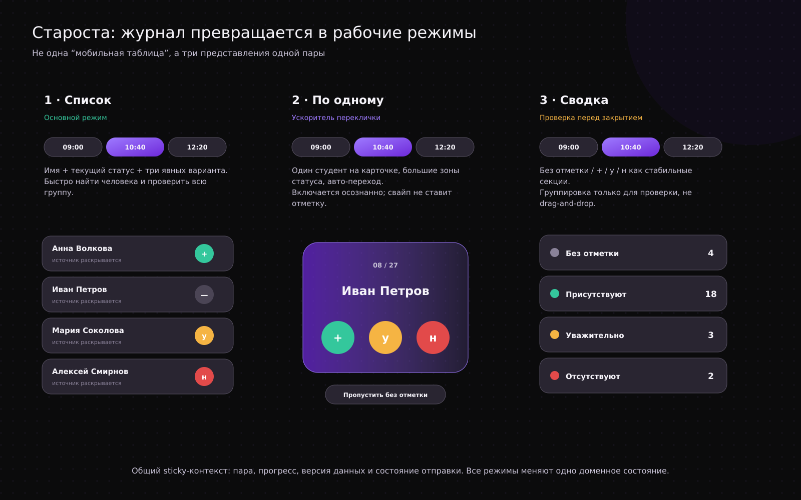
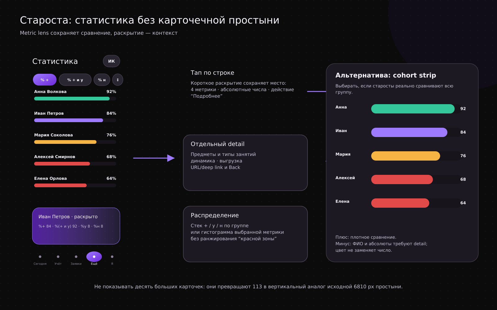
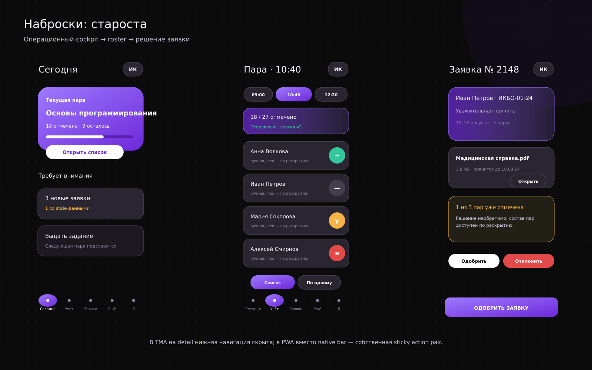
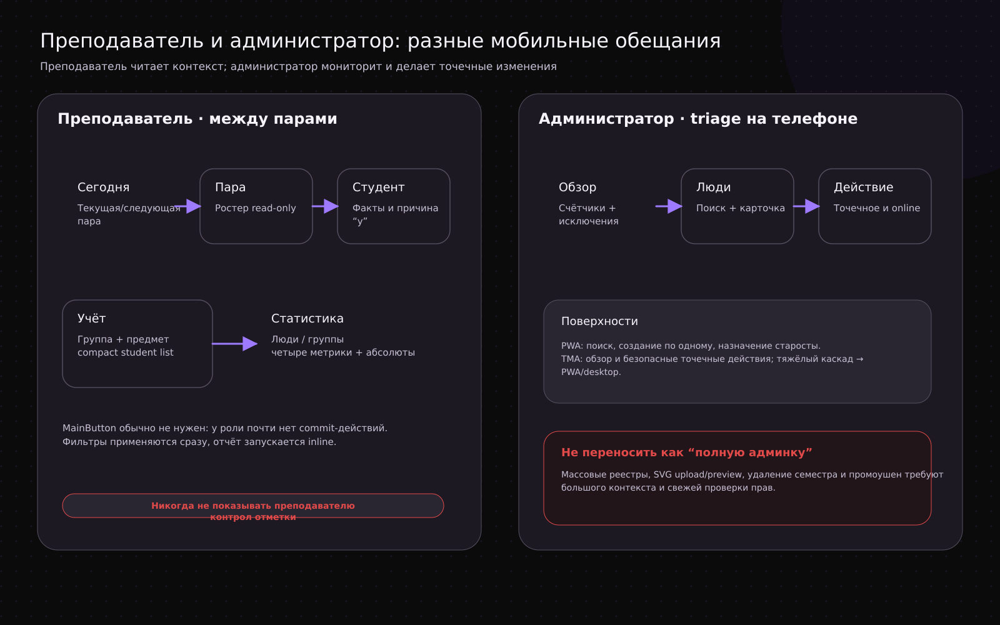
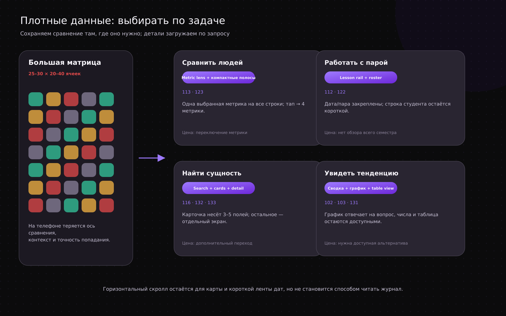
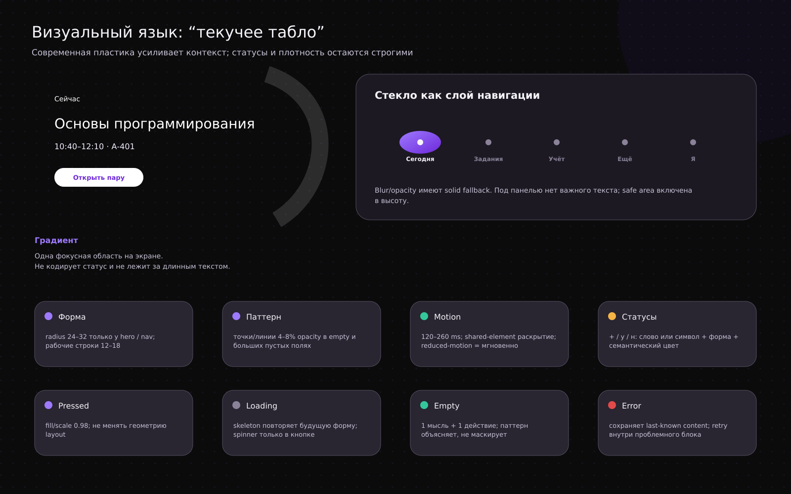

# RutCampusTrack mobile

## Рабочая инструкция для макетов PWA и Telegram Mini App

**Версия:** 1.0 · **срез исследования:** 28.08.2026 · **тема макетов:** dark first · **статус:** решение для проектирования, не готовая Figma-спецификация

Эта инструкция переводит существующий RutCampusTrack в два самостоятельных мобильных опыта. Она не предлагает ужать desktop 1920→300 и не правит существующий кит. Исполнитель в Figma должен собирать новые мобильные маршруты на общей доменной логике, сохраняя фиолетовую семантику бренда и проверяемые состояния.



---

## 0. Как пользоваться документом

### 0.1 Что здесь является решением

- **Решение** — можно сразу переносить в карту экранов и макеты.
- **Вариант** — нужно собрать два style/interaction probe и выбрать после проверки.
- **Запрос на токен** — не локальный hex/blur/radius, а изменение, которое надо внести в mobile extension дизайн-системы.
- **Вопрос владельцу** — не блокирует первую итерацию; до ответа действует указанное временное допущение.

### 0.2 Как маркируется доказательная база

| Метка | Основание | Как использовать |
|---|---|---|
| **A** | официальная документация платформы, design system, актуальный кит | нормативное ограничение или сильное правило |
| **B** | код/интерфейс живого продукта, практический кейс, доклад автора | переносить паттерн с учётом домена и ограничений |
| **C** | воспроизводимый issue с клиентом/устройством/сценарием | проектировать fallback и включать в QA, не считать частоту известной |
| **D** | Behance/Dribbble-концепт без продуктовых данных | только визуальный moodboard |
| **H** | гипотеза для RutCampusTrack | прототипировать и измерять, не выдавать за исследовательский факт |

### 0.3 Что было на входе

- полный kit RutCampusTrack: правила, журнал решений, figma-spec, токены и реестр компонентов;
- архив основного дизайна и более ранние сканы всех четырёх ролей;
- отдельные актуальные 1920 dark exports студента и старосты;
- отдельного текущего 1920 dark export преподавателя и администратора нет.

По преподавателю и администратору эта версия опирается на kit/spec и экранные материалы внутри design archive. Нужны свежие экспорты, чтобы перед финальным pixel pass проверить реальную визуальную иерархию, названия полей, высоты блоков и последние owner-corrections. Отсутствие кадров не блокирует IA и flow.

### 0.4 Что нельзя делать при сборке

- переносить desktop-матрицу на телефон через уменьшение шрифта или постоянный горизонтальный scroll;
- одновременно показывать собственный нижний dock, Telegram `MainButton` и ещё одну sticky CTA;
- использовать градиент или стекло как статус посещаемости;
- скрывать критическое действие только в swipe, long-press, app shortcut или push;
- считать `initDataUnsafe`, локальное хранилище или Telegram theme color источником роли/прав доступа;
- рисовать невыполнимую навигацию по карте, пока нет данных о помещениях и графе маршрутов;
- превращать мобильный админский опыт в уменьшенную enterprise-консоль.

---

## 1. Решение в одном развороте

1. **Один доменный core, две оболочки.** Названия сущностей, статусы, права, маршруты и содержимое карточек общие; Back, primary action, установка, offline, safe area, host chrome и storage различаются.
2. **Пять слотов сохраняются как стартовая гипотеза**, но только для верхнего уровня. В detail/editor/task mode нижний dock скрывается.
3. **«Один основной путь» уточняется:** у экрана один канонический маршрут и родитель, но несколько контекстных входов — Today, push, сообщение бота, ссылка. Иначе короткий мобильный сценарий искусственно удлиняется.
4. **Главная становится «Сегодня»** у студента, старосты и преподавателя; у администратора — «Обзор». Это старт действия, а не каталог разделов.
5. **Telegram `MainButton` — commit**, а не таб: «Сохранить посещаемость», «Отправить заявку», «Продолжить». На чтении и root-экранах он скрыт.
6. **PWA имеет собственный sticky/FAB action**, но только там, где есть один доминирующий commit. В обычной вкладке остаются browser Back и browser chrome; в standalone detail появляется собственный Back.
7. **Журнал старосты:** список + режим исключений — основной; «колода неотмеченных» — опциональный ускоритель; сводка перед commit — обязательна.
8. **Статистика:** Metric Lens → компактный список → карточка студента → период. Никакой шестиколоночной матрицы.
9. **Современный визуальный слой:** solid data surfaces + один fluid-акцент на экран + glass только для floating chrome + morph только у объекта, который раскрывается.
10. **Мобильный администратор:** наблюдение, поиск и безопасные точечные действия. Массовые и каскадно-разрушительные операции — PWA desktop/large screen.

### 1.1 Что оспаривается из прежнего решения

| Прежняя формула | Вердикт | Обоснованная замена |
|---|---|---|
| «Один дизайн, различия только MainButton/BackButton/высота» | **недостаточно** | минимум восемь adapter-зон: host chrome, navigation/back, primary actions, stable viewport + 2 safe areas, keyboard, theme, storage/offline, files/links/capability fallback |
| Пять слотов у всех ролей | **оставить как baseline** | форма панели общая; состав и порядок валидировать телеметрией отдельно для PWA/TMA; живой Doday уже использует разные compositions |
| Каждый экран достижим ровно одним путём | **уточнить** | один canonical owner в IA, но разрешить contextual deep links с entity/time context |
| Роль меняется в Profile и открывает новую Главную | **оставить** | при dirty draft сначала confirmation; после switch очистить history/role cache и открыть «Сегодня/Обзор» новой роли |
| У старосты в «Ещё» две группы | **оставить** | «Разделы» и «Управление» остаются явными секциями полноценного route, не ephemeral sheet |

---

## 2. Исследование: что подтверждено практикой

### 2.1 Навигация в Telegram Mini Apps

- **[A]** Telegram `BackButton` по умолчанию скрыт и только сообщает событие; историю обрабатывает приложение. В актуальных iOS/Android он занимает левый host-slot вместо Close. Следствие: на root скрыт, на detail/editor показан; собственной второй стрелки нет. [Telegram BackButton](https://core.telegram.org/bots/webapps#backbutton)
- **[A]** `SettingsButton` — пункт контекстного меню, а не постоянная шестерёнка в шапке. Для v1 не использовать: настройки и смена роли уже принадлежат Profile. [Telegram SettingsButton](https://core.telegram.org/bots/webapps#settingsbutton)
- **[A]** `MainButton` и `SecondaryButton` — нативные bottom actions с disabled/progress/shine, а не навигация. [Telegram BottomButton](https://core.telegram.org/bots/webapps#bottombutton)
- **[B]** TelegramUI, Doday и Bedolaga показывают жизнеспособный custom bottom nav на верхнем уровне. Doday сохраняет пять slots, но меняет их состав между PWA и TMA. [TelegramUI](https://github.com/telegram-mini-apps-dev/TelegramUI), [Doday PWA/TMA](https://github.com/SwairIt/doday), [Bedolaga](https://github.com/BEDOLAGA-DEV/bedolaga-cabinet)
- **[B]** TeleOTP и `my-saved-answers` показывают правильный lifecycle host action: show только в контексте, disabled до валидности, progress при commit, cleanup при route change. [TeleOTP](https://github.com/UselessStudio/TeleOTP), [my-saved-answers](https://github.com/vkruglikov/my-saved-answers)
- **[B]** Выпущенный MemoCard убрал swipe-only оценку после конфликта жеста с Telegram и оставил две видимые кнопки. Критические статусы RutCampusTrack также не зависят от свайпа. [MemoCard](https://github.com/kubk/memo-card), [разбор автора](https://teletype.in/@alteregor/memocard-telegram-contest-win)
- **[B]** OK, Bob! держит быстрые задачи в Mini App, а тяжёлую отчётность выносит в browser. Это практическая опора для ограничения мобильного администратора. [OK, Bob!](https://okbob.app/)
- **[C]** Production issues с dead/looping Back подтверждают: singleton host button должен иметь одного shell-controller и semantic fallback для deep link. [Bedolaga #436](https://github.com/BEDOLAGA-DEV/bedolaga-cabinet/issues/436), [#545](https://github.com/BEDOLAGA-DEV/bedolaga-cabinet/issues/545)

**Вывод для макетов:** root = собственный dock, host Back/Main скрыты. Task leaf = dock скрыт, host Back + Main/Secondary. Никакого третьего нижнего слоя.

### 2.2 Compact, fullscreen, safe area и клавиатура

- **[A]** `expand()` раскрывает sheet до максимальной доступной высоты; это не fullscreen. `requestFullscreen()` — отдельное enhancement с success/failure events. Обязательный flow работает без fullscreen. [Telegram Mini Apps API](https://core.telegram.org/bots/webapps)
- **[A]** fixed/sticky элементы считаются от `viewportStableHeight`, а не от часто меняющегося `viewportHeight`. В fullscreen нужно учитывать и `safeAreaInset`, и `contentSafeAreaInset`.
- **[C]** На iOS зафиксированы перекрытия inputs, отсутствие удобного dismiss, прыжки bottom menu и редкое схлопывание stable viewport до 1 px после сторонней клавиатуры. Это не доказывает частоту, но требует отдельного keyboard state и recovery. [Telegram-iOS #1410](https://github.com/TelegramMessenger/Telegram-iOS/issues/1410), [#1385](https://github.com/TelegramMessenger/Telegram-iOS/issues/1385), [#2235](https://github.com/TelegramMessenger/Telegram-iOS/issues/2235)
- **[C]** `requestFullscreen()` может быть проигнорирован отдельным клиентом/entry point; интерфейс нельзя ставить в зависимость от него. [Telegram-iOS #2241](https://github.com/TelegramMessenger/Telegram-iOS/issues/2241)
- **[B]** Bedolaga скрывает tabbar при focus и сбрасывает это состояние при route change; Notepher отдельно следит за `visualViewport`. Это рабочие реализации, не просто советы.

**Контракт keyboard state:** скрыть dock; прокрутить активное поле в content safe area; показать «Готово»; сохранить draft до рискованного resize; после blur/back пересчитать insets; при недопустимой высоте удержать последний stable layout и дать recovery.

### 2.3 PWA на практике

- **[A]** PWA обязан быть полноценным в обычной вкладке. `beforeinstallprompt` не Baseline и отсутствует на iOS; установка — enhancement. [MDN: installable PWA](https://developer.mozilla.org/en-US/docs/Web/Progressive_web_apps/Guides/Making_PWAs_installable)
- **[A]** В iOS/iPadOS 26 любой сайт, добавленный на Home Screen, по умолчанию открывается как web app, но пользователь может выключить Open as Web App. Manifest всё равно нужен для identity/scope/icons/display. [WebKit Safari 26](https://webkit.org/blog/17333/webkit-features-in-safari-26-0/)
- **[A]** Web Push на iPhone/iPad доступен только Home Screen web app и только после user gesture + permission. На других платформах поддержка и permission различаются. [WebKit Web Push](https://webkit.org/blog/13878/web-push-for-web-apps-on-ios-and-ipados/)
- **[A]** Service Worker может завершиться; Background Sync не кроссбраузерен. «Синхронизировано» показывается только после server ACK, а не после записи в local outbox. [MDN Service Worker](https://developer.mozilla.org/en-US/docs/Web/API/Service_Worker_API), [MDN Background Sync](https://developer.mozilla.org/en-US/docs/Web/API/Background_Synchronization_API)
- **[C]** Старый клиент после deploy может запросить удалённый lazy chunk и получить blank page. Нужны versioned assets и recovery для update. [Vite #11804](https://github.com/vitejs/vite/issues/11804)

**Вывод:** offline PWA = последнее известное чтение + явный draft/outbox. Массовые административные операции, авторизация, смена роли и окончательный commit требуют сети.

### 2.4 Плотные данные

- **[A]** IBM Carbon рекомендует expansion только для вспомогательного содержимого; если раскрытию тесно, сущность уходит на отдельный экран. Touch-actions должны быть видимы, lazy detail — skeleton. [Carbon Data Table](https://carbondesignsystem.com/components/data-table/usage/)
- **[B]** Doday превращает календарь в day chips → один день → вертикальный список, а heatmap оставляет сводкой. Это прямой живой аналог продукта.
- **[B]** Практика mobile tables сводится к task-specific projection: пользователь видит не всю строку БД, а поля, нужные для решения сейчас. [UXmatters: Mobile Tables](https://www.uxmatters.com/mt/archives/2020/07/designing-mobile-tables.php)
- **[H]** Для RutCampusTrack самые сильные дополнения к уже принятому «пара → студенты»: режим исключений, focus-deck, Metric Lens, status-beads, schedule ridge и bento→filtered queue. Их надо тестировать на реальной группе 25–30 человек.

### 2.5 Современный визуальный язык

- **[A]** Исследование Material 3 Expressive связывает более быстрое нахождение ключевых элементов с управляемыми размером, формой, цветом и placement; цифру эффекта нельзя переносить на RutCampusTrack без теста. [Google Expressive Design research](https://design.google/library/expressive-material-design-google-research)
- **[A]** Apple применяет Liquid Glass прежде всего как navigation/control layer. Web/TMA-имитация должна иметь solid fallback и не становится подложкой для плотного текста. [WWDC25: Meet Liquid Glass](https://developer.apple.com/videos/play/wwdc2025/219/)
- **[A]** Material shape morph полезен для связи «карточка → detail», но не для постоянного движения всего экрана. [Material 3 Shape Morph](https://m3.material.io/styles/shape/shape-morph)
- **[D]** Behance/Dribbble подтверждают актуальность deep purple, rounded layers, gradient edge и glass dock только как moodboard. Красивый shot без keyboard/error/30 строк не является UX-доказательством.

**Решение:** solid data surfaces + один выразительный fluid-object на экран + glass only chrome + морфинг только раскрываемого объекта.

---

## 3. Техническое различие поверхностей

### 3.1 Матрица возможностей

| Зона | PWA | Telegram Mini App | Правило для дизайна |
|---|---|---|---|
| Внешняя оболочка | browser chrome или standalone без URL bar | нативная Telegram-шапка с Close/Back/menu | не дублировать host-контролы; сделать browser и standalone state |
| Back | browser/OS history; в standalone свой control | `BackButton`, историю держит app | один semantic parent и deep-link fallback |
| Primary action | собственный sticky/FAB/inline | `MainButton`, при необходимости `SecondaryButton` | одна команда, разные физические носители |
| Высота | `dvh`, browser toolbar, safe-area CSS | compact/expanded/fullscreen, stable viewport | критический первый блок помещается в compact |
| Safe area | `env(safe-area-inset-*)` | device + Telegram content safe areas | platform adapter возвращает итоговый inset |
| Тема | продуктовая theme + `prefers-color-scheme` | `themeParams` и `themeChanged` | hybrid mapping; статусные токены остаются продуктовые |
| Offline/cache | Service Worker, Cache API, IndexedDB | не считать эквивалентом PWA; storage API неоднородны | общий draft model, разные adapters и гарантии |
| Storage | IndexedDB/Cache; quota/eviction | CloudStorage 1024 keys; DeviceStorage 5 MB; SecureStorage 10 items и не везде | только prefs в CloudStorage; server = источник истины |
| Auth | web session/SSO | server validation raw `initData` + account link | роль только с backend |
| Push | Web Push + OS/browser permission | сообщения бота/Telegram delivery | общая taxonomy и deep links, разные permission/settings |
| Файлы | `<input type=file>`, browser download/share | `downloadFile` с native confirmation, `openLink`, client fallbacks | сообщать «загрузка началась», не «файл сохранён» |
| Haptics | Vibration API не единый контракт | `HapticFeedback`, эффект не гарантирован | только дополнительный feedback |
| Fullscreen | обычно не нужен в standalone | `requestFullscreen()` progressive enhancement | только карта/focus mode, никогда обязательный путь |

### 3.2 Минимум восемь platform adapters

```text
AppCore
  routes · permissions · entities · drafts · submit · status vocabulary

SurfaceAdapter
  hostChrome       Back / Close / browser chrome
  primaryAction    own CTA / Telegram BottomButton
  viewport         dvh / stableHeight / compact / fullscreen
  safeArea         CSS env / safeArea + contentSafeArea
  keyboard         visualViewport / Telegram recovery
  theme            product scheme / Telegram mapping
  storageOffline   SW+IDB / Telegram storage capabilities
  filesLinks       browser APIs / Telegram APIs + fallbacks
```

### 3.3 TMA capability policy

1. Проверить `isVersionAtLeast()` как первый фильтр.
2. Проверить platform/capability, если доступно.
3. Обработать callback/event failure и `UNSUPPORTED`.
4. На той же поверхности дать inline/web fallback.
5. Никогда не связывать доступ к критической операции только с fullscreen, haptic, SecureStorage, story share или host button.

Актуальный Bot API на дату среза — **10.3 от 24.08.2026**. С 10.2 Telegram отклоняет method calls, если текущий origin отличается от исходного domain Mini App; redirect на другой origin нельзя использовать как незаметную архитектурную деталь. [Telegram Mini Apps changelog](https://core.telegram.org/bots/webapps#recent-changes)

### 3.4 TMA theme: смешанная модель

- Telegram задаёт начальную light/dark схему и цвета окружающей header/bottom bar.
- Семантические product surfaces мапятся на closest Telegram params с проверенным fallback.
- Фиолетовый action/selection и attendance/status семантика остаются RutCampusTrack.
- На `themeChanged` и resume набор токенов меняется атомарно, а не по одному цвету.
- Если пользователь выбрал тему внутри Profile, она может иметь приоритет; host chrome всё равно синхронизируется.
- Неполный/неконтрастный theme param не используется напрямую: берётся product fallback.

### 3.5 Storage и авторизация TMA

- Backend валидирует **raw `initData`**, проверяет HMAC/Ed25519-правила и свежесть `auth_date`; `initDataUnsafe` не доверяется. [Telegram validation](https://core.telegram.org/bots/webapps#validating-data-received-via-the-mini-app)
- Telegram `user.id` связывается с внутренним аккаунтом через подтверждённый one-time flow; `start_param` и storage не назначают роль.
- После link backend выдаёт собственную короткую сессию. Роль и разрешения server-authoritative.
- CloudStorage: фильтры, последняя вкладка, компактный UI preference. Не: токены, роли, журнал, медицинские/личные вложения.
- Device/SecureStorage — enhancement; Desktop/Web могут вернуть `UNSUPPORTED`.

### 3.6 PWA install/offline/update

- `display: standalone`; `fullscreen` не нужен.
- Install CTA показывать только после value moment и реальной availability. На iOS — короткая инструкция Share → Add to Home Screen.
- Browser mode и standalone проектировать как два состояния одного route.
- Offline badge содержит timestamp «Данные на 10:42»; stale data визуально не притворяется live.
- Outbox показывает три разных состояния: «черновик на устройстве», «ожидает отправки», «подтверждено сервером».
- Update ready: не перезагружать посреди журнала; сначала сохранить/синхронизировать draft, затем предложить обновление.

---

## 4. Навигационная система


### 4.1 Общая модель route

| Тип route | Нижняя навигация | Back | Primary action |
|---|---|---|---|
| `root` | видна | скрыт | обычно скрыт |
| `overview` | видна | если пришли из другого root — нет; фильтр хранится в URL/state | только inline фильтры |
| `detail` | скрыта | показан | только если есть действие с сущностью |
| `editor/task` | скрыта | показан; dirty-state guard | один sticky/MainButton, Secondary только при реальной второй команде |
| `modal/confirm` | нижняя nav недоступна | закрывает modal | destructive confirm, не веселая анимация |

**Canonical route:** сущность имеет один URL и одного родителя. Push/Today/bot message передают entity id, role, version и expected parent. Если local history пуст, Back идёт к canonical parent, а не вызывает слепой `history.back()`.

### 4.2 Рекомендуемые слоты

| Роль | Slot 1 | Slot 2 | Slot 3 | Slot 4 | Slot 5 | Содержимое «Ещё» |
|---|---|---|---|---|---|---|
| Студент | Сегодня | Задания | Посещаемость | Ещё | Профиль | Статистика, Карта, Заявки и тикеты |
| Староста | Сегодня | Учёт | Заявки | Ещё | Профиль | **Разделы:** Статистика, Домашнее задание, Карта. **Управление:** Группа, Предметы, Конструктор расписания, Управление парами |
| Преподаватель | Сегодня | Посещаемость | Статистика | Карта | Профиль | не нужен |
| Администратор | Обзор | Пользователи | Группы | Ещё | Профиль | Семестры, Карта |

Это стартовая гипотеза. Не различать PWA/TMA composition до telemetry. Пересмотр допускается, если минимум 2–4 недели данных показывают устойчивое различие частоты/времени завершения, а не единичные переходы.

### 4.3 Поведение «Ещё»

- полноценный root route, а не bottom sheet: его можно deep-link, восстановить после reload и прочитать при изменении viewport;
- две секции старосты сохраняются визуально и семантически;
- поиск по 7 редким пунктам не нужен в v1;
- «закрепить в табы» — будущий вариант после telemetry, не пользовательская настройка по умолчанию;
- badge показывается у конкретного пункта и агрегированно на tab «Ещё», но не дублирует каждое число.

### 4.4 Смена роли

`Профиль → Сменить роль → роль → Сегодня/Обзор новой роли`.

- 3 intentional taps от любого root.
- Если нет dirty-state — без дополнительного confirm.
- Если есть несинхронизированный журнал/форма — confirm: остаться / сохранить черновик и сменить / отменить изменения и сменить.
- После switch сбросить history stack, entity cache и notification context предыдущей роли; общие пользовательские settings сохранить.

---

## 5. Карта ролей и частых переходов



| Роль | Момент открытия | Ограничение времени/контекста | Первый вопрос | Что всегда рядом | Что глубже |
|---|---|---|---|---|---|
| Студент | метро, коридор до пары, во время объявления, вечером | 10–60 секунд, одна рука, плохая сеть | что сейчас/дальше и что надо сделать | текущая пара, задания, свой статус/изменения | долгий анализ статистики, профиль, история тикетов |
| Староста | начало/конец пары, перемена, после изменения расписания | 30 секунд на старт, затем серия быстрых отметок | какую пару веду и кто не отмечен | текущая пара, progress, unsynced state, заявки | предметы, состав группы, редкие конструкторы |
| Преподаватель | между парами, перед аудиторией, после занятия | 15–90 секунд, часто read-only | следующая группа и состояние учёта | расписание дня, текущая группа, исключения | тренды за семестр, карта |
| Администратор | при уведомлении, вне рабочего места, быстрый контроль | точечное решение, высокий риск ошибки | что требует реакции и можно ли безопасно решить с телефона | инциденты, поиск пользователя/группы, permission state | каскадные/массовые изменения, импорт, SVG map management |

---

## 6. Студент

### 6.1 Принцип роли

Студент читает чаще, чем меняет. Главный экран должен за 2–3 секунды ответить: **«что сейчас, что следующим и что от меня требуется»**. Современный fluid hero уместен именно здесь; ниже — спокойная лента.

### 6.2 Сценарии, ранжирование и tap budget

| № | Сценарий | Entry | Flow | Тапы | Цель |
|---:|---|---|---|---:|---|
| 1 | посмотреть текущую/следующую пару | app icon/menu | Сегодня → hero/лента | 0–1 | факт виден без навигации |
| 2 | открыть домашнее задание в метро | root | Задания → карточка | 1–2 | текст и attachment доступны сразу |
| 3 | отметиться на текущей паре | Сегодня или deep link | hero «Отметиться» → confirmation/commit | 1 cold / 2 из уведомления | без входа в меню |
| 4 | понять пропуск и подать подтверждение | Посещаемость | день/предмет → absence → заявка → отправить | 3–4 | причина/срок/attachment не теряются |
| 5 | посмотреть статистику | root | Ещё → Статистика → Metric Lens/detail | 2–4 | редкий путь не занимает tab |

Внешний tap по push/bot message учитывается отдельно как entry action; ввод текста не считается tap, но отмечается в flow.



### 6.3 Экран «Сегодня»

Порядок сверху вниз:

1. compact header: дата, аватар/роль без дублирования слова «Студент» в каждом блоке;
2. fluid hero текущей пары; если пары нет — следующая;
3. одно действие: «Отметиться», «Открыть аудиторию» или «Посмотреть задание» — никогда три равноценных CTA;
4. day ridge: past / now / future как вертикальная последовательность;
5. блок «Требует внимания»: просроченная домашка, изменение пары, ответ по тикету;
6. timestamp stale/offline при необходимости.

Hero закреплён только пока пользователь просматривает его содержимое; после прохождения конца блока компактный context chip «Сейчас · 12:20 · А-401» может появиться сбоку/сверху и уйти после конца расписания. Постоянная подпись «Текущая пара» ниже уже не нужна.

### 6.4 Посещаемость студента

Два режима одного root:

- **По дням:** 7/14 status-beads → tap дня → список пар этого дня;
- **По предметам:** compact cards с `посещено/всего`, пропусками и трендом; tap → предмет/период.

Absence-card содержит дату, предмет, статус словом+иконкой, последнюю серверную отметку и прямое действие «Подать подтверждение». Никакой месячной матрицы.

### 6.5 Домашнее задание

- default «Сейчас»: сегодня, завтра, просрочено;
- day rail — короткий горизонтальный rail, но выбранный день также доступен через date picker;
- карточка отвечает на один вопрос: предмет, deadline, первые 2–3 строки задания, наличие attachment/status;
- tap morph → detail; длинный текст не раскрывается в бесконечной ленте списка;
- выполненное уходит вниз/в фильтр, но не исчезает сразу после отметки;
- offline: текст и уже загруженные attachments; ссылка явно показывает unavailable/offline.

### 6.6 Что не нужно на телефоне

- desktop-графики с несколькими рядами и таблица «по предметам» в одном viewport;
- постоянный месячный календарь рядом со списком домашки;
- расширенный список account sessions на главной Profile; оставить отдельным detail;
- притворная indoor navigation на карте без данных маршрута.

### 6.7 Быстрое действие

- **TMA:** `MainButton` только на leaf «Подтвердить отметку»/«Отправить заявку»; на Today inline hero CTA.
- **PWA:** inline hero CTA; на форме заявки sticky action над safe area. Не нужен постоянный FAB на чтении.

### 6.8 Макетные наброски



---

## 7. Староста — основной тяжёлый кейс

### 7.1 Принцип роли

Староста работает в два темпа: **быстрый burst на паре** и **редкое управление структурой**. Интерфейс не должен заставлять его проходить десять разделов как равноправное меню. Today и Учёт обслуживают burst; «Ещё» хранит две группы редких маршрутов.

### 7.2 Сценарии, ранжирование и tap budget

| № | Сценарий | Entry | Flow | Тапы | Цель |
|---:|---|---|---|---:|---|
| 1 | открыть текущую пару и отметить группу | Today/notification | current lesson → roster → N status changes → review/commit | 1 + N; notification 1 + N | один вход, без меню |
| 2 | закончить только неотмеченных | внутри roster | «Осталось 6» → focus deck/buttons → review | 1 + N + 1 | ускоритель, не замена overview |
| 3 | решить заявку/тикет | tab или notification | queue/detail → approve/reject → confirm | approve 2–3; reject 3–4 | stale check до необратимого действия |
| 4 | выдать домашнее задание | Today quick action | next suitable lesson → editor → publish | 2 + ввод; через Ещё 4 | default уже выбран по контексту |
| 5 | перенести пару | Today/Ещё | source summary → target day/slot → conflict preview → confirm | 5 из Today; ~7 из Ещё | редкий wizard, не таблица |

### 7.3 Сегодня старосты

1. current lesson fluid card: предмет, время, аудитория, progress `21/27`, sync indicator;
2. главный CTA «Открыть журнал»;
3. bento исключений: `6 без статуса`, `2 заявки`, `1 конфликт` — каждая плитка открывает уже отфильтрованный route;
4. next lesson + quick action «Задать домашнее»;
5. day ridge и служебные изменения.

Не показывать на Today мини-версии всех десяти разделов. Bento существует только для actionable queues.

### 7.4 Журнал пары: три режима одного состояния



#### Режим A — Список

- sticky lesson rail: пара, дата/время, revision, sync;
- summary `отмечено / без статуса / отсутствуют`;
- chips `Все · Без статуса · Отсутствуют · Заявки`;
- compact person row: ФИО, короткий id/подгруппа, текущий статус;
- tap раскрывает одну action-card с 3 status controls, причиной, last changed;
- раскрыта только одна строка; если контента больше 5–6 полей — отдельный detail.

#### Режим B — Исключения

Вариант для большинства обычных пар:

1. действие «Предварительно: все присутствуют»;
2. пользователь отмечает только исключения;
3. review показывает число массово выставленных и каждое исключение;
4. commit с undo window/историей.

**Цена:** высокий риск слепой отметки. Нужны явный preview, запрет commit при изменившемся составе/revision и отдельное решение владельца о допустимости массовой операции.

#### Режим C — Колода неотмеченных

- одна большая карточка студента, счётчик `4 из 6`;
- три видимые кнопки статуса; swipe — только ускоритель с тем же результатом;
- после выбора auto-next; undo всегда рядом;
- tap имени открывает деталь/комментарий;
- завершение возвращает в summary, не выполняет silent commit.

Это опциональный focus mode. Он не заменяет список и не должен быть единственным способом работы.

#### Review/commit

- группы: «без статуса», «присутствуют», «уважительная», «нет»;
- изменения с момента последнего server version выделены, но не зависят только от цвета;
- TMA: если строки только локально изменены — `MainButton = Сохранить посещаемость`; если каждое изменение уже server-autosaved — `Завершить журнал`; progress блокирует повторный commit;
- PWA: sticky action + явный outbox state;
- server ACK → «Синхронизировано 12:47»; local save никогда не называется синхронизацией.

### 7.5 Статистика старосты



1. **Metric Lens:** один выбранный показатель — посещаемость, успеваемость, пропуски, динамика;
2. selector метрики закрепляется после прокрутки hero, затем уходит в detail;
3. список сортируется по метрике и показывает число + одинаковую compact bar;
4. tap студента раскрывает 2–3 secondary metrics и status-beads;
5. full leaf показывает период/предмет и доступную таблицу чисел.

Вариант B — **cohort strip**: студенты сгруппированы `требует внимания / стабильно / данных мало`; пригоден для обзора, но не для точного ранжирования. Вариант C — small multiples; только с общей шкалой и числом.

### 7.6 Управленческие разделы

| Раздел | Мобильная единица | Root → leaf | Что убрать |
|---|---|---|---|
| Группа | student card | поиск/filter → student detail → точечное действие | wide registry и одновременное редактирование многих полей |
| Предметы | subject card | предмет → типы занятий/преподаватели → step editor | длинная форма на одной странице |
| Конструктор расписания | день + vertical slots | parity switch → день → slot → editor | недельная сетка и drag по маленьким ячейкам |
| Управление парами | agenda item | пара → detail; перенос = wizard | таблица всех пар и сложный inline modal |
| Домашнее задание | next suitable lesson | lesson → editor → publish | календарь и редактор рядом |
| Заявки | queue item | queue/filter → decision detail | desktop rows с несколькими action columns |

### 7.7 Wizard переноса пары

`Источник закреплён → выбрать день → выбрать свободный слот → conflict preview → подтвердить`.

- source summary остаётся видимым на каждом шаге;
- конфликт содержит причину и доступные альтернативы;
- Back возвращает на предыдущий шаг, не теряя source;
- TMA MainButton меняется `Продолжить → Проверить → Перенести`;
- destructive/irreversible финал имеет confirm и fresh permission check.

### 7.8 Что не нужно на телефоне

- 1824×1120 журнал-матрица в любом масштабе;
- одновременно несколько статистических колонок на 27 студентов;
- массовая перестройка всей недели drag-and-drop;
- редактирование справочника и списка в одном split-view;
- экспорт как единственный способ «посмотреть всё»; export — background job, не мобильный просмотр.

### 7.9 Макетные наброски



---

## 8. Преподаватель

### 8.1 Основание и допущение

Текущий отдельный live 1920 export не предоставлен. IA опирается на kit/spec: Главная, Посещаемость, Статистика, Карта. По роли чтение преобладает; управление статусами старосты не переносится преподавателю без изменения прав.

### 8.2 Сценарии и tap budget

| № | Сценарий | Flow | Тапы | Решение |
|---:|---|---|---:|---|
| 1 | увидеть следующую пару между занятиями | Сегодня → hero/day ridge | 0–1 | first viewport отвечает сразу |
| 2 | открыть состав/состояние текущей группы | Today → lesson roster | 1 | read-only compact rows |
| 3 | найти посещаемость студента/даты | Посещаемость → filter/lesson → student detail | 2–4 | list, не матрица |
| 4 | сравнить статистику группы | Статистика → Metric Lens → filter/detail | 2–5 | одна метрика за раз |
| 5 | найти аудиторию | Карта → корпус/этаж → room | 2–3 | только если room directory подтверждён |

### 8.3 Сегодня преподавателя

- fluid hero ближайшей пары;
- day ridge;
- exception cards: неотмеченная пара, изменение аудитории, требующая внимания группа;
- tap hero → read-only roster, current attendance summary, домашнее задание;
- никаких status controls, если права только read.

### 8.4 Посещаемость и статистика

- переключатель «Пары / Студенты»;
- lesson card → roster summary → student detail;
- Metric Lens и cohort strip как у старосты, но без edit/batch controls;
- дата/предмет фильтруют server query, не прячут уже загруженную гигантскую матрицу;
- chart всегда имеет число, шкалу и data view.

### 8.5 Быстрые действия и запреты

- TMA MainButton обычно скрыт: роль преимущественно read-only.
- PWA FAB не нужен; inline действия «Открыть группу», «Показать на карте».
- Не переносить управление расписанием/парами старосты по сходству экранов.
- Не делать сложный export в mobile primary flow.

---

## 9. Администратор

### 9.1 Основание и граница мобильной роли

Текущий отдельный live 1920 export не предоставлен; использованы kit/spec и reference frames. Телефон администратора — **операционный обзор, поиск, подтверждённые точечные действия**. Это не место для каскадных семестровых операций, массового импорта и SVG floor-plan authoring.

### 9.2 Сценарии и tap budget

| № | Сценарий | Flow | Тапы | Surface |
|---:|---|---|---:|---|
| 1 | понять, что требует реакции | Обзор → actionable bento/queue | 0–1 | обе |
| 2 | найти пользователя и проверить статус | Пользователи → поиск → card/detail | 2–3 + ввод | обе |
| 3 | открыть группу/назначить старосту | Группы → group → участник/role → confirm | ~5 | PWA preferred; TMA по feature flag |
| 4 | создать одного пользователя | Пользователи → создать → step form → confirm | ~5 + ввод | PWA; TMA вариант |
| 5 | изменить семестр | Ещё → Семестры → detail → action → confirm | ~5 | PWA large/desktop recommended |



### 9.3 Обзор

- bento только actionable: черновики групп, конфликтующие роли, непринятые изменения, ошибки карты;
- каждая плитка открывает filtered queue и показывает, какой фильтр применён;
- recent activity — короткая feed, а не audit table;
- опасное действие не доступно из bento одним tap.

### 9.4 Реестры

- server search прежде полного списка;
- structured card: главное поле, роль/группа/status, один overflow;
- tap → detail; inline expansion только для 2–3 read-only полей;
- server cursor/page для больших наборов; scroll position восстанавливается;
- batch mode появляется после explicit select, не long-press-only;
- TMA batch dock заменяет custom nav/host button по одному shell rule.

### 9.5 Что не нужно на телефоне

- каскадное удаление/продвижение семестра;
- массовый import/column mapping;
- загрузка, разметка и preview большого SVG floor plan;
- одновременное редактирование реестра и detail panel;
- destructive действие без fresh permission/state check.

Вместо серой disabled-кнопки дать handoff card: «Откройте PWA на большом экране — операция меняет N групп», с QR/deep link при уместности.

### 9.6 TMA против PWA

- TMA v1: overview, search, read detail, safe approvals/rejections при подтверждённой идемпотентности.
- PWA mobile: может добавить создание одной сущности и назначение роли.
- PWA large/desktop: imports, bulk, cascade, map authoring.

---

## 10. User map и screen ownership

| Canonical screen | Владелец в nav | Контекстные входы | Semantic parent |
|---|---|---|---|
| Текущая пара студента | Сегодня | push, bot message | Сегодня |
| Задание detail | Задания | Today, push | Задания с сохранённым фильтром |
| Отсутствие/заявка | Посещаемость | Today alert, notification | Посещаемость, выбранная дата |
| Журнал пары старосты | Учёт | Today, notification | список/день Учёта |
| Ticket decision | Заявки | Today bento, bot message | очередь с сохранённым filter |
| Student stats | Статистика в Ещё | Today exception, search | Metric Lens list |
| Lesson transfer | Управление парами в Ещё | Today lesson overflow | agenda/day |
| Teacher roster | Сегодня/Посещаемость | schedule notification | выбранный lesson/day |
| Admin user detail | Пользователи | alert, group member | search result/list |
| Admin group detail | Группы | Обзор alert | group list |

Так сохраняется один владелец в IA и одновременно сокращаются частые задачи.

---

## 11. Плотные данные без матрицы



### 11.1 Выбор представления по вопросу пользователя

| Вопрос | Первое представление | Следующий уровень | Не использовать |
|---|---|---|---|
| «Кто ещё не отмечен на этой паре?» | summary + filtered roster | person action-card/focus deck | матрица группы × даты |
| «У кого худшая динамика?» | Metric Lens + sorted compact bars | student card + period | 6 метрик в строке |
| «Что происходило в этом месяце?» | heatmap/status-beads как overview | выбранный день/неделя | heatmap как editor |
| «Что случилось с этим студентом?» | student card | chronological events + exact values | график без данных |
| «Какую пару перенести?» | day ridge/agenda | source → target wizard | недельный drag grid |
| «Кого найти в реестре?» | search + filter summary | entity card/detail | загрузить весь реестр |
| «Что требует решения?» | actionable bento | filtered queue | декоративные KPI без маршрута |

### 11.2 Паттерны, привязка и цена

| Паттерн | Где применять | Выигрыш | Цена/условие |
|---|---|---|---|
| **Summary → filter** | журнал, admin overview, tickets | первый экран объясняет объём и превращает KPI в путь | число обязано соответствовать открываемому filter |
| **Режим исключений** | староста, текущая пара | десятки обычных отметок превращаются в несколько исключений | preview, undo, server revision, owner approval |
| **Focus deck** | оставшиеся студенты | one-hand speed и нулевая матрица | кнопки дублируют swipe; overview доступен одним tap |
| **Metric Lens** | статистика старосты/преподавателя | одно сравнение читается чисто | теряется одновременный cross-metric scan; нужен selector/reset |
| **Status-beads 7/14** | история студента | тренд без широкой таблицы | symbol/text + scale switch после 14 дней |
| **Attendance Ribbon 6–10** | карточка студента/предмета | последние занятия видны как короткая временная лента | более длинный период открывается отдельно |
| **Small multiples** | список статистики | видны выбросы/тренд | единая шкала, точное число и data alternative |
| **Compare Tray ≤3** | статистика | осознанное сравнение выбранных людей | жёсткий лимит 3; одинаковые small multiples |
| **Dual-axis Pivot** | статистика | быстро сменить субъект `Люди / Пары / Предметы` | каждый pivot сохраняет свой filter и metric |
| **Heatmap → focus strip** | месяц посещаемости | overview и drill-down рядом | только read/filter; не массовое редактирование |
| **Inline morph** | тикет, user, group, subject | сохраняет контекст | одно раскрытие; >6 полей уходит в leaf |
| **Schedule ridge** | Today, пары, перенос | прошлое/сейчас/будущее читается как поток | bulk week editing остаётся desktop |
| **Batch dock** | admin/headman multi-select | действия появляются только после выбора | explicit checkbox; в TMA заменяет, а не дублирует host action |
| **Cursor/page** | пользователи, группы, тикеты | контролируемая память и длина | сохранить filter/scroll; не пагинировать roster 25–30 |

### 11.3 Когда допустим горизонтальный scroll

Допустим только для короткой обозримой оси, где положение понятно без frozen labels:

- day rail 7–14 дней;
- selector одной метрики;
- mini timeline;
- панорама floor map с явными zoom controls.

Недопустим как основной способ читать journal, registry или multi-metric statistics. Если без первой колонки пользователь теряет субъект, представление уже выбрано неверно.

### 11.4 Sticky-элементы

- lesson context закреплён в пределах roster и уходит после его конца;
- metric selector закреплён в пределах списка;
- day context закреплён в пределах выбранного дня;
- toast «Сохранено» плавает над nav и исчезает; unsynced/error остаётся постоянным;
- sticky header не повторяет заголовок, который и так остаётся в viewport.

### 11.5 Compact / подробно

Это не глобальный переключатель приложения. Он уместен там, где один и тот же пользователь чередует scan и investigation:

- statistics: compact bars ↔ detail metrics;
- admin registry: compact card ↔ one expanded row/leaf;
- headman roster: name+status ↔ status controls/comment;
- tickets: queue card ↔ decision detail.

Режим запоминается только локально для раздела и роли. В Telegram CloudStorage можно хранить preference, но не данные списка.

### 11.6 Визуализации данных

| Визуализация | Допустима | Требование |
|---|---|---|
| horizontal progress/bar | доля и ranking в Metric Lens | число, единая шкала, label |
| line/sparkline | тренд одной метрики по времени | период, endpoints/tooltip, data view |
| status-beads | дискретные события 7/14 дней | символ/shape + текстовая легенда |
| heatmap | агрегат по дням/неделям | sequential scale, числовой detail по tap |
| ring | одно отношение часть/целое | `18 из 24` рядом; не сравнивать много людей |
| pie/donut | почти всегда нет | только если один простой part-to-whole лучше числа; иначе убрать |
| red–green gradient | нет для attendance categories | статусы категориальные, не непрерывные |

---

## 12. Визуальный язык: mobile visual extension



### 12.1 Решение по направлению

Рекомендуемая рабочая смесь четырёх режимов, а не одна «модная тема»:

- **Quiet Liquid** — shell, PWA nav и единичные floating controls;
- **Expressive Bento / Текущий поток** — home/overview и current hero;
- **Signal Grid** — журнал, статистика и реестры на solid surfaces;
- **Aurora Flow** — только current/loading/empty и дозированная атмосфера карты.

Для старосты и администратора ориентир — примерно 70% Signal Grid и 30% Quiet Liquid/Expressive layers. Это композиционная эвристика, не количественный token.

Это оформляется как **новое решение mobile visual extension**. Оно осознанно расширяет прежнее ограничение кита на gradients/glass по прямому указанию владельца; старые desktop токены остаются foundation, но не ceiling.

### 12.2 Что остаётся от веба

- Onest и существующая типографическая иерархия;
- фиолетовый как action/selection/now;
- semantic green/amber/red и нейтральные поверхности;
- словарь компонентов, labels и status wording;
- spacing scale 4/8/12/16/20/24/32/40/48/64;
- min touch 44×44;
- базовые radii 6/10/12/16/24/full;
- motion durations 120/180/260 ms как основа;
- raised/overlay/sticky elevation semantics.

### 12.3 Что становится легче и живее

1. Один крупный fluid hero на root screen, связанный с текущим моментом/главной задачей.
2. Плавающий nav PWA с ограниченным glass-like material; TMA получает более solid/frosted variant.
3. Асимметричные cut/inset corners для managed objects, но не разные случайные формы на каждой карточке.
4. Gradient edge/halo у selected/current, а не заливка всех карт.
5. Тихий campus-grid/dots pattern только в header/empty/section divider.
6. Shared-container morph card→detail; reduced-motion = fade/instant.
7. Bento различной высоты только на overview; data list остаётся линейным.

### 12.4 Семантический словарь форм

| Форма | Значение | Примеры | Запрет |
|---|---|---|---|
| soft fluid/blob | сейчас, следующий фокус | current lesson, nearest task | не для ошибки/удаления |
| capsule | filter, toggle, short status | day/metric/filter chips | не для длинной команды |
| cut-corner | managed entity | subject/group/lesson card | не для каждой read-only строки |
| inset action corner | одно явное действие | open roster, review | hit-area остаётся прямоугольной ≥44 |
| plain rounded solid | данные/форма/ошибка | person row, input, alert | не маскировать под glass |
| glass floating plane | chrome/transient controls | PWA nav, batch dock, map controls | не под длинный текст/таблицу |

### 12.5 Правила градиента, стекла и паттерна

- максимум **одна focal gradient area** на экран;
- gradient не кодирует attendance/status и не лежит за мелким текстом;
- glass максимум один слой, с tint/border/shadow в одном material token;
- при increased contrast/low performance glass становится solid;
- pattern opacity минимальна и равна системному токену; pattern исчезает под dense content;
- никакого постоянно движущегося gradient background; возможен очень медленный enhancement только в PWA, выключенный при reduced motion/low power;
- декоративная форма не выглядит кнопкой без pressed/focus и понятного результата.

### 12.6 Запросы на токены

| Запрос | Состав/ссылка на систему | Для чего | Fallback |
|---|---|---|---|
| `gradient/hero/current` | 2–3 stops из существующей violet/indigo scale | current/next hero | `surface/accent-tinted` |
| `gradient/edge/selected` | тонкий edge gradient | selected lens/card | solid accent border |
| `surface/accent-tinted` | semantic mix existing surface+violet | quiet focus surface | raised surface |
| `material/glass/chrome/base` | tint, opacity, blur, border | PWA nav/filter | solid float surface |
| `material/glass/chrome/strong` | более непрозрачный material | batch/map controls | solid overlay |
| `surface/data/solid` | гарантированно opaque | lists/forms/charts | raised surface |
| `radius/mobile/hero` | существующий radius 24 | fluid hero/sheet | radius 16 для compact |
| `shape/fluid/current` | reusable mask preset | current moment | rounded rectangle |
| `shape/cut/managed` | reusable cut preset | managed object | radius 16 |
| `pattern/campus/grid-or-dots` | asset + opacity token | header/empty/section | no pattern |
| `motion/morph/standard` | duration/easing в системе | card→detail | fade 120–180 ms |
| `motion/morph/expressive` | controlled spring/curve | safe non-destructive hero | standard morph |
| `motion/feedback/press` | scale/translate/highlight | tap affordance | color/outline state |
| `elevation/floating/nav` | shadow + border | PWA dock | raised surface |
| `elevation/floating/batch` | stronger separation | contextual actions | overlay surface |
| `noise/subtle` | единый low-opacity asset | aurora band | none |

Никаких локальных neon cyan/pink stop. Если violet palette не даёт нужной глубины, сначала запросить один системный indigo neighbor и проверить узнаваемость/контраст.

### 12.7 Компоновка телефона

- рабочая ширина макета: 360, 390 и 430; отдельный stress test 320;
- horizontal page padding: 16 на 360/390, до 20 на 430; 12 только для 320–359 и действительно dense list;
- mobile grid: 4 columns, gap 8–12;
- gap внутри compact row 8–12; между блоками 16–24; между крупными секциями 32;
- card padding: 12 compact / 16 default / 20 hero;
- rows: 48 compact / 56 default / 64–72 rich; primary CTA 52–56; secondary 44–48;
- bottom nav visual height 60–68 + итоговый safe area; sticky context rail 48–56; target ≥44;
- root hero ориентир 160–220, но первый actionable item обязан остаться в compact TMA viewport;
- line length body примерно 30–45 знаков; длинное описание — detail screen;
- floating elements не перекрывают последний row: content padding считается от фактической панели.

### 12.8 Типографика

- display 32 — один факт на root, не каждое число;
- title 24 — экран/hero;
- block 18 — секция/current object;
- body 16 — основной текст и controls;
- dense 14 — person rows/metadata при достаточной высоте строки;
- caption 13 и micro 12 — только secondary metadata, не action/status;
- long ФИО/предметы: две строки с предсказуемым truncation; полный текст в detail/tooltip по tap не должен быть единственным доступным способом.

---

## 13. Состояния, feedback, motion и доступность

### 13.1 Pressed / focus

- press слегка уплотняет форму/меняет state layer за 80–120 ms; label не прыгает;
- keyboard focus имеет заметный outline независимо от gradient;
- haptic — дополнительный feedback смены статуса/ошибки, не подтверждение само по себе;
- destructive action не получает весёлую spring animation;
- вся необычная shape входит в явный rectangular hit target.

### 13.2 Loading

- skeleton повторяет будущую форму; spinner допустим только в маленькой action area;
- initial root skeleton сначала показывает hero/day structure, затем lazy sections;
- expanded row грузит detail skeleton внутри себя;
- MainButton progress блокирует double submit, но content также сообщает состояние;
- slow >8–10 s: объяснение и retry/cancel, а не вечный shimmer.

### 13.3 Empty

- отвечает «почему пусто» и «что сделать»;
- допускает иллюстративный blob/pattern;
- декоративная форма не похожа на CTA;
- пример: «На сегодня заданий нет» + вторичное «Посмотреть неделю», а не просто «Нет данных».

### 13.4 Error

- opaque surface; icon + heading + plain reason + retry;
- field/person-level error остаётся рядом с источником;
- global error — alert region над контентом;
- unsynced attendance не исчезает toast-ом: persistent banner/chip + число pending changes;
- permission error различает «нет прав», «роль изменилась», «версия данных устарела».

### 13.5 Offline и conflict state machine

```text
LIVE
  ├─ потеря сети → STALE READ / LOCAL DRAFT
  ├─ edit → OUTBOX (не отправлено)
  └─ server ACK → SYNCED

OUTBOX
  ├─ reconnect + same revision → SENDING → SYNCED
  ├─ revision changed → CONFLICT REVIEW
  └─ user discard → LAST SERVER STATE
```

Надписи фиксированы: «На устройстве», «Ожидает отправки», «Отправляется», «Синхронизировано», «Нужно проверить конфликт». Не использовать одно расплывчатое «Сохранено».

### 13.6 Empty/error/loading для каждого критического route

| Route | Loading | Empty | Error/recovery |
|---|---|---|---|
| Today | hero/day skeleton | нет пар + следующий полезный шаг | cached day + retry |
| Headman roster | lesson+rows skeleton | состав группы пуст/не загружен | server version + local draft recovery |
| Homework | day/card skeleton | нет заданий в фильтре | last-known cards + retry |
| Stats | metric bar skeleton | недостаточно данных + период | preserve lens/filter, retry section |
| Ticket form | field skeleton только при schema load | не применимо | server draft restored / attachment retry |
| Admin registry | search/card skeleton | фильтр ничего не нашёл | change query / retry page |

### 13.7 A11y

- contrast WCAG AA как минимум; glass проверяется на худшем фоне и has solid high-contrast fallback;
- статус = слово + symbol/shape + color;
- charts имеют accessible summary и data table/list;
- screen reader announcement для sync, error, focus-deck progress и applied filter;
- focus order соответствует visual order; morph не переносит focus в невидимый node;
- touch ≥44×44 и промежуток между destructive/positive actions;
- reduced motion: morph→fade, aurora→static, pattern может исчезнуть;
- 200% zoom и системный large text: bottom controls не перекрывают content, labels не заменяются одними иконками.

---

## 14. Заметки для бэкенда

Это условия и вопросы, не API design.

### 14.1 Role-aware mobile bootstrap

Первый ответ должен позволить отрисовать полезный first viewport без каскада запросов:

- account id, display name, доступные роли и текущая server-authoritative роль;
- current semester/timezone;
- current/next lesson + today schedule summary;
- role-specific actionable counters;
- permissions/capability flags;
- data revisions и server time;
- feature flags для exceptions/focus-deck/mobile admin actions.

Дополнительно:

- староста: текущий roster, progress/revision, pending tickets count;
- преподаватель: day assignments/current group;
- администратор: exception summary и recent actionable events;
- студент: due homework/current attendance action state.

### 14.2 Lazy/cached

- lazy: charts, history beyond first period, attachments, full map, long audit trail, admin pages;
- cache: today schedule, active homework text, campus map snapshot, recent read-only summaries;
- never offline-cache by default: passwords/tokens, medical or sensitive attachments, raw Telegram IDs, full admin registries;
- namespace local data by account + role + semester; clear inaccessible data after role/account change;
- stale response includes `asOf` timestamp.

### 14.3 Drafts, attendance and conflicts

- per-row optimistic update with idempotency key;
- roster/lesson revision (ETag/version) and stale detection;
- server draft for critical TMA flow and optional PWA offline draft;
- merge/review model: server changed person/status while local pending;
- commit receipt with server timestamp and author;
- realtime update or lightweight poll for concurrent editors;
- role/permission rechecked at commit, not only bootstrap;
- closing/resume restores explicit draft version.

### 14.4 Notifications/deep links

Каждое событие содержит:

- category, role, entity id, semantic route, expected parent;
- server version/expiry where relevant;
- safe preview without sensitive text;
- deduplication/collapse key;
- actionability marker for badge.

Каналы:

- student: schedule change, deadline, ticket response;
- headman: unclosed roster, conflict, ticket requiring decision;
- teacher: room/time change, unresolved class state;
- admin: actionable incident, failed job, unsafe inconsistency.

Push/Telegram message не является хранилищем: route после открытия повторно запрашивает permissions/current state.

### 14.5 Account linking and role switching

- как пользователь подтверждает связь Telegram account ↔ internal account: one-time code, authenticated web handoff или admin-approved flow;
- сколько живёт `initData` для продукта;
- что происходит при смене Telegram account/device;
- role list только с server;
- смена роли инвалидирует role cache/stack, но не общие accessibility/theme preferences;
- deep link на недоступную роль открывает neutral resolver, а не silent switch.

### 14.6 Files and export

- upload constraints возвращаются до picker: тип, max size, privacy;
- server validates content, not only extension;
- TMA `downloadFile` требует HTTPS, CORS/Content-Disposition и native confirmation; UI говорит «Загрузка началась»;
- export больших данных = background job + notification/link;
- external link route сохраняет app state и ясно предупреждает о выходе.

### 14.7 Карта

Если нужен поиск/wayfinding, backend должен дать room directory, floor ids, coordinates/anchors и graph/links. Пока есть только floor plan, мобильная карта честно поддерживает корпус/этаж/масштаб/легенду и selected room, но не обещает маршрут.

### 14.8 Telemetry без персональных данных

События: surface, entry point, role, canonical route, start/complete/cancel/error, taps, duration, active filter, fallback used, viewport recovery, conflict, offline→sync. Не писать ФИО, текст домашки, комментарии, attachments и raw Telegram data.

Метрики для пересмотра tabs:

- weekly unique users per root;
- time to first useful action;
- path length и backtracking;
- task completion/error/undo;
- direct/deep-link share;
- отличие PWA/TMA после контроля роли.

---

## 15. Сборка в Figma: порядок и экранный реестр

### 15.1 Сначала три probes

1. **Студент:** Сегодня → текущая пара → отметка. Проверить fluid hero, morph и PWA/TMA task mode.
2. **Староста:** текущая пара, реальные 27 студентов. Сравнить list+exceptions и focus-deck; измерить скорость и ошибки.
3. **Статистика:** Metric Lens → студент → период. Проверить понимание без матрицы.

Только после проверки probes тиражировать систему на остальные routes.

### 15.2 Обязательные frame variants

Для каждого probe:

- 360×800, 390×844, 430×932; stress 320;
- PWA browser и standalone;
- TMA compact/expanded; fullscreen only map/focus enhancement;
- default/scrolled/pressed/loading/empty/error;
- keyboard open;
- offline/stale/conflict;
- reduced motion/increased contrast;
- long ФИО, long subject, 30 students, no data.

### 15.3 Component groups

| Group | Components/variants |
|---|---|
| Mobile shell | PWA browser/standalone, TMA overview/task, compact/expanded, safe areas |
| Bottom nav | 3/4/5 slots, PWA glass/solid fallback, TMA solid/frosted, badge, keyboard hidden |
| Host action spec | Main/Secondary states, PWA sticky equivalent, no-action |
| Hero/current | now/next/empty/stale/loading, action/no-action |
| Day ridge | past/now/future/changed/cancelled |
| Dense list | person/user/group/ticket compact, expanded, selected, error |
| Attendance | status control, summary, exceptions, focus deck, review, sync |
| Metric Lens | selector, sorted row, secondary reveal, data alternative |
| Feedback | toast, persistent sync, inline error, conflict, skeleton |
| Materials | solid data, accent tint, glass base/strong/fallback, patterns/shapes |

### 15.4 Экранный backlog

#### Студент

- S-01 Сегодня root;
- S-02 current lesson/check-in task;
- S-03 Посещаемость по дням;
- S-04 Посещаемость по предметам;
- S-05 absence detail → request;
- S-06 Задания «Сейчас»;
- S-07 assignment detail;
- S-08 Статистика Metric Lens/detail;
- S-09 Карта;
- S-10 tickets queue/detail/editor;
- S-11 More;
- S-12 Profile/role switch.

#### Староста

- H-01 Сегодня root;
- H-02 Учёт lesson list/day;
- H-03 roster list;
- H-04 exceptions review;
- H-05 focus deck;
- H-06 commit/conflict/recovery;
- H-07 Stats Metric Lens/student;
- H-08 Homework next lesson/editor;
- H-09 Group list/student detail;
- H-10 Subjects list/step editor;
- H-11 Schedule parity/day/slot editor;
- H-12 Lessons agenda/detail/transfer wizard;
- H-13 Tickets queue/decision;
- H-14 Map;
- H-15 More with two groups;
- H-16 Profile/role switch.

#### Преподаватель

- T-01 Сегодня;
- T-02 lesson roster;
- T-03 Attendance lessons/students/detail;
- T-04 Statistics Metric Lens/detail;
- T-05 Map;
- T-06 Profile/role switch.

#### Администратор

- A-01 Обзор;
- A-02 Users search/list/detail;
- A-03 Create one user — PWA variant;
- A-04 Groups list/detail/assign headman;
- A-05 Semesters read/detail + desktop handoff;
- A-06 Map status/read + desktop handoff;
- A-07 More;
- A-08 Profile/role switch.

### 15.5 Annotation на каждом макете

Указать прямо на frame:

- route type (`root/detail/editor`), canonical parent и entry points;
- surface (`PWA browser/standalone`, `TMA overview/task`);
- nav/back/main action state;
- safe-area/keyboard behavior;
- data source + lazy areas;
- empty/error/offline/conflict variant links;
- token references и новые token requests;
- motion trigger + reduced-motion fallback;
- tap count до цели.

### 15.6 Prototype tests

| Probe | Задание | Успех | Что измерять |
|---|---|---|---|
| Student current | «Узнайте следующую пару и отметьтесь» | верный факт и commit | time, taps, wrong route |
| Headman roster | «Отметьте 27 человек, 4 исключения» | correct server-ready review | time, errors, undo, mode preference |
| Statistics | «Найдите человека с худшей динамикой и объясните почему» | верный student/period | filter comprehension, backtracking |
| Ticket | «Примите/отклоните запрос с причиной» | correct decision + confirm | stale/error handling |
| Keyboard | «Заполните длинный комментарий и вернитесь» | no overlap/loss | resize recovery, draft restore |

---

## 16. Открытые вопросы владельцу

### Must answer до финального интерактивного прототипа

1. Может ли студент сам отмечаться на паре, каким механизмом и в какое временное/географическое окно?
2. Допустима ли старосте операция «все присутствуют, отметить исключения»? Какие юридические/учебные риски и нужен ли преподавательский approval?
3. Кто имеет право редактировать посещаемость после закрытия пары и как выглядит audit trail?
4. Какой текущий порядок частоты разделов подтверждён аналитикой отдельно для студента и старосты?
5. Какие действия администратора официально разрешены на телефоне/TMA?
6. Есть ли room directory/coordinates/graph или карта пока только изображение этажа?
7. Что считается чувствительным в заявках/attachments и разрешён ли local offline cache?
8. Как связывается Telegram account с существующим аккаунтом и каков TTL launch auth?

### Should answer до production handoff

9. Целевая client/browser matrix и минимальные версии?
10. Нужен ли light mode в первой mobile delivery или dark-first достаточно для probe?
11. Кто получает Telegram notifications, кто Web Push, и можно ли включать оба без дубликатов?
12. Каков SLA/ожидаемая задержка attendance sync и что делать при concurrent edit?
13. Можно ли создавать server drafts для журнала/тикета?
14. Нужен ли offline edit журнала в PWA v1 или только offline read?
15. Какие exports реально открывают на телефоне, а какие должны приходить ссылкой позже?
16. Предоставить свежие 1920 dark frames преподавателя и администратора для visual validation.

### Варианты, которые надо решить тестом, а не вкусом

17. Headman: exceptions default или explicit mode?
18. Focus deck: нужен ли swipe как ускоритель или только три кнопки?
19. Glass nav: base или strong tint на слабом/контрастном фоне?
20. PWA и TMA: одинаковый порядок slots или различие после telemetry?
21. Peek inline или всегда full leaf для user/ticket detail?

---

## 17. Acceptance checklist

### IA и flow

- [ ] у каждого экрана один canonical owner и parent;
- [ ] contextual deep links не создают второй экран-копию;
- [ ] частый сценарий достигается за 0–2 перехода до рабочей сущности;
- [ ] роль переключает всю nav и сбрасывает старый stack;
- [ ] «Ещё» старосты сохраняет две группы;
- [ ] mobile-only omissions явно подписаны и имеют handoff при необходимости.

### TMA

- [ ] root: Back/Main скрыты, custom nav виден;
- [ ] task: custom nav скрыт, один owner Back, contextual MainButton;
- [ ] работает без fullscreen и в compact;
- [ ] учтены safeArea + contentSafeArea + stable viewport;
- [ ] keyboard не перекрывает поле/CTA; есть dismiss/recovery;
- [ ] feature failures имеют inline fallback;
- [ ] `initData` проверяется сервером, role не берётся из client storage;
- [ ] протестированы iOS, Android, Desktop, Web и разные entry points.

### PWA

- [ ] browser и standalone полноценны;
- [ ] install CTA не блокирует функцию и имеет отдельный iOS path;
- [ ] offline/stale/outbox/server ACK различимы;
- [ ] update не теряет dirty work;
- [ ] push просится после value moment и deep link устойчив;
- [ ] safe area и browser toolbars не перекрывают bottom controls.

### Data и visual

- [ ] ни одной desktop-матрицы на phone;
- [ ] chart имеет число/шкалу/data alternative;
- [ ] status не зависит только от цвета;
- [ ] одна focal gradient area, glass только chrome;
- [ ] все novel shapes имеют семантику и pressed/focus;
- [ ] loading/empty/error/offline/keyboard для critical routes;
- [ ] reduced motion/increased contrast/200% zoom проверены;
- [ ] 30 студентов и длинный русский контент не ломают layout.

---

## 18. Реестр ключевых источников

Полные исследовательские записки с дополнительными source URLs входят в пакет. Ниже — источники, непосредственно повлиявшие на решения.

### Telegram — нормативная база [A]

1. [Telegram Mini Apps API](https://core.telegram.org/bots/webapps) — кнопки, viewport, safe areas, theme, storage, haptics, files, auth, events.
2. [Telegram Mini Apps recent changes](https://core.telegram.org/bots/webapps#recent-changes) — Bot API 10.3 и origin protection 10.2.
3. [Mini Apps 2.0](https://telegram.org/blog/fullscreen-miniapps-and-more) — fullscreen, files/share и новые platform capabilities.
4. [Mini App Bar](https://telegram.org/blog/mini-app-bar-paid-media-and-more) — minimize/resume behavior.
5. [Telegram Android source](https://github.com/TelegramOrg/Telegram-Android) — snapshot client capability/implementation, не кросс-клиентный контракт.
6. [Telegram iOS source](https://github.com/TelegramMessenger/Telegram-iOS) — host controls, viewport/safe area snapshot.
7. [Telegram Desktop source](https://github.com/telegramdesktop/tdesktop) — unsupported/fallback behavior snapshot.
8. [Telegram Web K source](https://github.com/TelegramOrg/Telegram-web-k) — web host behavior snapshot.

### Живые продукты и практики [B]

9. [Doday](https://github.com/SwairIt/doday) — реальный PWA+TMA планировщик: пять slots с разной composition, contextual MainButton, day chips/heatmap.
10. [Bedolaga Cabinet](https://github.com/BEDOLAGA-DEV/bedolaga-cabinet) — route/back controller, focus-aware bottom nav, production issue trail.
11. [TeleOTP](https://github.com/UselessStudio/TeleOTP) — lifecycle MainButton/BackButton в multi-step flow.
12. [Notepher](https://github.com/deptyped/notepher-bot) — sticky search, detail/editor, visualViewport, close guard.
13. [TelegramUI](https://github.com/telegram-mini-apps-dev/TelegramUI) — community production component model и tabbar issues.
14. [MemoCard](https://github.com/kubk/memo-card) — явные buttons вместо конфликтного swipe-only управления.
15. [OK, Bob!](https://okbob.app/) — fast TMA tasks и browser handoff для отчётности.
16. [Open League UI workshop](https://www.youtube.com/watch?v=b4qomZ3p6JU) — короткие TMA sessions, entry points, familiar themes/CTA; направляющий источник без метрик RutCampusTrack.

### Реальные failure reports [C]

17. [Telegram-iOS #1410](https://github.com/TelegramMessenger/Telegram-iOS/issues/1410) — keyboard overlap/broken scroll.
18. [Telegram-iOS #2235](https://github.com/TelegramMessenger/Telegram-iOS/issues/2235) — instrumented viewport collapse with third-party keyboard.
19. [Telegram-iOS #2241](https://github.com/TelegramMessenger/Telegram-iOS/issues/2241) — silent fullscreen failure.
20. [TelegramUI #93](https://github.com/telegram-mini-apps-dev/TelegramUI/issues/93) — safe-area loss after Back.
21. [Telegram Desktop #31051](https://github.com/telegramdesktop/tdesktop/issues/31051) — localStorage cleared after reopen in a live Mini App.
22. [tma.js #789](https://github.com/Telegram-Mini-Apps/tma.js/issues/789) — theme event differences by client/entry point.
23. [Vite #11804](https://github.com/vitejs/vite/issues/11804) — stale lazy chunks after deploy.

### PWA — нормативная база [A/A−]

24. [WebKit: Safari 26 web apps](https://webkit.org/blog/17333/webkit-features-in-safari-26-0/).
25. [MDN: Making PWAs installable](https://developer.mozilla.org/en-US/docs/Web/Progressive_web_apps/Guides/Making_PWAs_installable).
26. [MDN: display modes](https://developer.mozilla.org/en-US/docs/Web/Progressive_web_apps/Manifest/Reference/display).
27. [MDN: CSS env/safe area](https://developer.mozilla.org/en-US/docs/Web/CSS/Reference/Values/env).
28. [MDN: History API](https://developer.mozilla.org/en-US/docs/Web/API/History_API/Working_with_the_History_API).
29. [MDN: Service Worker](https://developer.mozilla.org/en-US/docs/Web/API/Service_Worker_API).
30. [MDN: storage quotas/eviction](https://developer.mozilla.org/en-US/docs/Web/API/Storage_API/Storage_quotas_and_eviction_criteria).
31. [MDN: Background Sync](https://developer.mozilla.org/en-US/docs/Web/API/Background_Synchronization_API).
32. [WebKit: Web Push iOS/iPadOS](https://webkit.org/blog/13878/web-push-for-web-apps-on-ios-and-ipados/).
33. [MDN: Push API](https://developer.mozilla.org/en-US/docs/Web/API/Push_API).
34. [Chrome: PWA navigation management](https://developer.chrome.com/docs/capabilities/pwa-navigation-management).
35. [MDN: beforeinstallprompt](https://developer.mozilla.org/en-US/docs/Web/API/Window/beforeinstallprompt_event).

### Data/visual systems [A] и moodboard [D]

36. [IBM Carbon Data Table](https://carbondesignsystem.com/components/data-table/usage/) — expansion, separate detail, touch actions, loading.
37. [Google Material expressive research](https://design.google/library/expressive-material-design-google-research) — управляемая expressive hierarchy.
38. [Material 3 Shape Morph](https://m3.material.io/styles/shape/shape-morph), [Motion](https://m3.material.io/styles/motion/overview/how-it-works) и [State layers](https://m3.material.io/foundations/interaction/states/state-layers).
39. [Apple WWDC25: Liquid Glass](https://developer.apple.com/videos/play/wwdc2025/219/) и [Apple HIG Color](https://developer.apple.com/design/human-interface-guidelines/color).
40. [Linear Mobile redesign](https://linear.app/changelog/2025-10-16-mobile-app-redesign) — shipped glass/floating toolbar в плотном рабочем продукте [B].
41. [Google Gemini visual design](https://design.google/library/gemini-ai-visual-design) — gradient как направленный брендовый материал, не сплошная декорация [B].
42. [NN/g: Data Tables](https://www.nngroup.com/articles/data-tables/) и [Mobile Tables](https://www.nngroup.com/articles/mobile-tables/) — hierarchy/progressive disclosure [A/B].
43. [WebKit View Transitions](https://webkit.org/blog/16967/two-lines-of-cross-document-view-transitions-code-you-can-use-on-every-website-today/) — PWA morph как enhancement с fallback [A].
44. [Attendance iOS App](https://www.behance.net/gallery/26564073/Attendance-iOS-App) — короткий attendance journey [B].
45. [Classroom Scheduling case](https://www.behance.net/gallery/118312705/Classroom-Scheduling-UX-Case-Study) — day/slot alternatives and testing [B].
46. [Education Management Mobile App](https://dribbble.com/shots/27547618-Education-Management-Mobile-App-Design) — dark purple composition [D].
47. [Query AI Study Dashboard](https://dribbble.com/shots/27083917-Query-AI-Study-Dashboard-Snap-Learning-App-UI-UX-Design) — aurora/glass moodboard [D].
48. [everything.co Telegram Mini App](https://dribbble.com/shots/26295241-everything-co-Telegram-Mini-App) — vertical packing/action weight [B−].
49. [The Market Telegram Mini App](https://www.behance.net/gallery/247089805/The-Market-Telegram-Mini-App-UIUX-Case-Study) — strong branded dark TMA reference [B−].

**Граница доверия:** ни Behance, ни Dribbble не доказывают удобство. Их формы попадают в макет только после stress states и task test на данных RutCampusTrack.

---

## 19. Короткий handoff агенту Figma

1. Не открывать desktop frames как шаблон layout; использовать их как источник сущностей, labels, статусов и визуальной ДНК.
2. Сначала построить mobile IA и shell variants из разделов 4–5.
3. Собрать три probes из §15.1 на реальных длинных данных.
4. Использовать один gradient focus, solid data surfaces и glass-only chrome.
5. Старосту решить первым: list+exceptions, focus deck как вариант, review/commit обязательно.
6. TMA overview и task mode — разные оболочки одного route; не рисовать два bottom bars.
7. На каждом frame указать route type, parent, tap count, platform state и fallback.
8. После проверки probes перенести компоненты на преподавателя и администратора; перед pixel final запросить их свежие 1920 dark exports.
9. Любой новый radius/gradient/material/motion записать как token request из §12.6.
10. Макет считается готовым не после happy path, а после keyboard, compact, offline/conflict, long content, reduced motion и client matrix.

## ✏️ 01.09.2026 — принятый glass и borderless mobile-material

Эта запись отменяет временный foundation-запрет на новые mobile variables после
показа владельцу и уточняет общее правило поверхностей только для PWA/TMA.

1. `shared/MobileBottomNav` использует отдельный абсолютный слой
   `glass-surface` под контентом. Fill — `color/surface/float`, opacity —
   `component/mobile-bottom-nav/glass-surface-opacity` (`78%` dark, `90%`
   light), эффект — `material/glass/chrome/base`.
2. `material/glass/chrome/base` содержит `BACKGROUND_BLUR 20px` через
   `component/mobile-bottom-nav/glass-background-blur` и существующую
   `shadow/raised`. Внешнего stroke и luminous edge нет. Контент nav остаётся
   opacity `1`.
3. Solid fallback: opacity `1`, blur `0`, `surface/float` и `shadow/raised`.
   Он включается при отсутствии backdrop-filter, Reduce Transparency и
   low-performance режиме. Auth-glass не является fallback.
4. Пассивные mobile card/hero/row и внешняя плоскость bottom nav не получают
   замкнутую декоративную обводку. Surface, spacing и одна осмысленная ступень
   elevation формируют иерархию. Цветная illumination допустима у текущей пары,
   но не размножается на обычные строки.
5. Смысловые границы не отменены: focus 2/2, form/error/disabled,
   secondary-button, dropzone, auto-absent ring, внутренние separators и
   forced/increased contrast.
6. Тонкий gradient-edge из probe B удалён. Два подписанных QA-only glow-слоя
   остаются исследовательским материалом и не входят в продуктовый мастер.
7. На 390 / 358 / 320 CSS px glass-surface растягивается точно по ширине nav;
   минимальная цель пяти пунктов на stress 320 остаётся больше 44×44 CSS px.

Светлая композиция не собрана до приёмки dark; светлое значение переменной
записано только как контракт будущего режима.
