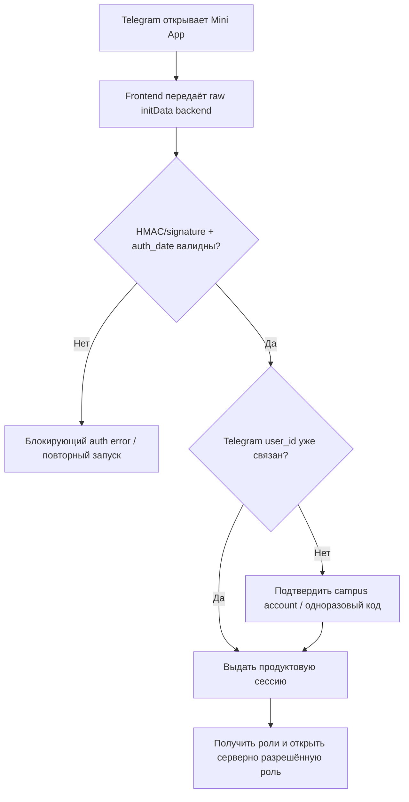

# Telegram Mini Apps / WebApp API для RutCampusTrack

Дата среза: **28.08.2026**  
Область: только официальная документация Telegram, официальный Telegram Blog и отдельно помеченные срезы исходного кода официальных клиентов.  
Figma не запускалась; исходники и архивы не изменялись.

## Как читать уверенность

- **[HIGH]** — это прямо написано в актуальной официальной документации API или changelog.
- **[MEDIUM]** — проектный вывод из документированного поведения; это не формулировка Telegram.

## 0. Актуальность среза

- **[HIGH]** На дату среза общий Bot API — **10.3 от 24.08.2026**. В 10.3 нет новых методов `Telegram.WebApp`; изменения относятся к rich/ephemeral messages и другим возможностям ботов. Источник: [Bot API — Recent changes](https://core.telegram.org/bots/api#recent-changes).
- **[HIGH]** Последняя Mini-App-специфичная запись в changelog страницы Mini Apps — **Bot API 10.1 от 11.06.2026** (`chat_join_request_query_id`). Последние изменения именно UX-поверхности: `requestChat` в 9.6, custom emoji в `BottomButton` в 9.5, `hideKeyboard` в 9.1, `DeviceStorage`/`SecureStorage` в 9.0, fullscreen/safe area/share/download в 8.0. Источник: [Telegram Mini Apps — Recent changes](https://core.telegram.org/bots/webapps#recent-changes).
- **[HIGH]** В Bot API 10.2 от 14.07.2026 появилось критичное для архитектуры ограничение: методы Mini App запрещены со страниц, чей origin отличается от исходного домена Mini App; автоматическое включение состоялось 20.07.2026. Через BotFather можно отключить защиту, но Telegram прямо перекладывает безопасность внешних ссылок на владельца. Источник: [Bot API 10.2 — General](https://core.telegram.org/bots/api#recent-changes).

Следствие: актуальную платформу нельзя описывать только уровнем Bot API 8.0. Для RutCampusTrack нужно проектировать под текущий API, но реализовывать **capability detection и безопасные fallback**, потому что у пользователей будут клиенты разных версий.

## 1. Короткое решение для RutCampusTrack

1. **[MEDIUM] Запускать как Main Mini App** (профиль бота / `startapp`-ссылка), а не как `KeyboardButton`. Это полноценный продукт, которому нужны подтверждённая Telegram-идентичность, собственная маршрутизация и длинная сессия. Main Mini App открывается в один тап и по умолчанию занимает полную доступную высоту. Источник контракта: [Launching the main Mini App](https://core.telegram.org/bots/webapps#launching-the-main-mini-app).
2. **[MEDIUM] Оставить продуктовую нижнюю навигацию RutCampusTrack**, но не путать её с `MainButton`/`SecondaryButton`: Telegram предоставляет контекстные кнопки действия, а не системный tab bar. На обычных списках и дашбордах нативные BottomButton скрыты. В focused-flow (редактирование посещаемости, отправка заявки, подтверждение расписания) продуктовый tab bar скрывается, а действие выносится в `MainButton`; PWA показывает на том же месте свой sticky action.
3. **[MEDIUM] Использовать смешанную тему**: структура, типографика, скругления и семантика статусов остаются RutCampusTrack; базовые поверхности, основной текст, ссылки, шапка и нативные кнопки получают значения из `themeParams`. Полностью игнорировать Telegram theme нельзя: Telegram рекомендует реагировать на неё в реальном времени. Полностью перекрасить предметные статусы в Telegram accent тоже нельзя: пропадёт семантика «присутствовал / отсутствовал / предупреждение».
4. **[MEDIUM] Не требовать настоящий fullscreen для основной работы.** Обычная посещаемость, домашние задания, статистика и реестры должны работать в expanded-height. Fullscreen оправдан как опция для карты или редкого ландшафтного представления расписания, с fallback без потери функции.
5. **[MEDIUM] Telegram-аккаунт — не роль в RutCampusTrack.** Документированный факт **[HIGH]**: валидированный `initData` подтверждает переданные Telegram данные пользователя. Проектный вывод: связь с университетским аккаунтом и набор ролей должны жить на сервере продукта. Смена роли не меняет Telegram identity и не может опираться на данные из клиента/CloudStorage.

## 2. Контейнер Telegram: header, закрытие, BackButton, SettingsButton

| Возможность | Точный контракт Telegram | Решение для RutCampusTrack | Чем обязано отличаться от PWA | Уверенность и источник |
|---|---|---|---|---|
| Внешняя шапка Mini App | Telegram владеет контейнером. API позволяет менять `headerColor`; `BackButton` показывается именно в header Telegram. Шапка также остаётся зоной жеста: даже после `disableVerticalSwipes()` пользователь может минимизировать/закрыть Mini App свайпом по header. | Не рисовать вторую «шапку приложения» с дублирующими стрелкой и крестиком. Внутри контента оставить только заголовок страницы/контекст. Геометрию Telegram header считать внешней по отношению к макету. | PWA не имеет Telegram header: ей нужна собственная app bar / системная логика `history.back()`, safe area и кнопка закрытия только в модальных режимах. | **[HIGH]** [WebApp fields and methods](https://core.telegram.org/bots/webapps#initializing-mini-apps), [BackButton](https://core.telegram.org/bots/webapps#backbutton). Вывод «не дублировать» — **[MEDIUM]**. |
| Закрытие/минимизация | `close()` программно закрывает Mini App. Пользователь может свернуть её свайпом вниз по header и вернуться через Mini App bar. Состояние активности доступно через `isActive`, события `activated`/`deactivated` (8.0+). | Не считать уход из активного состояния logout. На `deactivated` приостановить тяжёлые обновления/таймеры; при `activated` мягко обновить устаревшие данные. Черновик сохранять заранее, а не надеяться выполнить async-запрос во время закрытия. | PWA получает browser/app lifecycle (`visibilitychange`, service worker и т. п.), но не Telegram Mini App bar. | **[HIGH]** [Mini App Bar, 30.06.2024](https://telegram.org/blog/mini-app-bar-paid-media-and-more), [Events](https://core.telegram.org/bots/webapps#events-available-for-mini-apps). Про сохранение заранее — **[MEDIUM]**. |
| `BackButton` | Bot API 6.1+. По умолчанию скрыт; `show()`/`hide()` и `backButtonClicked`. Telegram не делает маршрутизацию за приложение. | На корне каждой роли скрыть. На detail/edit/subflow показать и привязать к одному шагу назад в продуктовой истории. При dirty-state сначала показать подтверждение/сохранение. | В PWA стрелка рисуется компонентом продукта и синхронизируется с History API/аппаратным back; в TMA сама стрелка — нативная. | **[HIGH]** [BackButton](https://core.telegram.org/bots/webapps#backbutton). |
| `SettingsButton` | Bot API 7.0+. Это **пункт контекстного меню Telegram**, а не постоянно видимая шестерёнка в шапке. Есть `show()`/`hide()` и `settingsButtonClicked`. | Можно вести в технические настройки Mini App: тема/уведомления/связка Telegram. **Не переносить туда «Профиль» и смену роли**: этот путь невидим и хуже обнаруживается; пятый tab «Профиль» остаётся. | В PWA нет Telegram context menu; те же настройки должны быть доступны из «Профиля». | **[HIGH]** [SettingsButton](https://core.telegram.org/bots/webapps#settingsbutton), changelog 7.0 на [Mini Apps](https://core.telegram.org/bots/webapps#recent-changes). |
| Цвет контейнера | `setHeaderColor`, `setBackgroundColor`; `setBottomBarColor` (7.10+) также красит navigation bar на Android. | При каждой смене темы выставлять согласованные surface-токены, чтобы не возникали полосы чужого цвета вокруг приложения. | PWA красит собственные поверхности и `theme-color` manifest/meta; Telegram API там отсутствует. | **[HIGH]** [WebApp methods](https://core.telegram.org/bots/webapps#initializing-mini-apps). |

Дополнительная проверка по актуальным исходникам клиентов (snapshot, не публичный API-контракт):

- **[MEDIUM / official client source]** В текущих Android 12.10.1 и iOS клиентах `BackButton` занимает тот же левый slot, что container Close/Cancel: `show()` меняет close-affordance на back, `hide()` возвращает close. Это усиливает правило «root = hide, nested = show», но не должно хардкодиться как одинаковая пиксельная геометрия всех клиентов. Источники: [Android `BotWebViewSheet.java` at commit 62b56a0](https://github.com/DrKLO/Telegram/blob/62b56a07ca7e30e39f7fd00a6728d6bbd716ca1c/TMessagesProj/src/main/java/org/telegram/ui/bots/BotWebViewSheet.java#L360-L372), [iOS `WebAppController.swift` at commit 6ad963e](https://github.com/TelegramMessenger/Telegram-iOS/blob/6ad963e5b62d354da79040f388ae2b9132fb17b8/submodules/WebUI/Sources/WebAppController.swift#L3708-L3796).
- **[HIGH]** Отдельного публичного `CloseButton` object в `Telegram.WebApp` нет: доступны `close()`, BackButton и closing confirmation. Поэтому макет не должен обещать скрытие/замену container Close средствами WebApp API.

### Closing confirmation

- **[HIGH]** `enableClosingConfirmation()` / `disableClosingConfirmation()` доступны с Bot API 6.2 и включают нативный диалог при попытке закрытия Mini App. Источник: [WebApp methods](https://core.telegram.org/bots/webapps#initializing-mini-apps).
- **[MEDIUM]** Включать только при несохранённых изменениях: отметки посещаемости, отредактированный конструктор расписания, незавершённая заявка/тикет. После успешного сохранения сразу выключать.
- **[MEDIUM]** Не включать глобально «на всякий случай»: это превращает обычный выход в постоянное препятствие.
- **[HIGH]** Публичный API документирует подтверждение, но не callback, позволяющий надёжно закончить произвольное async-сохранение непосредственно перед закрытием. Поэтому авто-черновик/локальное сохранение должны происходить по мере редактирования.
- **PWA:** собственный in-app guard; browser `beforeunload` не является визуально/поведенчески тем же нативным диалогом Telegram. Макет должен показывать один и тот же смысл («есть несохранённое»), но оболочки различаются.

## 3. BottomButton: `MainButton` и `SecondaryButton`

### Что реально даёт API

- **[HIGH]** `MainButton` — нативная кнопка в нижней области Telegram. `SecondaryButton` добавлен в 7.10; обе представлены типом `BottomButton`. Это не пять навигационных слотов. Источник: [BottomButton](https://core.telegram.org/bots/webapps#bottombutton).
- **[HIGH]** Обе по умолчанию скрыты. Можно менять text/color/textColor, активность, видимость; показывать loading; у SecondaryButton задавать расположение слева/справа/сверху/снизу относительно MainButton. С 9.5 возможен custom emoji icon. Источник: [BottomButton](https://core.telegram.org/bots/webapps#bottombutton).
- **[HIGH]** Если Mini App открыт из attachment menu, MainButton скрыт, пока пользователь не взаимодействовал с интерфейсом. Для RutCampusTrack attachment-menu launch не должен быть основным путём. Источник: тот же раздел.
- **[HIGH]** `showProgress()` по умолчанию деактивирует кнопку и рекомендован Telegram для долгого действия.

### Правило для макетов

| Контекст | Telegram Mini App | PWA | Почему |
|---|---|---|---|
| Дашборд, список, статистика, карта без выбранного действия | Нативные кнопки скрыты; видна продуктовая нижняя навигация. | То же. | Две постоянные нижние панели съедят viewport и создадут конкурирующие уровни навигации. |
| Староста редактирует посещаемость | Скрыть tab bar в focused-mode; `MainButton`: «Сохранить · 7 изменений», disabled при 0 изменений, progress при запросе. Опциональный `SecondaryButton`: «Отменить», только если отмена действительно нужна постоянно. | Sticky action тех же размеров/состояний внутри приложения; не имитировать Telegram-кнопку пиксельно. | Нативная кнопка остаётся доступной над динамическим viewport и явно завершает задачу. |
| Отправка заявки/тикета | Последний шаг: `MainButton` «Отправить заявку»; BackButton возвращает к предыдущему шагу. | Sticky submit + собственный Back. | Один главный commit-action на экран. |
| Выбор фильтра, строки, таба | Не использовать MainButton. | Не использовать floating action. | Это навигация/селекция, а не завершение операции. |
| Опасное действие | Подтверждение через native popup или явный destructive control внутри страницы; MainButton не должен становиться красной кнопкой без контекста. | Диалог/confirmation sheet продукта. | У Telegram есть нативный destructive popup style; действие должно быть осознанным. |

**[MEDIUM] Вывод для принятого решения «5 нижних слотов»:** официальная платформа не даёт оснований отказываться от продуктового tab bar. Но `MainButton` нельзя делать шестым постоянным элементом. Поэтому один дизайн PWA/TMA возможен на уровне content и IA, а слой primary action обязан быть platform adapter.

## 4. Высота, `expand()` и настоящий fullscreen — три разных состояния

| Состояние | Контракт | Проектное следствие |
|---|---|---|
| Compact / частичная высота | Mini App может занимать часть экрана и расширяться жестом. Main/direct-link можно явно открыть с `mode=compact`. | Не основной режим RutCampusTrack. Но loading/empty/error и первый экран не должны ломаться на малой высоте; особенно при клавиатуре. |
| Expanded / maximum available height | `expand()` расширяет до максимальной **доступной** высоты; `isExpanded` показывает состояние. Main Mini App по умолчанию открывается на полной доступной высоте; для direct-link Mini App такое поведение действует с Bot API 7.6. В обоих launch mode можно явно запросить `mode=compact`. | Это стандартный рабочий режим продукта. Называть в спецификации «expanded height», не «fullscreen». |
| True fullscreen | `requestFullscreen()`/`exitFullscreen()` с Bot API 8.0; header становится прозрачным, нужны safe areas, возможен `fullscreenFailed` (`UNSUPPORTED`, `ALREADY_FULLSCREEN`). | Только прогрессивное улучшение для карты/редкого immersive view. Никогда не делать доступ к базовой функции зависимым от успеха fullscreen. |

Источники: [Main Mini App](https://core.telegram.org/bots/webapps#launching-the-main-mini-app), [Direct Link Mini Apps](https://core.telegram.org/bots/webapps#direct-link-mini-apps), [WebApp fields/methods](https://core.telegram.org/bots/webapps#initializing-mini-apps), [fullscreen events](https://core.telegram.org/bots/webapps#events-available-for-mini-apps), [Mini Apps 2.0, 17.11.2024](https://telegram.org/blog/fullscreen-miniapps-and-more). Все факты в таблице — **[HIGH]**; выбор применения — **[MEDIUM]**.

### Как верстать viewport

- **[HIGH]** `viewportHeight` меняется в реальном времени, но Telegram прямо предупреждает: частота обновления недостаточна, чтобы плавно «приклеивать» элемент к движущейся нижней границе.
- **[HIGH]** Для закреплённых элементов использовать `viewportStableHeight` / `--tg-viewport-stable-height`; он обновляется после завершения жестов/анимаций. Слушать `viewportChanged` и `isStateStable`.
- **[HIGH]** В fullscreen учитывать две разные величины: `safeAreaInset` (системные вырезы/панели) и `contentSafeAreaInset` (перекрытия UI Telegram), а также события `safeAreaChanged`/`contentSafeAreaChanged`.
- **[HIGH]** Fullscreen поддерживает portrait и landscape. `lockOrientation()` (8.0+) фиксирует **текущую** ориентацию, а `unlockOrientation()` возвращает автоматический поворот; это не API «принудительно повернуть в произвольную ориентацию». Источник: [WebApp fullscreen/orientation methods](https://core.telegram.org/bots/webapps#initializing-mini-apps).
- **[HIGH]** В fullscreen header прозрачен, но Telegram рекомендует всё равно вызвать `setHeaderColor()`: этот цвет используется, чтобы выбрать контраст системной status bar и других controls.
- **[MEDIUM]** Не задавать макет как «100vh = экран». Figma-инструкция должна показать нижний safe-area spacer и отметить, что фактическая высота приходит из платформы.
- **[HIGH]** `ready()` нужно вызвать после загрузки основных элементов, чтобы Telegram убрал placeholder; иначе он ждёт полной загрузки страницы. Источник: [WebApp.ready](https://core.telegram.org/bots/webapps#initializing-mini-apps).
- **[HIGH]** `hideKeyboard()` доступен с 9.1, но является enhancement: старые клиенты должны работать и без него.

### Вертикальные свайпы

- **[HIGH]** С 7.7 можно отключить vertical swipes, если они конфликтуют с жестами Mini App; Telegram рекомендует держать их включёнными, когда конфликта нет. Даже при отключении header остаётся способом закрыть/минимизировать приложение.
- **[MEDIUM]** В RutCampusTrack не вводить глобальные вертикальные swipe-навигации. Для горизонтальных каруселей/табов не нужно отключать vertical swipes. Локальное отключение допустимо только на действительно конфликтующей интерактивной карте/drag-surface, с немедленным обратным включением после выхода.

### PWA-разница

PWA не имеет `viewportHeight`, Telegram header и Mini App bar. Её adapter использует браузерные динамические единицы/свои safe-area insets и собственный sticky-layer. Состояния и content остаются общими, но расчёт высоты и нижнего слоя — отдельный.

## 5. `themeParams`: подстраиваться, игнорировать или смешивать

### Факты

- **[HIGH]** Telegram передаёт `colorScheme` (`light`/`dark`) и `themeParams`; изменения приходят через `themeChanged` в реальном времени. Telegram рекомендует следовать динамической теме клиента. Источник: [Color Schemes and Design Guidelines](https://core.telegram.org/bots/webapps#designing-mini-apps), [ThemeParams](https://core.telegram.org/bots/webapps#themeparams).
- **[HIGH]** Доступны CSS variables для background, text, hint, link, button/button text, secondary background, header, bottom bar, accent text, section background/header/separator, subtitle, destructive text. Многие поля помечены optional и добавлялись в разных версиях.
- **[HIGH]** `setHeaderColor`, `setBackgroundColor`, `setBottomBarColor` управляют внешними поверхностями Telegram.

### Решение: смешанная тема

**[MEDIUM]** Маппинг в токены, а не прямые цвета в компонентах:

| Семантический слой RutCampusTrack | TMA-источник | Что не менять |
|---|---|---|
| App background | `tg-theme-bg-color` с fallback на существующий токен | Сетка, радиусы, плотность |
| Cards/sections | `section_bg_color` или `secondary_bg_color` с fallback | Иерархия карточек |
| Primary/subtitle/muted text | `text_color`, `subtitle_text_color`, `hint_color` | Типографическая шкала |
| Links/общий интерактивный accent | `link_color`/`button_color`, после проверки контраста | Форма и hit-area элементов |
| Telegram MainButton | нативные `button_color`/`button_text_color` по умолчанию | Текст действия и состояния |
| Предметные статусы | существующие semantic tokens RutCampusTrack | «присутствовал», «нет», warning, error нельзя перекрашивать в произвольный theme accent |
| Destructive action | `destructive_text_color` с fallback на системный semantic token | Подтверждение и wording |

- **[MEDIUM]** Если входные макеты только тёмные, агент Figma всё равно должен показать правила для Telegram light/custom theme хотя бы как token mapping и один smoke-frame; иначе `themeChanged` остаётся не спроектирован.
- **[MEDIUM]** Нельзя слепо доверять контрасту пользовательской custom theme. Для critical status/charts нужен собственный accessible semantic palette и runtime contrast check/fallback.
- **PWA:** использует исходную дизайн-систему RutCampusTrack и её light/dark policy; Telegram `themeParams` отсутствуют. Это одно из обязательных расхождений при близком дизайне.

## 6. CloudStorage, DeviceStorage, SecureStorage

### Официальные лимиты

| Хранилище | Версия и лимит | Назначение по Telegram | RutCampusTrack |
|---|---|---|---|
| `CloudStorage` | 6.9+; до **1024 keys на bot/user**; key 1–128 символов (`A-Z a-z 0-9 _ -`), value 0–4096 символов | Cloud key/value storage | Небольшие несекретные предпочтения: последний фильтр, свёрнутые подсказки, выбранный вид «компактно/подробно». Не права доступа, не журнал посещаемости как source of truth, не токен. |
| `DeviceStorage` | 9.0+; до **5 MB на bot/user** | Персистентное локальное хранилище устройства, доступно только создавшему bot | Локальный UI-cache/черновик как enhancement; сервер остаётся источником истины. Нужен fallback для старых/неподдерживающих клиентов. |
| `SecureStorage` | 9.0+; до **10 items на bot/user**; iOS Keychain, Android Keystore; encrypted at rest | Tokens, secrets, auth state и другие чувствительные значения | Допустим короткий device/session secret после серверной аутентификации, но не campus-role/permissions. Официальная страница прямо описывает iOS/Android; на Desktop/Web не закладывать обязательную функцию без проверки поддержки. |

Источники: [CloudStorage](https://core.telegram.org/bots/webapps#cloudstorage), [DeviceStorage](https://core.telegram.org/bots/webapps#devicestorage), [SecureStorage](https://core.telegram.org/bots/webapps#securestorage). Лимиты/назначение — **[HIGH]**; продуктовый выбор — **[MEDIUM]**.

- **[HIGH]** Документация не обещает для CloudStorage шифрование, транзакции, TTL или офлайн-доступ. Нельзя превращать название «cloud» в недокументированные гарантии.
- **[MEDIUM / official client source]** Текущие Telegram Desktop 7.1.3, Web K и Web A явно возвращают `UNSUPPORTED` для SecureStorage; поэтому SecureStorage не может быть обязательным условием входа даже при высоком общем WebApp API level. Источники: [Desktop at `956e93e`](https://github.com/telegramdesktop/tdesktop/blob/956e93e386dfad11cd150f361b78342505f41fa7/Telegram/SourceFiles/ui/chat/attach/attach_bot_webview.cpp#L2808-L2818), [Web K at `b59a023`](https://github.com/TelegramOrg/Telegram-web-k/blob/b59a02302fb385faaa9bd8997a36c14310e9c370/src/components/webApp.tsx#L1300-L1330), [Web A at `f05ad7d`](https://github.com/TelegramOrg/Telegram-web-z/blob/f05ad7d00ed05c82bd370ada8f0e2e226c7a912f/src/components/modals/browser/hooks/useWebAppFrame.ts#L249-L291).

### Рекомендуемые ключи CloudStorage

- `ui_role_last` — только hint для первого отображения; сервер обязан подтвердить, что роль доступна.
- `attendance_filter_last`, `stats_period_last`, `map_layer_last` — presentation preferences.
- `tip_<id>_dismissed` — состояние подсказок.
- Не хранить `access_token`, пароль, персональные выгрузки, полную таблицу посещаемости или несохранённые критичные изменения без дополнительной модели безопасности.

### PWA-разница

PWA использует browser storage/IndexedDB/Cache API и свой secure-session подход. Нельзя строить общий persistence слой прямыми вызовами `CloudStorage`; нужен интерфейс `PreferenceStore` с Telegram и PWA реализациями. Серверные данные и права едины.

## 7. HapticFeedback

- **[HIGH]** С 6.1 доступны `impactOccurred(light|medium|heavy|rigid|soft)`, `notificationOccurred(error|success|warning)`, `selectionChanged()`. Telegram формулирует эффект как «клиент **может** воспроизвести» haptic — ответ не гарантирован. Источник: [HapticFeedback](https://core.telegram.org/bots/webapps#hapticfeedback).
- **[HIGH]** Telegram отдельно говорит: `selectionChanged()` использовать при изменении выбора, не при подтверждении выбора.
- **[MEDIUM]** RutCampusTrack:
  - `selectionChanged` — смена статуса студента в журнале, переключение сегмента/фильтра;
  - `notificationOccurred(success)` — одно успешное сохранение пачки отметок;
  - `warning/error` — только значимое предупреждение/ошибка;
  - не давать haptic на каждый tab/tap/scroll.
- **PWA:** haptic не является обязательной частью результата. Всегда есть визуальное pressed/selected/success/error состояние; возможная веб-вибрация — отдельное enhancement, не требование к паритету.
- **[MEDIUM / official client source]** Snapshot клиентов подтверждает разную реализацию: Android/iOS вызывают native haptics; Web K использует `navigator.vibrate`, если он доступен; в Desktop 7.1.3 нет соответствующего обработчика, а в текущем Web A событие типизировано, но не обработано. Источники: [Android](https://github.com/TelegramOrg/Telegram-Android/blob/4e1a61eca6c9b6ee3aa9c35cf8c70554750f2439/TMessagesProj/src/main/java/org/telegram/ui/web/BotWebViewContainer.java#L1708-L1794), [iOS](https://github.com/TelegramMessenger/Telegram-iOS/blob/6ad963e5b62d354da79040f388ae2b9132fb17b8/submodules/WebUI/Sources/WebAppController.swift#L1406-L1444), [Web K](https://github.com/TelegramOrg/Telegram-web-k/blob/b59a02302fb385faaa9bd8997a36c14310e9c370/src/components/webApp.tsx#L694-L739). Следствие: визуальная обратная связь обязательна, vibration — нет.

## 8. Файлы, download, share и внешние ссылки

| Задача | Контракт Telegram | Ограничение / что макетировать | PWA-разница |
|---|---|---|---|
| Скачать файл | `downloadFile(params)` (8.0+) показывает **нативный popup** с запросом скачать HTTPS-файл; callback/event сообщает только, началась загрузка или пользователь отменил. | Нельзя обещать silent-download. Показать состояние подготовки файла, затем нативное подтверждение; после `downloading` — не фальшивое «файл сохранён», а «загрузка началась». | Обычная browser download UX; свой progress возможен до передачи файла браузеру. |
| Web-клиенты и download | Для одинакового поведения нужны `Content-Disposition: attachment; filename="..."` и `Access-Control-Allow-Origin: https://web.telegram.org`; без них особенно Web может работать иначе. | Это обязательная backend note и пункт QA. | Для PWA CORS/Content-Disposition настраиваются под origin продукта, не только web.telegram.org. |
| Загрузка файла пользователем | В WebApp API нет отдельного Telegram-метода upload. `sendData` не подходит: максимум 4096 bytes, только KeyboardButton launch и закрывает Mini App. | Файл загружается обычным HTTPS web flow; file picker/camera и MIME/size необходимо проверить на iOS, Android, Desktop, Web. Не проектировать поток, который зависит от `sendData`. | PWA использует тот же web upload, но в обычном браузере/installed mode; capability/permission UX иной. |
| Внешний URL | `openLink(url)` открывает внешний браузер, не закрывает Mini App и разрешён только в ответ на действие пользователя. `try_instant_view=true` доступен с 6.4. | Для нормативных документов/внешних страниц — явная кнопка/ссылка; не открывать автоматически. Состояние Mini App должно корректно восстановиться. | PWA может обычной навигацией открыть tab/window; всё равно требуется явный внешний affordance. |
| Telegram URL | `openTelegramLink(url)` открывает Telegram link внутри клиента. С 7.0 Mini App после этого не закрывается; до 7.0 закрывалась. | Использовать для перехода в bot/chat/message; на старых клиентах состояние должно быть восстановимо. | PWA открывает deep link/web fallback, а не внутренний переход клиента. |
| Поделиться в чат | `shareMessage` (8.0+) открывает нативный диалог для server-prepared `PreparedInlineMessage`; есть success/failure (`UNSUPPORTED`, expired, send failed, declined). | Для «поделиться расписанием/заявкой» нужен backend, который готовит message id; обязательно fallback «копировать ссылку». | PWA — Web Share/копирование ссылки, не Telegram prepared-message flow. |
| Поделиться в Story | `shareToStory` (7.8+) принимает HTTPS media URL. Caption: до 200 символов у обычного пользователя и до 2048 у Premium; ссылка-виджет в Story доступна только Premium. | Для RutCampusTrack, вероятно, не основной сценарий; не делать критичный flow. | PWA использует системный share и не может обещать Telegram Story editor тем же способом. |

Источники: [WebApp methods: openLink/openTelegramLink/share/download/sendData](https://core.telegram.org/bots/webapps#initializing-mini-apps), [DownloadFileParams](https://core.telegram.org/bots/webapps#downloadfileparams), [file/share events](https://core.telegram.org/bots/webapps#events-available-for-mini-apps), [Mini Apps 2.0](https://telegram.org/blog/fullscreen-miniapps-and-more). Контракт — **[HIGH]**; upload-вывод — **[HIGH]** по отсутствию отдельного метода и ограничениям `sendData`, требование клиентского QA — **[MEDIUM]**.

Дополнительные platform snapshots:

- **[MEDIUM / official client source]** Текущие Android/iOS требуют недавнее пользовательское действие для `downloadFile`; реализация использует окно 10 секунд. iOS 12.9.2 также отклоняет filename с `/`, filename длиной от 256 UTF-8 bytes и URL длиной от 32768 UTF-8 bytes. Это не общий разрешённый максимум API, а более строгие implementation guards: сервер должен использовать короткое безопасное имя, HTTPS URL и fallback-ссылку. Источники: [Android 12.10.0 download](https://github.com/TelegramOrg/Telegram-Android/blob/4e1a61eca6c9b6ee3aa9c35cf8c70554750f2439/TMessagesProj/src/main/java/org/telegram/ui/web/BotWebViewContainer.java#L2635-L2679), [iOS 12.9.2 validation/download](https://github.com/TelegramMessenger/Telegram-iOS/blob/6ad963e5b62d354da79040f388ae2b9132fb17b8/submodules/WebUI/Sources/WebAppController.swift#L2910-L3028).
- **[MEDIUM / official client source]** `shareToStory` реально поддержан текущими Android/iOS, но Telegram Desktop 7.1.3 показывает unsupported, Web K — unsupported toast, а в текущем Web A обработчика нет. Поэтому даже `isVersionAtLeast('7.8')` не гарантирует функцию: fallback — `shareMessage`, системный share или копирование ссылки. Источники: [Android](https://github.com/TelegramOrg/Telegram-Android/blob/4e1a61eca6c9b6ee3aa9c35cf8c70554750f2439/TMessagesProj/src/main/java/org/telegram/ui/web/BotWebViewContainer.java#L2284-L2416), [iOS](https://github.com/TelegramMessenger/Telegram-iOS/blob/6ad963e5b62d354da79040f388ae2b9132fb17b8/submodules/WebUI/Sources/WebAppController.swift#L1625-L1698), [Desktop](https://github.com/telegramdesktop/tdesktop/blob/956e93e386dfad11cd150f361b78342505f41fa7/Telegram/SourceFiles/ui/chat/attach/attach_bot_webview.cpp#L2938-L2945), [Web K](https://github.com/TelegramOrg/Telegram-web-k/blob/b59a02302fb385faaa9bd8997a36c14310e9c370/src/components/webApp.tsx#L1300-L1330), [Web A bridge snapshot](https://github.com/TelegramOrg/Telegram-web-z/blob/f05ad7d00ed05c82bd370ada8f0e2e226c7a912f/src/components/modals/browser/hooks/useWebAppFrame.ts).
- **[MEDIUM / official client source]** Реальные клиенты дополнительно фильтруют URL schemes для `openLink`. Для внешних campus-ссылок универсальная безопасная база — HTTPS; специальные схемы не считать кросс-клиентным контрактом. Источники: [Android](https://github.com/TelegramOrg/Telegram-Android/blob/4e1a61eca6c9b6ee3aa9c35cf8c70554750f2439/TMessagesProj/src/main/java/org/telegram/ui/web/BotWebViewContainer.java#L1708-L1794), [iOS](https://github.com/TelegramMessenger/Telegram-iOS/blob/6ad963e5b62d354da79040f388ae2b9132fb17b8/submodules/WebUI/Sources/WebAppController.swift#L1262-L1397), [Desktop](https://github.com/telegramdesktop/tdesktop/blob/956e93e386dfad11cd150f361b78342505f41fa7/Telegram/SourceFiles/ui/chat/attach/attach_bot_webview.cpp#L2821-L2865).

### Origin protection 2026 — обязательное правило

- **[HIGH]** После 20.07.2026 Mini App methods по умолчанию нельзя вызывать со стороннего origin внутри текущего webview. Источник: [Bot API 10.2 General, 14.07.2026](https://core.telegram.org/bots/api#recent-changes).
- **[MEDIUM]** Не навигировать top-level Mini App на внешнюю университетскую страницу и не ожидать, что там продолжат работать `MainButton`, `BackButton`, storage и другие методы Telegram.
- **[MEDIUM]** Внешние документы открывать через `openLink`; если нужен чужой контент внутри продукта, безопаснее получить его сервером/своим origin или использовать строго контролируемый iframe без права самостоятельно управлять Telegram bridge.
- **[MEDIUM]** Не отключать защиту через BotFather ради удобства интеграции без отдельного security review.

## 9. `initData`, авторизация и безопасность

### Что доверять

- **[HIGH]** `initData` — raw query string для серверной валидации. Его нужно отправить backend продукта и проверить там.
- **[HIGH]** `initDataUnsafe` **нельзя доверять**. Оно пригодно для предварительного UI до авторизации, но не для доступа, роли, ФИО в официальной операции или любого state-changing request.
- **[HIGH]** Server validation для владельца bot выполняется в точном порядке:
  1. извлечь полученный `hash`; остальные пары `key=value` отсортировать по имени поля и соединить LF (`0x0A`) — это `data_check_string`;
  2. вычислить `secret_key = HMAC-SHA-256(key="WebAppData", message=bot_token)`;
  3. сравнить полученный `hash` с hex-представлением `HMAC-SHA-256(key=secret_key, message=data_check_string)`.
- **[HIGH]** Дополнительно проверить `auth_date`, чтобы не принимать устаревшие данные. Telegram не задаёт универсальный TTL — его должен определить продукт.
- **[HIGH]** Для третьей стороны доступна проверка поля `signature` через Ed25519 public key Telegram без передачи bot token. В этом flow `data_check_string` начинается с `bot_id:WebAppData`, затем LF, затем все полученные поля **кроме `hash` и `signature`**, отсортированные и разделённые LF; проверяется base64url-encoded Ed25519 signature.
- **[HIGH]** Bot token не должен попадать во frontend.
- **[MEDIUM]** Сравнение HMAC выполнять constant-time функцией, а допустимый возраст `auth_date` и политику повторного использования определить на backend; это security implementation policy, не заданный Telegram универсальный TTL.

Опубликованные Telegram Ed25519 keys на дату среза:

- production: `e7bf03a2fa4602af4580703d88dda5bb59f32ed8b02a56c187fe7d34caed242d`;
- test: `40055058a4ee38156a06562e52eece92a771bcd8346a8c4615cb7376eddf72ec`.

Они нужны только для documented third-party validation flow; свой backend с bot token использует HMAC flow выше. Источник: [Third-Party Validation](https://core.telegram.org/bots/webapps#validating-data-for-third-party-use), **[HIGH]**.

Источник: [Validating data received via the Mini App](https://core.telegram.org/bots/webapps#validating-data-received-via-the-mini-app), [Validating data for Third-Party Use](https://core.telegram.org/bots/webapps#validating-data-for-third-party-use).

### Важное ограничение launch mode

- **[HIGH]** `WebAppInitData` пуст, если Mini App запущен из `KeyboardButton` или inline mode. Разные способы запуска дают разный контекст; `sendData` существует только для KeyboardButton. Источники: [WebAppInitData](https://core.telegram.org/bots/webapps#webappinitdata), [launch modes](https://core.telegram.org/bots/webapps#implementing-mini-apps).
- **[MEDIUM]** Поэтому основной вход RutCampusTrack — Main Mini App/menu/direct link, а не KeyboardButton. Если разрешены альтернативные ссылки, frontend должен явно обработать отсутствие нужного init context.
- **[HIGH]** Direct-link Mini App получает `chat_type`/`chat_instance`, но не получает права читать сообщения чата или отправлять новые от имени пользователя; для отправки нужен другой явно подтверждаемый flow (например, native `shareMessage` или переход в inline mode). Источник: [Direct Link Mini Apps](https://core.telegram.org/bots/webapps#direct-link-mini-apps).

### Правильная связка с аккаунтом RutCampusTrack

- **[MEDIUM]** Ключ связи — валидированный стабильный `user.id`; `username` optional и не должен быть ключом доступа.
- **[MEDIUM]** При первом запуске пользователь доказывает владение университетским аккаунтом. Простого совпадения ФИО/username недостаточно.
- **[MEDIUM]** Список ролей и текущая роль приходят от backend. `ui_role_last` может только предложить начальный tab, но сервер подтверждает право.
- **[MEDIUM]** После смены роли перезагрузить permission-bound initial payload и всю нижнюю навигацию. Не нужна повторная Telegram-аутентификация, если продуктовая сессия действительна.
- **[MEDIUM]** Telegram и PWA используют разные bootstrap-механизмы: TMA — validated `initData`; PWA — существующий campus login/OIDC/session. После bootstrap должна работать единая модель серверных прав.

## 10. Уведомления

- **[HIGH]** Mini App может вызвать `requestWriteAccess()` (6.9+) — нативный popup разрешения bot отправлять сообщения пользователю. Результат: allowed/cancelled; `WebAppUser.allows_write_to_pm` показывает доступное разрешение в init data. Источник: [WebApp methods and events](https://core.telegram.org/bots/webapps#initializing-mini-apps), [WebAppUser](https://core.telegram.org/bots/webapps#webappuser).
- **[MEDIUM]** Не спрашивать разрешение на первом экране без контекста. Запросить после явного выбора «Получать уведомления о…» и объяснить типы: изменение пары, новая домашняя работа, ответ на заявку, напоминание старосте о незавершённой отметке.
- **[MEDIUM]** Telegram delivery — сообщения bot, а не PWA Web Push. Backend хранит отдельные каналы/согласия. PWA использует push subscription/service worker; предпочтения пользователя могут быть общими, технические токены — разными.

## 11. Различия iOS / Android / Desktop / Web: что известно точно

Официальная документация **не публикует полную матрицу «метод × клиент × минимальная версия приложения»**. Она даёт `WebApp.version`, `WebApp.platform`, `isVersionAtLeast()`, статусы `unsupported` и failure events. Следовательно, честная спецификация — capability-driven, а не обещание абсолютного паритета.

| Аспект | iOS | Android | Desktop / macOS | Telegram Web | Надёжность |
|---|---|---|---|---|---|
| Базовая feature gate | Проверять `version`, события/результат | То же | То же | То же | **[HIGH]** API contract |
| Платформа | `WebApp.platform` доступен; официальный список строк не дан на странице | То же | То же | То же | **[HIGH]** поле есть; **[MEDIUM]** не строить бизнес-логику на недокументированной строке |
| Safe area / viewport | Динамические значения клиента | Динамические значения клиента | Значения всё равно читать из API, не предполагать mobile geometry | То же | **[HIGH]** API; конкретная геометрия — runtime |
| Android hardware info | — | В User-Agent добавляются app/device/Android/SDK/performance class (`LOW/AVERAGE/HIGH`) | — | — | **[HIGH]** [Additional Data in User-Agent](https://core.telegram.org/bots/webapps#additional-data-in-user-agent) |
| SecureStorage implementation | Официально: Keychain | Официально: Keystore | Реализация/гарантии на странице не описаны | Реализация/гарантии на странице не описаны | **[HIGH]** для mobile; для остальных не закладывать обязательность |
| Haptic | Клиент может воспроизвести; результат не гарантирован | То же | Не делать обязательным UX | Не делать обязательным UX | **[HIGH]** формулировка `may play`; вывод — **[MEDIUM]** |
| Fullscreen | Может вернуть `UNSUPPORTED`; нужен fallback | То же | Может вернуть `UNSUPPORTED`; нужен fallback | Может вернуть `UNSUPPORTED`; нужен fallback | **[HIGH]** failure contract |
| Add to Home Screen | Объявлено для mobile devices; `checkHomeScreenStatus` может вернуть unsupported/unknown/added/missed | То же | Не обещать | Не обещать | **[HIGH]** [Mini Apps 2.0](https://telegram.org/blog/fullscreen-miniapps-and-more), [checkHomeScreenStatus](https://core.telegram.org/bots/webapps#initializing-mini-apps) |
| Download | `downloadFile` + native consent | То же | Проверить в клиенте | Нужны корректные CORS/Content-Disposition headers | **[HIGH]** DownloadFileParams |
| Debugging | Safari Web Inspector после включения Allow Web View Inspection | Chrome remote inspect после Enable WebView Debug | Windows/Linux beta WebView inspection; на Telegram Desktop for macOS этот путь не поддержан | Browser devtools | **[HIGH]** [Testing Mini Apps](https://core.telegram.org/bots/webapps#testing-mini-apps) |

### Что добавляет проверка текущего кода официальных клиентов

Это **не** замена runtime capability detection: следующий релиз клиента может изменить реализацию. Но snapshot показывает реальные расхождения, которые абстрактная API-таблица скрывает.

| Клиент и snapshot | Наблюдаемая реализация | Проектное следствие | Уверенность |
|---|---|---|---|
| iOS, commit `6ad963e` | В fullscreen обычная navigation bar скрывается, клиент рисует собственные Back/Minimize/More controls; их верхняя зона отражается в `contentSafeAreaInset`. Viewport учитывает keyboard и system insets. | Любой fullscreen-content начинает layout ниже `contentSafeAreaInset.top`; не ставить свой контент под Telegram overlay. | **[MEDIUM / official source]** [fullscreen controls](https://github.com/TelegramMessenger/Telegram-iOS/blob/6ad963e5b62d354da79040f388ae2b9132fb17b8/submodules/WebUI/Sources/WebAppController.swift#L910-L1004), [viewport/safe area](https://github.com/TelegramMessenger/Telegram-iOS/blob/6ad963e5b62d354da79040f388ae2b9132fb17b8/submodules/WebUI/Sources/WebAppWebView.swift#L304-L310) |
| Android 12.10.1, commit `62b56a0` | Sheet сообщает changing/stable/expanded viewport; fullscreen имеет success/error; device safe area и Telegram content-safe area передаются раздельно. | Не использовать один универсальный top/bottom inset и не считать каждый viewport event финальным. | **[MEDIUM / official source]** [viewport](https://github.com/DrKLO/Telegram/blob/62b56a07ca7e30e39f7fd00a6728d6bbd716ca1c/TMessagesProj/src/main/java/org/telegram/ui/web/BotWebViewContainer.java#L830-L858), [fullscreen](https://github.com/DrKLO/Telegram/blob/62b56a07ca7e30e39f7fd00a6728d6bbd716ca1c/TMessagesProj/src/main/java/org/telegram/ui/web/BotWebViewContainer.java#L2418-L2439), [safe areas](https://github.com/DrKLO/Telegram/blob/62b56a07ca7e30e39f7fd00a6728d6bbd716ca1c/TMessagesProj/src/main/java/org/telegram/ui/web/BotWebViewContainer.java#L3162-L3184) |
| Telegram Desktop, commit `bdbcf2d` | Viewport отправляется как `window.innerHeight`, stable и expanded; device safe area = 0; в fullscreen резервируется верхний content-safe inset под controls. Sensors возвращают `UNSUPPORTED`; orientation lock handler отсутствует. | Desktop нельзя считать «телефоном пошире»: fullscreen/sensors/orientation — optional; layout всё равно читает runtime inset. | **[MEDIUM / official source]** [attach_bot_webview.cpp](https://github.com/telegramdesktop/tdesktop/blob/bdbcf2d4a97c311cebd7c9c321655c86b354e580/Telegram/SourceFiles/ui/chat/attach/attach_bot_webview.cpp#L2555-L2620) |
| Telegram Web K, commit `b21491c` | Fullscreen использует browser Fullscreen API; при отказе отдаёт `UNSUPPORTED`. В overlay показаны More + Close, top content-safe = 56; Back в этом fullscreen overlay текущим кодом не показан. | Не открывать обязательный nested flow сразу в fullscreen. Для fullscreen-карты дать внутри safe content явное «Выйти из полноэкранного режима/назад», которое не нужно на обычных sheet-экранах. | **[MEDIUM / official source]** [handler](https://github.com/TelegramOrg/Telegram-web-k/blob/b21491cfdec248127cfb6a1e6617e26826021ff4/src/components/webApp.tsx#L1300-L1317), [controls](https://github.com/TelegramOrg/Telegram-web-k/blob/b21491cfdec248127cfb6a1e6617e26826021ff4/src/components/webApp.tsx#L134-L149), [safe top](https://github.com/TelegramOrg/Telegram-web-k/blob/b21491cfdec248127cfb6a1e6617e26826021ff4/src/components/webApp.tsx#L1470-L1479) |

### Capability policy

1. **[HIGH]** Перед новым API проверять `isVersionAtLeast(minVersion)`.
2. **[MEDIUM]** Для native feature этого **недостаточно**: текущие official-client snapshots показывают несовпадение поддержки при одинаковом API level (`shareToStory`, SecureStorage, haptics). После version gate учитывать `platform`, callback/event failure, `UNSUPPORTED` и предусмотреть timeout/fallback.
3. **[MEDIUM]** `platform` использовать для telemetry, диагностики и узких исправлений, не для выдачи прав/разных данных.
4. **[MEDIUM]** Минимальный QA: iOS stable; Android stable на LOW/AVERAGE device class; Telegram Desktop Windows/Linux; Telegram macOS; Telegram Web. Проверить не только открытие, но back, keyboard, safe area, download, link, theme switch, deactivation/reactivation и dirty-close.

## 12. Что одинаково, а что обязано различаться с PWA

| Слой | Одинаково | Telegram Mini App | PWA |
|---|---|---|---|
| IA и маршруты | Роли, user map, структура разделов, единственный основной путь | Telegram BackButton отражает внутренний route stack | Собственная back/app bar + History API |
| Нижняя навигация | Состав tab bar по роли | Продуктовый tab bar; native BottomButton только для focused action | Продуктовый tab bar + sticky/floating action |
| Primary action | Label, validation, loading, success/error | MainButton/SecondaryButton adapter | In-app sticky/FAB adapter |
| Theme | Семантика продукта, status tokens, типографика | Base surfaces/text/chrome из `themeParams`, live `themeChanged` | Собственные tokens / system theme policy |
| Viewport | Layout breakpoints и content priority | `viewportStableHeight`, safe/content safe area, Telegram header/bar | Browser dynamic viewport + PWA safe area |
| Close protection | Dirty-state model | Native closing confirmation | In-app navigation guard / browser mechanism |
| Preferences | Схема ключей/значений | CloudStorage/DeviceStorage adapters | Browser storage adapter |
| Authentication | Единая product session и permissions | Validated `initData` bootstrap | Campus login/OIDC bootstrap |
| Notifications | Единые пользовательские настройки событий | Bot write access + Telegram messages | Web Push subscription |
| Download/share | Один бизнес-сценарий и серверный файл/link | Native Telegram popup/share dialog | Browser download/Web Share/link copy |
| Haptic | Не является источником состояния | Native HapticFeedback enhancement | Визуальная обратная связь обязательна; haptic optional |

**[MEDIUM] Итог:** тезис «один дизайн, различия только MainButton/BackButton/viewport» слишком узок. Близкими могут быть визуальный язык, content и IA. Но минимум **восемь platform adapters** различаются: back/chrome, primary action, theme, viewport/safe area, lifecycle/close, storage, auth, notifications/share/download. Это не означает два разных продукта; это означает один продуктовый сценарий с двумя оболочками.

## 13. Инструкция агенту, который будет собирать макеты

Обязательно показать/аннотировать следующие состояния:

1. **Root screen TMA, expanded-height:** Telegram-owned header с native close/minimize считается внешним; BackButton скрыт; продуктовый tab bar виден; MainButton скрыт.
2. **Nested detail TMA:** native BackButton отмечен в platform annotation; не рисовать вторую стрелку внутри content.
3. **Focused edit TMA:** продуктовый tab bar скрыт; native MainButton «Сохранить · N изменений»; disabled / loading / success; closing confirmation включается только при dirty-state.
4. **Тот же focused edit PWA:** собственная sticky action; собственный Back; content идентичен.
5. **Dynamic viewport:** вариант с открытой клавиатурой/уменьшенной высотой; sticky content опирается на stable viewport.
6. **Fullscreen map как optional variant:** safeArea + contentSafeArea; вариант отказа fullscreen возвращает пользователя в полностью рабочий expanded map.
7. **Telegram theme switch:** dark исходник + light/custom-theme token mapping; статусы остаются семантическими.
8. **Download/share:** подготовка → native consent/dialog → downloading/cancelled или copied-link fallback.
9. **Auth/bootstrap:** loading placeholder, invalid/expired initData, аккаунт не связан, несколько ролей.
10. **Lifecycle:** возврат из Mini App bar с мягким refresh, без сброса незавершённого безопасного UI state.

## 14. Backend notes, вытекающие только из Telegram-платформы

- Валидировать raw `initData` server-side; проверять `auth_date`; не принимать role/permissions из клиента.
- Хранить связь `telegram_user_id ↔ campus_account_id`; определить безопасный first-link и unlink/recovery flow.
- Выдать собственную product session после Telegram bootstrap; определить TTL и отзыв.
- Разделить preferences (можно CloudStorage), cache/draft (DeviceStorage/local + server policy) и source of truth (backend).
- Для download endpoint: HTTPS, корректный `Content-Disposition`, CORS для `https://web.telegram.org`; проверить большие файлы на всех клиентах.
- Для `shareMessage`: endpoint, создающий `PreparedInlineMessage`, плюс expiry/error fallback.
- Хранить отдельное согласие/канал Telegram notifications после `requestWriteAccess`; не считать его PWA push subscription.
- Не размещать bridge-dependent страницы на другом origin. Список разрешённых origins и внешних link targets подвергнуть security review.
- Первый payload после auth должен возвращать роли, разрешённую стартовую роль, critical counts/alerts и лёгкие данные главного экрана; Telegram `ui_role_last` — только hint.

## 15. Открытые вопросы владельцу

1. Какой основной launch: профиль Main Mini App, bot menu button или direct link из сообщений? Рекомендуется Main Mini App + `startapp` deep links.
2. Нужен ли attachment menu? Сейчас он доступен в production не всем ботам (официальная страница говорит о major advertisers), поэтому на него нельзя опирать основной путь.
3. Какие campus-данные разрешено сохранять локально/в Telegram cloud по требованиям организации?
4. Как связывается Telegram account с campus account и как пользователь восстанавливает связь после смены Telegram-аккаунта?
5. Какие события разрешено отправлять bot-сообщениями и кто управляет согласием?
6. Нужны ли upload-сценарии в заявках/домашней работе; какие MIME/размеры и нужен ли camera capture?
7. Нужен ли реальный fullscreen кроме карты? Если нет — исключить его из обязательного acceptance criteria.
8. Какой минимальный `WebApp.version` поддерживается? Рекомендация: core flow без зависимости от 8.0+, новые функции — progressive enhancement; точный минимум подтвердить аналитикой аудитории.

## 16. Реестр официальных источников

| Источник | Дата/версия | Что подтверждает | Доверие |
|---|---|---|---|
| [Telegram Mini Apps official docs](https://core.telegram.org/bots/webapps) | просмотрено 28.08.2026; changelog до Mini App-specific 10.1 | Полный JS API, launch modes, theme, viewport, buttons, storage, auth validation, events, testing | **Высокое, первичный контракт** |
| [Telegram Bot API — recent changes](https://core.telegram.org/bots/api#recent-changes) | 10.3, 24.08.2026; 10.2, 14.07.2026 | Текущая версия; origin hardening с 20.07.2026 | **Высокое, первичный changelog** |
| [Mini Apps 2.0](https://telegram.org/blog/fullscreen-miniapps-and-more) | 17.11.2024 / API 8.0 | Fullscreen, home shortcut, share/download, safe areas и другие 8.0 возможности | **Высокое для анонса; детали сверены с API docs** |
| [Mini App Bar](https://telegram.org/blog/mini-app-bar-paid-media-and-more) | 30.06.2024 | Минимизация по header и возврат через app bar | **Высокое, официальный product announcement** |
| [Telegram Android source](https://github.com/DrKLO/Telegram), [TelegramOrg Android mirror](https://github.com/TelegramOrg/Telegram-Android), [iOS source](https://github.com/TelegramMessenger/Telegram-iOS), [Desktop source](https://github.com/telegramdesktop/tdesktop), [Web K source](https://github.com/TelegramOrg/Telegram-web-k), [Web A source](https://github.com/TelegramOrg/Telegram-web-z) | точные commit-ссылки приведены в §11 | Реальная текущая реализация chrome, viewport, safe area, fullscreen и отдельных bridge methods по клиентам | **Среднее: официальный source snapshot, но не стабильный API-контракт** |

### Не утверждать в итоговом документе

- «Все методы одинаково работают на iOS/Android/Desktop/Web» — официальной матрицы нет.
- «`expand()` включает fullscreen» — неверно.
- «MainButton — часть нижней навигации» — неверно; это action control.
- «SettingsButton — видимая кнопка в header» — неверно; это context-menu item.
- «CloudStorage безопасно для токена/ролей» — официально для sensitive data выделен SecureStorage; права всё равно серверные.
- «Mini App shortcut = PWA install/offline» — shortcut открывает Mini App, но документация не обещает PWA offline semantics.
- «downloadFile автоматически сохраняет файл» — пользователь подтверждает, событие сообщает старт/отмену.
- «initDataUnsafe достаточно для авторизации» — Telegram прямо запрещает ему доверять.
