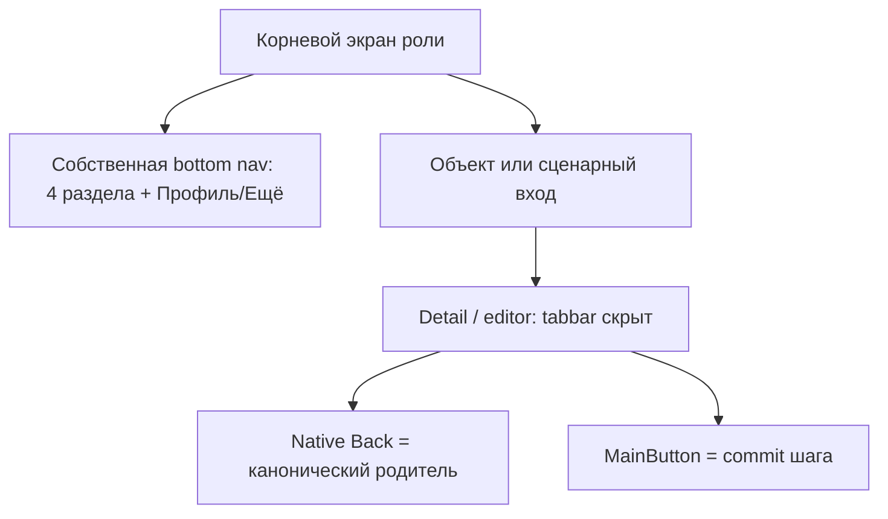
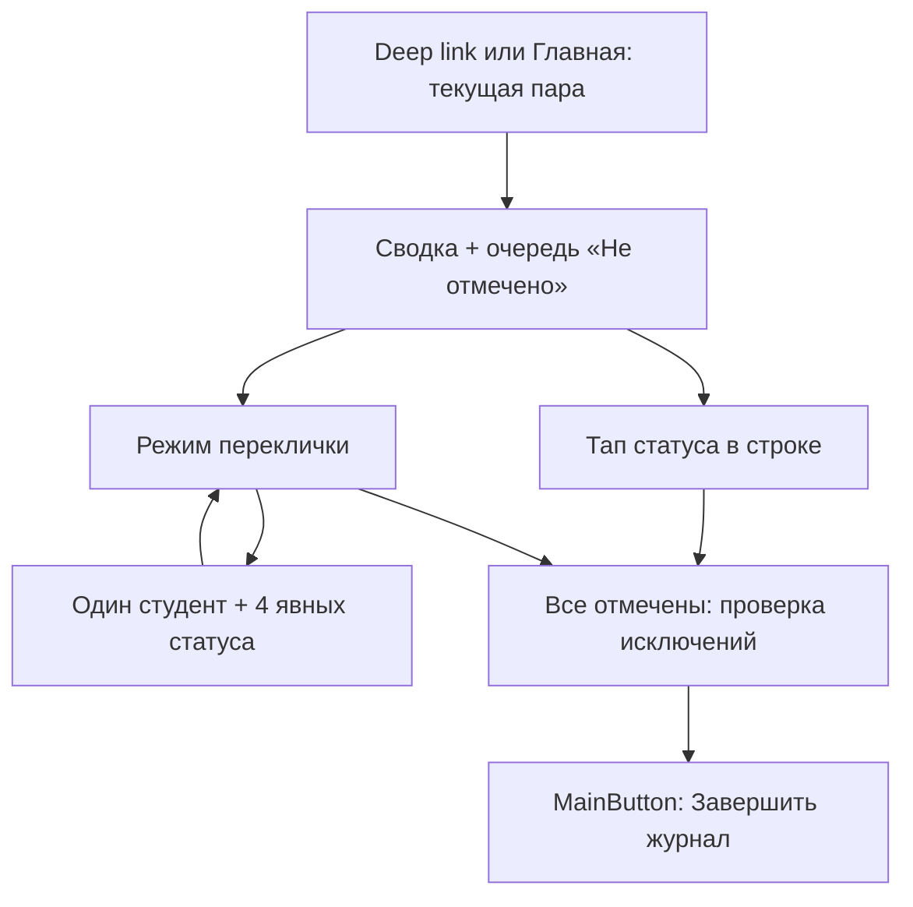
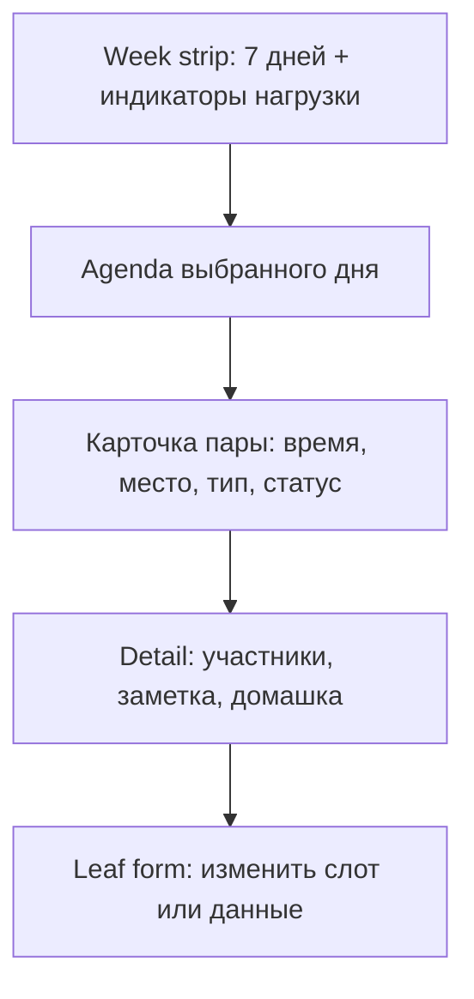

# Telegram Mini Apps: визуально-UX разбор живых продуктов и прототипов

Дата среза: 28.08.2026  
Продукт: RutCampusTrack  
Поверхность: Telegram Mini App; выводы также используются для сравнения с PWA.  
Figma не запускалась, кит и исходный дизайн не изменялись.

## 0. Что решено по итогам разбора

1. **Собственная нижняя панель в Telegram не является ошибкой сама по себе.** В выпущенных Mini Apps встречаются четыре-пять постоянных разделов. Для RutCampusTrack сохраняется пятислотовая панель на корневых экранах роли, но она скрывается на detail/editor/task-flow экранах.
2. **Нативные `MainButton`/`SecondaryButton` не входят в навигацию.** Это временные действия текущего шага: «Сохранить», «Отправить», «Завершить». Если одновременно оставить web-tabbar и две host-кнопки, получится три конкурирующих нижних слоя.
3. **У мобильного журнала старосты есть более сильная альтернатива обычному списку:** режим «сначала исключения» плюс опциональный focus-pass «один студент → видимые статусы → следующий». Он быстрее полного списка, но не зависит от свайпа и всегда допускает возврат к списку.
4. **Для расписания сильнее всего повторяется связка:** короткая недельная/месячная сводка → выбранный день → вертикальная agenda → деталь пары. Любой занятый слот должен быть тапабельным. Сетка служит обзором, а не основным редактором.
5. **Современность следует концентрировать, а не размазывать.** Один фиолетовый fluid/iridescent hero для «сейчас/следующее», один повторяемый органический мотив и один уровень полупрозрачной плавающей поверхности дадут характер. Длинные списки, формы, ФИО и статусы остаются на спокойной непрозрачной поверхности.
6. **Telegram chrome следует теме клиента, содержимое — RutCampusTrack.** Системные фон/шапка/иконки согласуются с `themeParams`; фирменный фиолетовый и семантика посещаемости не переопределяются случайными цветами темы Telegram.
7. **Тяжёлое администрирование честнее оставить PWA/desktop.** Реальный OK, Bob! показывает полезное разделение: быстрые задачи доступны в Telegram, отчётность — в браузере. Для администратора Mini App — оперативный поиск, просмотр, малые безопасные действия и инциденты, а не сжатая копия всех реестров.

## 1. Метод и уровень доверия

В выборку вошли 15 кейсов. Они намеренно смешаны, но **их статус не смешивается**:

- **A** — доступен публичный код и можно проверить реальный маршрут/компонент; либо есть конкурсный отчёт с конкретным пользовательским замечанием;
- **B** — выпущенный продукт с официальными или независимыми скриншотами/описанием, но без публичного кода;
- **C** — портфолио-концепт или редизайн; пригоден только как визуальная/композиционная гипотеза;
- `+`/`-` уточняют силу внутри уровня.

Статусы продукта:

- **shipped** — есть живой сервис/бот и признаки использования;
- **open source live** — код публичен и заявлен рабочий deployment;
- **contest prototype** — рабочая конкурсная сборка, но данные/сервис могут быть фиктивными;
- **concept/redesign** — polished presentation без подтверждения, что именно этот UI выпущен.

Важно: скриншот не доказывает корректную safe area, клавиатуру, загрузку и навигацию назад. Если этого нет в коде, документации продукта или отчёте тестировщика, в таблице стоит «не подтверждено», а не догадка.

## 2. Карта кейсов: 15 Mini Apps и UI case studies

| № | Кейс и статус | Дата / доверие | Живой вход, код, визуал | Главное доказуемое наблюдение |
|---:|---|---|---|---|
| 1 | **Doday**, учебный todo/planner — open source live | старт 02.05.2026; **A-** | [репозиторий](https://github.com/SwairIt/doday), [продукт](https://getdoday.ru/), [бот](https://t.me/DodayTaskBot), [TMA shell/nav](https://github.com/SwairIt/doday/blob/e7bef509ccf660e6ed055b5fbcdd5955c3bc3d6a/app/templates/miniapp/_base.html#L371-L393), [календарь](https://github.com/SwairIt/doday/blob/e7bef509ccf660e6ed055b5fbcdd5955c3bc3d6a/app/templates/miniapp/calendar.html#L30-L107) | Web и TMA сохраняют форму из пяти табов, но меняют состав/приоритет. TMA использует bottom sheets, haptics и контекстную MainButton; календарь соединяет day chips, agenda и компактную heatmap.
| 2 | **OK, Bob!**, задачи/команды — shipped | живой сайт и обновления до 2026; **B+** | [продукт](https://okbob.app/), [браузерная версия](https://hey.okbob.app/), [dark TMA screenshot](https://okbob.app/_ipx/f_webp%26q_90%26s_900x1848/images/main/personal-mini-app-version-dark.png) | Пять табов `Задачи / Расписание / Входящие / Чаты / Ещё`; быстрый ввод живёт рядом со списком. Тяжёлая отчётность официально вынесена в браузер на компьютере.
| 3 | **MemoCard**, интервальные карточки — open source live / конкурсный победитель | кейс 28.04.2024; **A-** | [репозиторий](https://github.com/kubk/memo-card), [продукт](https://memocard.org/), [разбор автора](https://teletype.in/@alteregor/memocard-telegram-contest-win) | Автор убрал swipe-only оценку карточки: горизонтальный жест конфликтовал с Telegram. Выпущены две явные кнопки «помню / повторить». Это прямое подтверждение, что красивый жест нельзя делать единственным критическим управлением.
| 4 | **Notepher**, заметки — open source contest app | 2023–2024, проверка нескольких клиентов в README; **A-** | [репозиторий](https://github.com/deptyped/notepher-bot), [бот](https://t.me/NotepherBot), [user guide](https://github.com/deptyped/notepher-bot/blob/main/README_USER.md) | Однозадачная IA без постоянной нижней навигации: поиск + теги + pinned/regular секции → редактор. Есть FAB, sync-state, offline-first и тема Telegram. Форматирование — контекстная панель, массовый выбор — отдельный mode.
| 5 | **My Saved Answers**, библиотека ответов — open source contest concept | 2023; **A-** для паттерна, **C+** для продукта | [репозиторий](https://github.com/vkruglikov/my-saved-answers), [web demo](https://vkruglikov.github.io/my-saved-answers), [бот](https://t.me/savedanswers_bot) | Список с tag filters → preview. Нативная MainButton `SEND` появляется только на preview, BackButton отражает вложенность, тема берётся из Telegram CSS variables. Данные моковые.
| 6 | **Telebook**, бронирование отеля — open source contest concept | конкурс 2023; **A-** код, **C+** продукт | [репозиторий](https://github.com/neSpecc/telebook), [contest entry](https://contest.com/mini-apps/entry4528), [бот/demo](https://t.me/tebook_bot/telebook) | Пошаговый list → card/detail → form/payment. В коде есть `DatePickerCompact`, `ListItemExpandable`, `DataOverview`, `FixedFooter`, `PageWithHeader`: полезная библиотека паттернов, но это фиктивный отель, не доказательство retention.
| 7 | **TeleVenue**, поиск и бронирование площадок — open source contest prototype, 3-е место | конкурс 2023; **A-** код, **B-** конкурсная оценка | [репозиторий](https://github.com/NickNaskida/TeleVenue), [бот/demo](https://t.me/TeleVenueBot), [contest entry](https://contest.com/mini-apps/entry4450) | Ясный последовательный маршрут venue list → browse/detail → booking form. React Router и React Hook Form подтверждают отдельные экраны/шаги вместо одной перегруженной страницы.
| 8 | **NextWeek TWA**, недельное бронирование — open source contest prototype | конкурс 2023; **B-** | [contest entry и отзывы](https://contest.com/mini-apps/entry4584), [бот](https://t.me/NextWeekTheBot), [source commit](https://github.com/inspectorr/NextWeekTWA/commit/48f7875959ec85a3dea011bbfdacf510eadf899d) | Внешний тестировщик не смог открыть занятый интервал и запросил detail; также попросил слоты короче часа. Автор согласился, что детализацию шага создания можно расширить. Вывод: обзор недели не должен быть тупиковым, а гранулярность задаётся в leaf-form.
| 9 | **Lowkey Brokey**, бюджет — open source contest prototype | конкурс 2023; **B-** | [contest entry и отзывы](https://contest.com/mini-apps/entry4455), [бот](http://t.me/LowkeyBrokeyBot/app), [source commit](https://github.com/yelnar/lowkey-brokey/commit/a4f553d59befed0a47b7b9b7e518625b53571370) | Тема Telegram реализована, но удаление спрятано в long press/right click, а тестировщик отметил ощущение, будто «вся страница — одна большая кнопка». Визуальная кликабельность и опасные действия должны быть явными.
| 10 | **Tribute**, подписки/платежи — shipped | актуальный продукт в 2026; **B+** | [продукт](https://tribute.top/products/subscriptions), [справка](https://wiki.tribute.tg/), [создание подписки](https://wiki.tribute.tg/ru/for-content-creators/subscriptions/creating-subscription) | Реальный transaction flow: dashboard/list → подключить канал → пошаговая форма → detail/copy link. Продукт заявляет 60 тыс.+ активных авторов и $45 млн.+ выплат; цифры — данные самого сервиса, не независимый аудит.
| 11 | **Wallet in Telegram**, кошелёк — shipped | актуальный продукт в 2026; **B** | [официальный продукт](https://wallet.tg/), [страница с визуалом](https://dyor.io/dapps/mini-apps-bots/wallet-acdxut), [прямой screenshot](https://storage.dyor.io/dapps/1940/images/asset/1732378152/26070734.jpeg) | Домашняя строится как крупная сводка баланса → четыре быстрых действия → активы/история. На доступном кадре нет постоянной bottom nav: один доминирующий summary и сценарные входы работают лучше каталога функций.
| 12 | **Fanton Fantasy Football**, fantasy sports — shipped | запуск на Product Hunt в 2023; срез 2026; **B** | [Product Hunt](https://www.producthunt.com/products/fanton-fantasy-football), [бот](https://t.me/fantongamebot), [screenshots](https://games.gg/fanton/), [direct image](https://assets.games.gg/fanton_screen_1_89f9e1e93b/fanton_screen_1_89f9e1e93b.png) | Тёмно-фиолетовая система с ярким secondary accent, большой progress/league hero, карточки турниров и пять подписанных табов. Отзывы одновременно хвалят быстрый старт и сообщают lag/loading: визуальная насыщенность не отменяет performance states.
| 13 | **Frienda**, поиск друзей — shipped + brand case | кейс 27.05.2025; **B+** | [Behance brand case](https://www.behance.net/gallery/226023327/Frienda-Brand-Development), [независимый hands-on обзор](https://t-j.ru/list/tinder-for-friends/), [screen example](https://opis-cdn.tinkoffjournal.ru/mercury/tinder-for-friends_010.png) | Три ясных таба `Friends / Feed / Profile`, photo-first карточки. Айдентика держится на одном повторяемом «spark» из двух букв f. Независимый обзор подчёркивает отсутствие swipe-only механики: профиль можно открыть/вернуть, действие показано иконкой дружбы.
| 14 | **Timetable Assistant DUIKT redesign**, расписание в вузе — concept/redesign реального бота | опубликован в 2026; **C+** визуал, **B-** контекст | [Dribbble case](https://dribbble.com/shots/27316948-Timetable-Assistant-DUIKT-Telegram-Mini-App-Design), бот указан автором: `@DuiktTrackBot` | Редизайн заменяет side menu четырьмя табами `Schedule / Notes / Profile / Support`; месяц получает точки нагрузки, список — timeline с типами занятий, detail — inline notes. Реален исходный бот, но нет доказательства, что редизайн выпущен.
| 15 | **Yield Cybro**, USDT staking — автор заявляет shipped | опубликован 07.02.2026; **C+ / B-** | [Dribbble case](https://dribbble.com/shots/27063833-Telegram-Mini-App-for-USDT-Staking) | Автор заявляет production TMA и 50+ generative coin skins: glass, iridescent shaders, procedural texture сосредоточены в одном hero-object, а deposit flow остаётся простым. Нет независимой ссылки/метрик; брать только принцип концентрации «вау»-эффекта.

### Быстрый вывод по реальности выборки

- **Сильные продуктовые опоры:** Doday, OK, Bob!, MemoCard, Notepher, Tribute, Wallet, Fanton, Frienda.
- **Сильные кодовые/flow-опоры, но не рыночное доказательство:** My Saved Answers, Telebook, TeleVenue, NextWeek, Lowkey Brokey.
- **Только визуальные гипотезы:** Timetable Assistant DUIKT redesign и Yield Cybro. Их нельзя использовать для обоснования UX без собственного теста RutCampusTrack.

## 3. Что реально делают с навигацией

### 3.1. Собственная bottom nav

| Наблюдаемая модель | Кейсы | Когда работает | Решение для RutCampusTrack |
|---|---|---|---|
| 4–5 постоянных top-level destinations | Doday, OK, Bob!, Fanton; в дизайне Frienda и DUIKT | Разделы действительно меняют пользовательский режим и вызываются часто; подпись и иконка видимы одновременно | Оставить пять слотов на корневых экранах роли. Порядок и состав — по роли, не одинаковая «корпоративная» перестановка ради симметрии |
| Один hub → detail, без tabbar | Notepher, MemoCard, доступный home Wallet | Одна доминирующая сущность; остальные действия контекстны | На leaf-flow скрывать панель. Для одиночных deep links из уведомления показывать канонический parent через native Back, а не принудительно возвращать табы |
| Overview → push-detail → form | Telebook, TeleVenue, Tribute, My Saved Answers | У операции есть ясный объект, затем детали, затем commit | Заявка, редактирование пары, пользователь/группа и карточка студента открываются как вложенные routes; bottom nav исчезает |
| Bottom nav только в polished redesign | DUIKT | Визуально правдоподобно, но нет подтверждения, что пользователи приняли замену side menu | Использовать как гипотезу для расписания, не как доказательство частотности табов |

**Проектное решение:** принятое ранее правило «пять слотов у всех ролей» можно сохранить как baseline. Но исследование опровергает идею, что панель обязана быть видна буквально всегда. На экране выполнения задачи она создаёт лишнюю возможность случайно уйти и конкурирует с нативной CTA-зоной.

### 3.2. Роль Telegram Main/Secondary/Back

| Host control | Правильная роль | Наблюдение из кейсов | Спецификация для RutCampusTrack |
|---|---|---|---|
| `MainButton` | Единственный commit текущего шага | My Saved Answers показывает `SEND` только в preview; Doday меняет кнопку по контексту | Скрыта на Home/List. На editor: `Сохранить`, `Отправить`, `Завершить`. Состояния disabled/loading/success. При отсутствии API — идентичная inline fallback-кнопка |
| `SecondaryButton` | Второе реальное решение, не постоянный Cancel | В кейсах редко выступает как постоянная навигация; её совместное присутствие ещё сильнее съедает viewport | Использовать выборочно: например, `Сохранить черновик` рядом с `Отправить`, только если оба исхода часты. `Отмена` обычно Back/inline text action |
| `BackButton` | Семантический родитель текущего route | My Saved Answers и list→detail кейсы подтверждают nested model | На корневом табе скрыта. `журнал пары → занятия`, `студент → статистика`, `тикет → список`. Не рисовать собственную вторую стрелку |
| Telegram top chrome | Закрытие Mini App и системный контекст | Ни один удачный utility case не пытается сделать копию Telegram close/header внутри контента | Под host chrome начинается app context: короткий title либо sticky context пары. Не повторять название продукта и роль на каждом экране |

### 3.3. Рекомендуемая shell-модель

Не считать notification/deep link вторым основным путём: это альтернативная **точка входа** в тот же route. Канонический parent и Back остаются одни.

## 4. Top chrome, тема, safe areas, клавиатура

### 4.1. Top chrome

- Telegram уже владеет close/menu и внешней шапкой. Внутри приложения нужен **контекст**, а не ещё один app bar.
- На списке достаточно короткого заголовка, фильтра и состояния синхронизации. На журнале — sticky line `Пара · 10:20–11:50 · Ауд. 312`, которая уходит/сжимается после прокрутки summary.
- `BackButton` синхронизируется с router state; на корне скрывается.
- Не выравнивать внутренние кнопки по координатам Telegram Close/Menu: они различаются между клиентами и режимами.

### 4.2. Две допустимые модели темы

| Модель | Плюсы | Минусы | Где использовать |
|---|---|---|---|
| **Telegram-native utility:** surface/text/divider из `themeParams`, продуктовый цвет только для action/status | Минимальный визуальный шов между Telegram и TMA, лёгкая поддержка light/dark | Слабее узнаваемость RutCampusTrack; theme params могут давать неожиданный контраст | Системные sheets, маленькие формы, settings, простые списки |
| **Hybrid branded:** host chrome и базовая light/dark схема согласуются с Telegram; content surfaces и purple accents — из токенов RutCampusTrack | Сохраняет продуктовую идентичность и даёт место современному hero/gradient | Требует явных fallback и проверки контраста на нескольких клиентах | Основная рекомендованная модель для всех ролей |

Фирменный цвет не должен менять смысл статусов. `Присутствовал / отсутствовал / опоздал / уважительная причина / не отмечено` остаются семантическими токенами продукта и дублируются текстом/формой/иконкой.

### 4.3. Safe area и клавиатура как состояния макета

Скриншоты кейсов почти никогда не показывают keyboard и compact viewport; поэтому это не «визуальная мелочь», а обязательная спецификация каждого form/editor route.

- Bottom nav и fixed in-app footer учитывают динамический `contentSafeAreaInset`, а не статический нижний padding.
- При фокусе поля bottom nav скрывается. Последнее поле прокручивается выше клавиатуры; рядом есть явное `Готово`/закрытие клавиатуры.
- Если Telegram MainButton показана, контент получает дополнительный bottom inset; нельзя одновременно оставлять web-копию CTA непосредственно над ней.
- После `Back`, `blur`, смены ориентации/expanded state и возврата из external link shell пересчитывает высоту и safe area.
- На iOS, Android, Desktop и Web тестируется длинное ФИО, две строки helper text, ошибка поля и открытая сторонняя клавиатура.
- Для журнала и длинной заявки черновик сохраняется до/во время ввода; потеря viewport не должна равняться потере данных.

## 5. Современный визуальный язык без потери функции

### 5.1. Что можно и стоит сделать выразительнее

| Приём | Где он функционален | Пример | Ограничение |
|---|---|---|---|
| **Fluid purple gradient / mesh** | Hero «текущая или следующая пара», роль, прогресс дня | Fanton показывает насыщенный branded hero; Yield Cybro — концентрацию сложного материала в одном объекте | Не класть под длинный текст, таблицу, ввод и статусы; иметь solid fallback и reduced motion |
| **Один органический бренд-мотив** | active state, edge hero-card, короткая transition-плашка, empty illustration | Frienda строит айдентику вокруг одной «искры» | Не создавать разные blobs на каждом экране; мотив должен быть узнаваемым, не случайным |
| **Стекло одного уровня** | Floating filter bar, compact nav/sheet, transient summary над картой | Yield Cybro/современные product shots | Blur не под 30 строками. На слабом устройстве — непрозрачная surface; border и contrast обязательны |
| **Крупное скругление hero + среднее card + pill control** | Отличает иерархию по форме без лишних подписей | OK, Bob!, Fanton, DUIKT redesign | Не делать каждую строку отдельной «мыльной» карточкой; группы можно объединять общей surface |
| **Цветная timeline rail / dots** | Тип пары, нагрузка дня, события недели | DUIKT redesign; Doday heatmap/day chips | Цвет дублируется label/icon/pattern; точка показывает наличие/нагрузку, не полный статус без легенды |
| **Микроанимация результата** | Отметка посещения, сохранение, переход к следующему студенту | Haptics/bottom sheet у Doday; generative hero у Yield Cybro как visual-only reference | 120–240 ms transition предпочтительнее «шоу». Ошибка/сохранение не зависят от анимации |

### 5.2. Три уровня плотности

1. **Hero/summary:** высокая выразительность, fluid gradient, асимметричный контур, крупная цифра/время.
2. **Рабочая карточка:** спокойная непрозрачная surface, 1–2 акцента, сильная типографическая иерархия.
3. **Dense list:** минимум теней, группирующие контейнеры вместо тени на каждой строке, status chip/indicator, стабильная высота tap target.

Так интерфейс остаётся «живым», но визуальный шум не растёт пропорционально числу студентов.

### 5.3. Запросы на токены, а не случайные значения

Точные значения должен согласовать владелец системы; ниже — **запросы на семантические токены**, а не готовые hex/blur:

- `gradient/current-context` — фиолетовый mesh для текущей/следующей пары;
- `gradient/role-ambient` — более тихий фон hero, light/dark variants;
- `surface/glass-floating` и `surface/glass-floating-fallback`;
- `border/glass`;
- `shadow/floating-control` и `shadow/hero-soft`;
- `radius/hero`, `radius/card`, `radius/control-pill` — три уровня, без десятка произвольных радиусов;
- `shape/hero-asymmetric` — один фирменный contour/mask;
- `motion/route-push`, `motion/status-commit`, `motion/sheet`;
- `overlay/scrim-sheet`;
- `status/attendance/*` — существующая семантика сохраняется и не выводится из Telegram accent;
- `focus/visible` и `state/pressed-overlay` для всех интерактивов.

## 6. Плотные данные: новые варианты сверх «пара → список студентов»

Матричный журнал на телефоне по-прежнему запрещён. Но даже вертикальный список из 25–35 человек не обязан быть единственной рабочей моделью.

### 6.1. Журнал старосты: четыре режима представления

| Вариант | Механика | Выигрыш | Цена / когда не применять |
|---|---|---|---|
| **A. Сначала исключения** — рекомендованный default | Summary `25 всего · 18 отмечено · 7 осталось`; верхние chips `Не отмечено / Отсутствуют / Все`; завершённые сворачиваются в одну строку | Во время пары староста видит только работу, которая осталась. Длина экрана уменьшается по мере отметки | Нужно объяснить, куда исчезли отмеченные; обязательны `Все` и undo/toast. Не подходит для итоговой сверки без full list |
| **B. Focus pass: один студент** | Карточка студента занимает рабочую область; четыре явные status-buttons; `Следующий`, счётчик `8/27`, кнопка `К списку` и быстрый jump | Крупные targets, работа одной рукой, минимум визуального поиска; можно отмечать по перекличке | Нельзя делать swipe-only. Смена порядка/поиск конкретного человека медленнее, поэтому list/jump обязателен |
| **C. Групповой пакет** | Выделить несколько строк → bottom contextual bar → один статус/комментарий для выбранных | Быстро для типичного «все присутствуют, кроме…» или подгруппы | Риск массовой ошибки; перед применением показывает `Изменить 18 студентов?`, есть undo. Не использовать для необратимых server actions |
| **D. Attendance rail / skyline** | В summary 25 коротких ticks/инициалов, цвет/форма показывает распределение; тап по tick открывает студента | Моментальная картина завершённости и выбросов без таблицы | Не является редактором и не заменяет имена/список; нужен доступный текстовый summary и legend |

Рекомендованная комбинация: **A как основа + B как опциональный «режим переклички» + D только как обзор.** C доступен старосте после теста ошибки/undo.

#### Flow журнала старосты

`MainButton` лучше называть «Завершить журнал», если промежуточные изменения автосохраняются. Если автосохранения нет, «Сохранить 7 изменений» явно показывает объём commit.

### 6.2. Статистика: пять мобильных линз

| Линза | Что на первом экране | Drill-down | Подходит | Компромисс |
|---|---|---|---|---|
| **Metric-first** | Segmented control `Посещаемость / Опоздания / Домашка`; 2–3 KPI; ranked mini-list | Тап студента → карточка с динамикой и событиями | Староста, преподаватель, админ | Смена метрики меняет сортировку; надо сохранять выбранный lens |
| **Student-first cards** | Поиск/фильтр + compact rows `ФИО · % · trend`; раскрытие по тапу | Bottom sheet или detail card | Уже принятое направление, хорошо для точечного вопроса | Длинный список; решается filters, sections и pagination/load more |
| **Cohort distribution** | Полоса/гистограмма `0–59 / 60–79 / 80–100`, количество в сегменте | Тап сегмента → только студенты риска | Преподаватель, староста | Не показывает персоналии до drill-down; это преимущество для обзора, но не для отчёта |
| **Exception feed** | События, требующие внимания: резкое падение, 3 пропуска подряд, не закрытая пара | Тап события → студент/пара | Главная преподавателя/старосты | Требует серверных правил/порогов и объяснения «почему показано» |
| **Story timeline** | Хронологические карточки значимых изменений | Тап → источник/деталь | Индивидуальная карточка студента | Не годится для точного сравнения всех студентов; только дополнение |

Не показывать decorative chart, если из него нельзя перейти к объекту. Любая точка/бар/сегмент либо открывает отфильтрованный список, либо служит чистой summary с явной кнопкой `Подробнее`.

### 6.3. Расписание и календарь

Рекомендованная последовательность:

- **Week strip/day chips** — быстрый горизонтальный контроль; стрелки/календарь остаются явной альтернативой жесту.
- **Month overview** — только точки/полосы нагрузки и выбранная дата. Не пытаться помещать текст занятий в клетки.
- **Vertical agenda** — основной режим дня: время как rail, карточка содержит только различающиеся поля.
- **Occupied slot tap → detail.** Это прямой урок NextWeek: нетапабельный занятый интервал воспринимается как тупик.
- **Edit time** — отдельная форма с доступной гранулярностью 15/30/60 минут; не дробить overview до нечитаемой сетки.
- **Пересечение/конфликт** — отдельная exception-card над agenda, а не красная рамка вокруг всей сетки.

### 6.4. Реестры пользователей и групп

- Первый экран — **поиск + сохранённые фильтры + summary**, а не первые 100 строк по алфавиту.
- Entity row: `ФИО/группа` как главное; роль/status/последняя активность — вторичное; раскрытие по тапу.
- Batch select включается явной кнопкой `Выбрать`, а не long press. После входа меняется top context и появляется contextual action bar.
- Пагинация/load-more предпочтительнее бесконечной ленты, если администратору важно понимать объём и вернуться к позиции.
- Массовая смена ролей, слияние групп, структура семестра и экспорт больших отчётов — PWA/desktop. В Mini App показывается `Открыть полную версию` с сохранённым контекстом фильтра.

## 7. Решения по ролям

### 7.1. Студент

**Корневой shell:** пять табов согласно продуктовой IA; `Профиль` остаётся пятым. Если шесть разделов не помещаются, редкий раздел уходит в `Ещё`, а не превращается в шестую маленькую иконку.

**Главная:**

- один fluid purple hero `Сейчас / Следующая пара` с временем, аудиторией и одной contextual action;
- ниже — две спокойные actionable cards: `Домашка сегодня` и `Изменение расписания/заявка`;
- декоративный мотив повторяется только в hero, active tab и empty state.

**Посещаемость/статистика:** summary по семестру → subject filter → события/карточки. Не показывать список других студентов. График имеет tap → детали пропусков/опозданий.

**Домашка:** day chips/agenda, группировка `Сегодня / Скоро / Просрочено`; detail route скрывает bottom nav. Если есть отправка — MainButton `Отправить`, иначе она отсутствует.

**Telegram-специфика:** уведомление о переносе или домашке ведёт сразу в канонический detail. Check-in открывается leaf route с `BackButton` и MainButton `Отметиться`; после успеха кнопка меняется на confirmed state, а не остаётся активной.

### 7.2. Староста

**Приоритет:** вход в текущую пару должен быть сильнее каталога десяти разделов. На Home первая карточка — `Начать/продолжить журнал`, доступна также deep link из сообщения/уведомления.

**Журнал:** default `Не отмечено`; status chips доступны в строке. Переключатель `Список / Перекличка` даёт focus-pass. Sticky context сжимается после прокрутки. Bottom nav скрыта; Back ведёт к занятиям; MainButton завершает журнал.

**Статистика:** metric-first → distribution → filtered student cards; «студент → карточка» сохраняется, но не является единственным первым экраном.

**Заявки:** queue cards с приоритетом/статусом → detail. На detail одно главное действие. `Одобрить` можно вынести в MainButton, `Отклонить` оставить явным inline action с причиной; две одинаково яркие кнопки опасны.

**Расписание/управление парами:** week summary → day agenda → slot detail → editor. Drag-and-drop, если добавлять, остаётся progressive enhancement; альтернативы `Изменить время`/`Перенести` обязательны.

**«Ещё»:** две группы `Разделы` и `Управление` сохраняются. Внутри — list cells, не сетка из десяти безымянных иконок.

### 7.3. Преподаватель

**Главная:** ближайшая пара + состояние группы + один exception block. Современный hero допустим для текущей пары; аналитические карточки спокойнее.

**Посещаемость:** сначала список занятий/групп, затем summary и карточки студентов. Если преподаватель только просматривает, не показывать лишние status controls. Если редактирует — тот же лист/перекличка, что у старосты, но права/команды отличаются.

**Статистика:** metric-first, distribution и exception feed; detail студента показывает объяснимые события, а не только процент.

**Расписание:** day chips + agenda + detail. Inline заметка на detail допустима по примеру DUIKT, но поле открывается по явному действию и переводит экран в keyboard state.

**Bottom nav:** при четырёх разделах не добавлять пустой `Ещё`; пятый `Профиль` остаётся продуктовым решением. Главное действие текущей пары не превращать в постоянный таб.

### 7.4. Администратор

**Мобильная роль:** оперативная консоль, а не вся система управления.

- Home: health/incident summary, ожидающие подтверждения, быстрый поиск;
- Пользователи/группы: query-first и saved filters → entity card → safe actions;
- Семестры: status/timeline и чтение; сложная перестройка — `Открыть в PWA/desktop`;
- карта: выбранная точка открывает sheet/detail, не gesture-only carousel;
- audit trail/критические изменения: карточки событий с автором/временем; destructive action требует явного confirmation.

Визуальная выразительность сосредоточена в health hero. Реестры не получают translucent cards на каждую строку. Разделение OK, Bob! между мобильным task flow и desktop reporting — сильный прецедент.

## 8. Формы, клавиатура и логика раскрытия

### 8.1. Как строить форму

1. Один экран/лист отвечает одному решению; длинная форма разбивается на логические шаги с названием и прогрессом.
2. Сначала объект и причина, затем детали; необязательные поля раскрываются по `Добавить комментарий/файл`.
3. MainButton появляется только когда commit сформулирован; до валидности disabled и объясняет ошибку рядом с полем.
4. После отправки показывается самостоятельный success state и следующий разумный путь, а не мгновенный прыжок на Home.
5. Draft и retry видимы: `Сохранено`, `Нет сети — отправим позже`, `Повторить`.

### 8.2. List → detail

- В строке должна быть одна очевидная primary tap area. Вложенные chips работают как фильтры/быстрые статусы и визуально отделены.
- Chevron не обязателен, если карточка явно clickable, но у плотной строки помогает. Long press не является единственным способом.
- Bottom sheet подходит для краткого preview/choice; полноценный detail с историей, формой или deep link — отдельный route.
- В раскрытом состоянии не повторять все поля desktop-record; сначала 3–5 релевантных полей, остальное `Показать данные`.
- Возврат восстанавливает фильтр, scroll position и выбранный день.

## 9. Пять анти-паттернов

1. **Тройное дно:** собственная bottom nav + постоянная MainButton + SecondaryButton. Контент теряет высоту, а пользователь видит три одинаково сильных направления. На task route tabbar скрывается; host-кнопки появляются только по смыслу.
2. **Жест как единственный вход или опасное действие.** MemoCard отказался от swipe-only из-за конфликта Telegram; Lowkey Brokey прятал удаление в long press. Свайп и long press могут ускорять, но кнопка/тап-эквивалент обязательны.
3. **Стекло и градиент под каждым именем, числом и статусом.** Это превращает современный стиль в шум, ухудшает контраст и производительность. Эффект живёт в hero/floating layer, dense data — на solid surface.
4. **Вторая системная шапка внутри Telegram.** Дубли Close/Back/названия приложения создают лишнюю высоту и разные истории. Telegram chrome остаётся внешним, внутренний header показывает только контекст задачи.
5. **Сжатая desktop-матрица или dashboard-collage из равных плиток.** Она не отвечает, что делать сейчас. Home строится вокруг текущего события, а таблица заменяется overview → filter → list/card → detail.

## 10. Что надо отрисовать агенту по Figma для проверки решения

Это не просьба собрать Figma сейчас, а перечень кадров для следующего исполнителя.

### Обязательные Telegram variants

- shell root: dark + light, compact + expanded, пять табов;
- root с появившейся MainButton fallback-проверкой — MainButton на root **не должна** появляться;
- detail/editor: bottom nav скрыта, native Back, MainButton disabled/loading/success;
- keyboard state: последнее поле, ошибка, helper text, закрытие клавиатуры;
- safe-area variants iOS/Android и Desktop/Web;
- offline/draft/retry;
- long name, 35 студентов, 10+ homework items, empty/error/skeleton.

### Обязательные сравнительные кадры журнала старосты

1. `Сначала исключения`: summary + 7 неотмеченных + completed collapsed.
2. `Перекличка`: один студент + четыре status controls + `8/27` + `К списку`.
3. `Проверка`: только отсутствующие/опоздавшие + завершение.
4. Batch mode с confirmation и undo.

### Визуальные A/B варианты

- **V1 restrained:** solid surfaces, gradient только в hero;
- **V2 expressive:** asymmetric hero + subtle glass floating filter/nav;
- **V3 Telegram-native:** Telegram surfaces + только purple action/status accents.

Выбирать не по «красивее», а по трём проверкам: время до первого действия, ошибки статуса/формы, читаемость в движении и при плохой яркости.

## 11. Проверки перед переносом приёмов в RutCampusTrack

| Проверка | Условие приёмки |
|---|---|
| Bottom nav | Пользователь называет назначение всех 4–5 табов без открытия `Ещё`; на task route панель не конкурирует с commit |
| MainButton | Подпись описывает результат текущего шага; кнопка скрыта на browse screens; есть inline fallback |
| Back | На root скрыт; direct deep link возвращает к каноническому parent, а не закрывает/зацикливает приложение |
| Keyboard | Любое поле и сообщение об ошибке остаются видимыми; есть явное завершение ввода; данные не теряются |
| Safe area | Последняя строка и floating controls полностью доступны в compact/expanded и после Back |
| Gradient/glass | Contrast проходит; reduced-motion/solid fallback не ломает иерархию; effect не является единственным status signal |
| Dense data | 35 студентов и длинные ФИО не создают горизонтальный scroll; исключение находится ≤2 taps |
| Schedule | Любой занятый слот открывает detail; сменить день можно без swipe; month grid не содержит мелкий текст пары |
| Admin | Опасное массовое действие не начинается случайным tap/long press; сложный desktop flow имеет осмысленный handoff |
| Performance | Есть skeleton, retry и offline/draft; hero-effect не блокирует first useful paint или scroll |

## 12. Источники и границы применимости

### Нормативная база

- [Telegram Mini Apps API](https://core.telegram.org/bots/webapps) — актуальная нормативная документация host controls, темы и viewport; она говорит, что API существует, но не доказывает удобство конкретного layout.
- [ChatLabs / Sostav: практический разбор TMA UX](https://www.sostav.ru/blogs/281129/67478), 16.09.2025 — опыт команды, работающей с TMA с 2022 года: не дублировать системный Back, учитывать safe/content safe area, делить сложное на ясные шаги и показывать loading. Доверие **B**: practitioner source, но не независимое исследование.

### Почему Dribbble/Behance не являются доказательством

- [Frienda case](https://www.behance.net/gallery/226023327/Frienda-Brand-Development) сильнее обычного портфолио, потому что авторы называют заказчика и запущенный продукт; independent hands-on обзор подтверждает существование приложения. Всё равно визуальный кейс не показывает keyboard/error/safe area.
- [DUIKT timetable redesign](https://dribbble.com/shots/27316948-Timetable-Assistant-DUIKT-Telegram-Mini-App-Design) относится к реальному боту, но сам redesign — proposal.
- [Yield Cybro](https://dribbble.com/shots/27063833-Telegram-Mini-App-for-USDT-Staking) содержит формулировку «what we shipped», однако нет независимой product link или метрик. Это источник визуального приёма, не UX-валидация.

### Итоговая граница уверенности

- **Можно уверенно закладывать:** route-based Back, contextual MainButton, tabbar только на top-level, явные controls вместо gesture-only, agenda/list→detail, search/filter before dense list, спокойные dense surfaces.
- **Нужно проверить собственным usability test:** точный состав табов каждой роли, эффективность режима «перекличка», default `сначала исключения`, batch edit, границы glass/gradient.
- **Нельзя утверждать без живой проверки:** что любой портфолио-shot корректен во всех Telegram clients, что сложная анимация не влияет на performance, что пользователи понимают новую органическую форму как действие.

