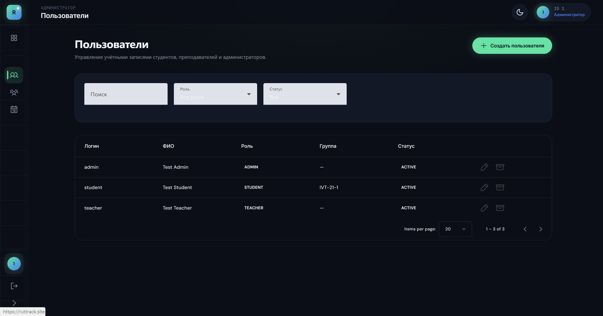

# Страница входа. Что не так: #
- нет кнопки войти по OTP одноразовому коду (хотя на бекенде мы делали такой функционал через телеграмм)
- дизайн страницы не вписывается в общую концепцию дизайна всей системы (нужная информация о дизайне лежит в папке docs b что-то может быть в .planning)
- не отображается пароль при входе и логин (белые на белом фоне)
- криво отображаются границы блока

# Зашёл как админ. Что не так: # 
- Ячейки поиска, роли и статуса выглядят не как в общей дизайн системе

# Зашёл как админ. Добавляю пользователя Что не так: # 
- ячейки ФИО и роли не соответствуют дизайну

# Зашёл как админ. Добавляю пользователя администратора Что не так: # 
- Проверь как в системе сделана запись ФИО, как она хранится в БД. Как одна строка на всё фил или есть разнесения на имя, фамилию и отчество?
- Как после создания администратора можно назначить ему пароль? И вобще должны ли мы создавать второго администратора для системы по ТЗ?

# Зашёл как админ. Добавляю пользователя преподаватель Что не так: # 
- Почему я сразу должен привязать преподавателя к группе
- Как у нас хранится ФИО преподавателя в бд

- 
# Зашёл как админ. Добавляю пользователя студент Что не так: #
- Как у нас хранится ФИО студента в бд
  

Зашёл как админ и хочу посомтреть группу или создать их. но нет тестовой группы и если создаю то ошибка "Не удалось загрузить данные."